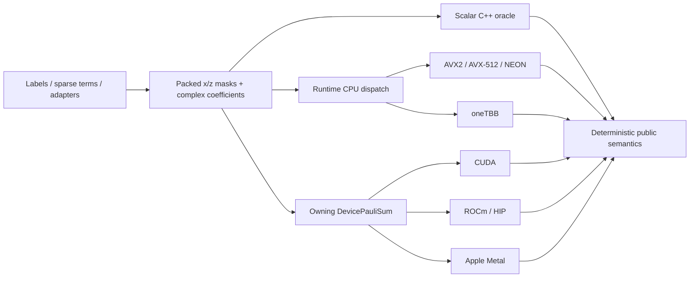

# Wolfgang

<p align="center">
  <strong>Packed Pauli algebra and evidence-driven accelerator kernels.</strong><br>
  C++20 · Python · SIMD · oneTBB · CUDA · ROCm/HIP · Apple Metal
</p>

<p align="center">
  <a href="https://github.com/sghowell/wolfgang/actions/workflows/ci.yml"></a>
  <a href="LICENSE"></a>
  <a href="https://www.python.org/"></a>
  <a href="https://isocpp.org/"></a>
</p>

Wolfgang is a native Python library for sparse sums of Pauli strings and Hamiltonians. It stores operators as compact symplectic bit masks, keeps a portable scalar C++ correctness path in every build, and promotes optimized CPU and accelerator kernels only when tests and retained measurements justify them.

The repository is also an inspectable artifact of agent-driven low-level engineering: agents help generate hypotheses, implementations, tests, and benchmark plans, while executable correctness oracles, real compilers, named hardware, profilers, and independent review determine what is accepted.

## Why Wolfgang

Quantum workloads routinely manipulate Hamiltonians containing thousands or millions of structured Pauli terms. String-heavy Python representations are convenient at boundaries but expensive in hot loops. Wolfgang moves the algebra into a packed native representation designed for:

- exact, deterministic Pauli multiplication and commutation;
- checked simplification and canonical ordering;
- runtime-dispatched AVX2, AVX-512, NEON, and oneTBB kernels;
- owning CUDA, ROCm/HIP, and Apple Metal source-build paths;
- Qiskit and OpenFermion interoperability without mandatory heavy dependencies;
- explicit allocation, transfer, synchronization, and host-materialization boundaries;
- reproducible performance decisions instead of unaudited “GPU accelerated” claims.

## Installation

The default distribution is a portable CPU package. When a package-index release is available for your platform:

```bash
python -m pip install wolfgang-quantum
```

Until then, or for a source build:

```bash
git clone https://github.com/sghowell/wolfgang.git
cd wolfgang
python -m pip install .
```

Optional adapters are separate extras:

```bash
python -m pip install ".[qiskit]"
python -m pip install ".[openfermion]"
```

CUDA, ROCm/HIP, and Metal are opt-in source builds. They are **not** silently downloaded, and backend implementation does not imply that an accelerator wheel exists. Start with the [installation guide](docs/getting-started/installation.md) and [support matrix](docs/release/support_matrix.md).

## Quickstart

```python
import numpy as np
from wolfgang_quantum import PauliSum

hamiltonian = PauliSum.from_labels(
    ["XX", "YY", "ZI", "IZ"],
    np.array([0.5, 0.5, -1.0, -1.0], dtype=np.complex128),
)

# Matrix-product Pauli algebra with phase-correct multiplication.
square = (hamiltonian @ hamiltonian).simplify(atol=1e-12)
labels, coefficients = square.to_labels()

# Exact pairwise commutation and deterministic commuting groups.
commuting = hamiltonian.commutes_with(hamiltonian)
groups = hamiltonian.group_commuting()

# Statevector expectation.
psi = np.zeros(4, dtype=np.complex128)
psi[0] = 1.0
expectation = hamiltonian.expectation_statevector(psi)

print(labels, coefficients)
print(commuting)
print([group.num_terms for group in groups])
print(expectation)
```

Construction is available from dense labels, sparse local terms, Qiskit `SparsePauliOp`, and OpenFermion `QubitOperator`. See the [quickstart](docs/getting-started/quickstart.md) and [Pauli conventions](docs/getting-started/conventions.md).

## Architecture

Wolfgang uses one packed invariant across the CPU and accelerator stack:



For each term and qubit, the local Pauli is encoded by two bits:

| Pauli | x | z |
|---|---:|---:|
| I | 0 | 0 |
| X | 1 | 0 |
| Y | 1 | 1 |
| Z | 0 | 1 |

Terms use `ceil(num_qubits / 64)` words per mask. Commutation becomes parity over bitwise intersections; multiplication is XOR plus a phase calculation. This representation is compact, vectorizable, and naturally transferable to accelerators.

### Engineering principles

1. **Scalar is the oracle.** Every build retains a portable baseline.
2. **Dispatch is observable.** Forced unavailable CPU paths fail rather than quietly relabel scalar execution.
3. **Growth is guarded.** Dense matrices, term products, statevectors, and byte sizes use checked arithmetic and public limits.
4. **Ownership is explicit.** Device objects own buffers and record backend/device identity.
5. **Evidence has levels.** Compile-tested, runtime-tested, performance-tested, and release-supported are different claims.
6. **Rejected ideas remain visible.** An optimization that does not win is documented rather than promoted.

Read the [architecture guide](docs/guide/architecture.md), [API stability policy](docs/architecture/api_stability.md), and [hardware evidence policy](docs/architecture/hardware_targets_and_testing.md).

## Performance

Wolfgang's benchmark discipline is designed to make fast results interpretable:


> The landscape is an engineering map, not one universal head-to-head benchmark. Each row retains its own semantic and timing boundary; consult the linked reports before comparing values.

- deterministic datasets and seeds;
- correctness checks against scalar or independent-library oracles;
- warmup and repeated timings;
- explicit allocation/reuse and transfer boundaries;
- explicit synchronization and host-materialization boundaries;
- captured compiler, runtime, driver, architecture, and Wolfgang build options;
- scoped claims that name the shapes and regimes where a kernel wins;
- retained reports for negative results and external-tool blockers.

The optimized CPU surface currently concentrates on commutation-heavy kernels, where packed popcount and batched parity map cleanly to SIMD and threading. Accelerator work emphasizes device-resident operations and compact consumers so that large dense outputs are not transferred merely to compute a summary.

For the methodology and current evidence, see:

- [Performance guide](docs/user/performance.md)
- [Benchmark protocol](docs/benchmarks/protocol.md)
- [Research provenance and campaign ledger](docs/research/provenance.md)
- [CUDA reports](docs/benchmarks/reports/)
- [Hardware targets and testing](docs/architecture/hardware_targets_and_testing.md)

Performance reports are evidence for a named configuration—not a promise that every platform or shape will see the same speedup.

## Platform support

The table below summarizes intent. The authoritative, versioned boundary is the [release support matrix](docs/release/support_matrix.md).

| Target | Installation channel | Status boundary |
|---|---|---|
| Portable scalar CPU | CPU wheel / source | Universal correctness baseline |
| x86 AVX2 / AVX-512 | Runtime-dispatched CPU build | Used only after feature and shape checks |
| Apple Silicon NEON | Runtime-dispatched CPU build | First-class CPU target |
| oneTBB | Optional source/wheel discovery | Deterministic large commutation workloads |
| NVIDIA CUDA | Source build | Architecture/toolkit/runtime evidence required |
| AMD ROCm/HIP | Source build | Target-specific evidence; not broad AMD support |
| Apple Metal | Source build | Hardware/runtime gated; operation-specific maturity |
| Windows / combined accelerator wheels | None | Not currently release-supported |

## Public API

The package intentionally exposes a small surface:

- `PauliSum`: host-owned packed operator and CPU semantics;
- `DevicePauliSum`: owning accelerator mirror;
- `DeviceCommutationMatrix`: owning dense device output with compact reductions;
- lazy Qiskit and OpenFermion adapters.

Invalid values, dtypes, layouts, device ownership, moved-from objects, and oversized outputs fail explicitly. Private names and benchmark hooks are not compatibility promises. See the [Python API guide](docs/guide/python-api.md) and [API reference](docs/api/index.md).

## Development and validation

```bash
python -m venv .venv
source .venv/bin/activate
python -m pip install --upgrade pip
python -m pip install -e ".[test]" \
  --config-settings=cmake.define.WOLFGANG_ENABLE_INTERNAL_BINDINGS=ON
python scripts/validate.py
python scripts/check_release_readiness.py
```

Validation covers formatting and source hygiene, editable native builds, imports, semantic/property tests, optional adapters, release contracts, and package artifacts. Hardware tests skip explicitly when their compiled backend or runtime is unavailable; a skip is never presented as runtime evidence.

## Documentation

- [Documentation home](docs/index.md)
- [Installation](docs/getting-started/installation.md)
- [Quickstart](docs/getting-started/quickstart.md)
- [Architecture](docs/guide/architecture.md)
- [Accelerator overview](docs/accelerators/overview.md)
- [Expectation values](docs/user/expectation_values.md)
- [Performance](docs/user/performance.md)
- [Release support matrix](docs/release/support_matrix.md)
- [Roadmap](docs/roadmap.md)
- [Research provenance](docs/research/provenance.md)

## Agent-driven engineering

Wolfgang uses coding agents as force multipliers for implementation, hypothesis generation, review, documentation, and experiment orchestration. The project deliberately separates **agent activity** from **scientific evidence**:

- plans are concrete and committed before substantial work;
- behavioral changes begin with failing tests;
- kernels are checked against independent semantics;
- benchmark producers retain exact boundaries and metadata;
- candidates are promoted only after repeated evidence;
- external blockers are reported as blockers, not converted into synthetic results;
- independent reviewers inspect security, architecture, and release claims.

`AGENTS.md` maps automated contributors to the same source-of-truth documents and validation gates used by human contributors.

The complete methodology is documented in [Agent-driven kernel engineering](docs/guide/agent-driven-engineering.md).

## Contributing and security

Contributions are welcome. Read [CONTRIBUTING.md](CONTRIBUTING.md), the [Code of Conduct](CODE_OF_CONDUCT.md), and [governance](GOVERNANCE.md).

Do not open a public issue for a suspected vulnerability. Follow [SECURITY.md](SECURITY.md). General support guidance is in [SUPPORT.md](SUPPORT.md).

## Citation

If Wolfgang contributes to published work, cite the exact release or revision and archive the relevant support/benchmark context. Machine-readable citation metadata is in [CITATION.cff](CITATION.cff).

## License

Wolfgang is released under the [MIT License](LICENSE).
