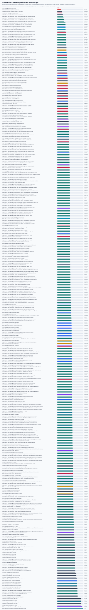

# Apple Metal Campaign 3 Optimization And Evidence Report

Date: 2026-05-06

## Summary

Apple Metal Campaign 3 keeps the existing source-build-only `backend="metal"`
API boundary and adds three benchmark-only experimental lanes:

```text
offline `.metallib` pipeline loading through FASTPAULI_EXPERIMENTAL_METAL_LIBRARY_PATH
private storage plus blit staging through FASTPAULI_EXPERIMENTAL_METAL_OUTPUT_STORAGE=private
GPU compact-consumer reductions through FASTPAULI_EXPERIMENTAL_METAL_COMPACT_CONSUMER=gpu
```

All three lanes are internal evidence tools, not public API. The retained
default remains shared storage for host-output paths, runtime source pipeline
creation, CPU scans for compact consumers, one-word specialization for one
packed word, and generic 2D commutation for two or more packed words.

## Commands

```bash
env FASTPAULI_VALIDATE_METAL=1 uv pip install -e '.[test]' \
  --config-settings=cmake.define.FASTPAULI_ENABLE_CUDA=OFF \
  --config-settings=cmake.define.FASTPAULI_ENABLE_HIP=OFF \
  --config-settings=cmake.define.FASTPAULI_ENABLE_METAL=ON

xcrun xctrace list templates

xcrun xctrace record --template 'Metal System Trace' \
  --time-limit 8s \
  --output /tmp/fastpauli-metal-campaign3-allprocess-benchmark.trace \
  --all-processes \
  --no-prompt

env FASTPAULI_VALIDATE_METAL=1 .venv/bin/python benchmarks/bench_metal_kernels.py \
  --profile smoke \
  --repeat 1 \
  --json

xcrun xctrace export \
  --input /tmp/fastpauli-metal-campaign3-allprocess-benchmark.trace \
  --toc \
  --output /tmp/fastpauli-metal-campaign3-allprocess-benchmark-toc.xml

env FASTPAULI_VALIDATE_METAL=1 .venv/bin/python benchmarks/bench_metal_kernels.py \
  --profile campaign3 \
  --repeat 10 \
  --json \
  --output docs/benchmarks/data/apple_metal_optimization_campaign3_2026-05-06/raw/metal_benchmark_campaign3.json

.venv/bin/python scripts/render_apple_metal_assets.py \
  --data-dir docs/benchmarks/data/apple_metal_optimization_campaign3_2026-05-06 \
  --plot-dir docs/benchmarks/plots
```

## Environment

```text
Host: Mac mini, Apple M4 Pro
CPU cores: 12 total, 8 performance and 4 efficiency
CPU architecture: arm64
Metal device: Apple M4 Pro
Metal storage mode: MTLResourceStorageModeShared
macOS: Version 26.2 (Build 25C56)
Xcode/CLT compiler: AppleClang 21.0.0.21000099
Python: 3.12.12
NumPy: 2.4.4
FastPauli build mode: metal_only
Compiled backends: cpu, metal
Runtime-visible backends during benchmark: cpu, metal
Compiled CPU backends: scalar, neon
oneTBB, AVX2, AVX-512, SVE, CUDA, and HIP: not compiled on this host
```

## Provenance

The checked benchmark JSON records `git_commit` with a `+dirty` suffix and a
`git_provenance` block because Campaign 3 evidence was generated from the
Campaign 3 working tree before the closeout commit existed. The dirty working
tree status is retained in the raw JSON so the evidence is not misrepresented
as coming from the pre-Campaign base revision.

## Results

Timings are median seconds over 10 timed repetitions. CPU rows are same-host
Apple Silicon baselines. Transfer-inclusive rows include operand transfer and
host output. Device-resident rows keep operands on Metal. Reused-output rows
time `commutes_with_device(..., output=existing_matrix)`. The `.metallib` rows
load kernels from an offline library compiled by `xcrun metal` and `xcrun
metallib`; they do not retain the binary artifact in the repository.

| Case | Terms | Words | CPU default | CPU NEON | Metal resident host output | Matrix reuse | Best forced selector | Offline `.metallib` reuse |
| --- | --- | ---: | ---: | ---: | ---: | ---: | ---: | ---: |
| words2 decision | 384x384 | 2 | 1.35230e-04 | 1.23792e-04 | 2.14730e-04 | 1.05334e-04 | generic 2D 1.01209e-04 | 1.04041e-04 |
| private-storage large | 1024x1024 | 1 | 5.88500e-04 | 5.53854e-04 | 2.90897e-04 | 2.13228e-04 | words1 1.19729e-04 | 1.22771e-04 |
| compact-reduction | 512x512 | 1 | 1.63230e-04 | 1.46771e-04 | 1.79708e-04 | 1.97063e-04 | words1 1.31687e-04 | 1.38292e-04 |

| Compact consumer | CPU shared scan | GPU reduction | Decision |
| --- | ---: | ---: | --- |
| total count, 512x512 | 3.33540e-05 | 1.43521e-04 | keep CPU scan default |
| column counts, 512x512 | 3.30624e-05 | 3.71812e-04 | keep CPU scan default |
| row counts, 512x512 | 3.33330e-05 | 1.79479e-04 | keep CPU scan default |

| Storage experiment | Median seconds | Decision |
| --- | ---: | --- |
| shared device-resident host output, 1024x1024 | 2.90897e-04 | retained default |
| private output plus shared blit staging, 1024x1024 | 3.54791e-04 | do not promote |



## Interpretation

The two-word specialized selector did not beat generic 2D in this Campaign 3
A/B case. Combined with mixed Campaign 2 evidence, Campaign 3 keeps
`fp_pairwise_commutation_words2` as a benchmark-only candidate rather than
changing the retained default from generic 2D for words >= 2.

Private output storage plus explicit blit staging is correct, but it is slower
than the shared-storage device-resident host-output path for the 1024x1024
checked case. It remains useful for future experiments that need private
device-only intermediates, but it is not promoted for public host-output
commutation.

The GPU compact-consumer reductions are correct, but the current one-thread per
row/column kernels and atomic total count lose to CPU scans over shared unified
memory for the checked 512x512 matrix. The default compact consumer path stays
on CPU scans. A future GPU compact path would need larger matrices, fused
downstream consumers, or a more aggressive parallel reduction to justify the
extra command-buffer work.

Offline `.metallib` loading is functional and correctness-checked. Steady-state
reuse does not beat runtime-source cached pipelines in the checked rows, so
Campaign 3 keeps the offline library path as a benchmark tool, not a default
policy.

The profiler evidence improved from a stale blocker to a sanitized Metal
System Trace inventory with the FastPauli smoke benchmark present. The trace
TOC exposes GPU counter, shader profiler, shader timeline, Metal command
buffer, and MPS hardware schemas. Raw trace bundles and raw TOCs are not
retained because they include broad process and device metadata. Derived
counter-value CSV retention remains future work once the export path can be
sanitized without committing full trace bundles.

MPSGraph and PyTorch MPS external baselines are explicitly skipped. Neither
surface currently provides an exact sparse Pauli packed-word commutation
mapping with a timing boundary comparable to FastPauli's device-resident rows.

## Checked Evidence

```text
Raw benchmark JSON: docs/benchmarks/data/apple_metal_optimization_campaign3_2026-05-06/raw/metal_benchmark_campaign3.json
Summary JSON: docs/benchmarks/data/apple_metal_optimization_campaign3_2026-05-06/summary.json
Profiler evidence: docs/benchmarks/data/apple_metal_optimization_campaign3_2026-05-06/profiler/metal_campaign3_profiler_evidence.json
README landscape plot: docs/benchmarks/plots/accelerator_landscape_with_rocm.svg
Campaign plan: docs/plans/apple_metal_optimization_campaign3_plan.md
Renderer: scripts/render_apple_metal_assets.py
```

## Remaining Headroom

1. Keep the two-word selector benchmark-only until it wins across more shapes
   and at least one additional Apple Silicon generation.
2. Revisit GPU compact consumers only for much larger matrices, fused
   downstream operations, or a parallel block-reduction design that avoids the
   current one-thread-per-row/column bottleneck.
3. Use private storage for future device-only intermediate workflows, not for
   current host-output commutation.
4. Capture sanitized derived shader-counter value exports if Instruments can
   emit narrow CSVs without retaining raw trace bundles or process inventories.
5. Add MPSGraph or PyTorch MPS baselines only if an exact sparse Pauli
   commutation mapping becomes available without measuring a different
   materialized dense problem.
