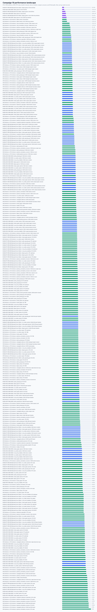
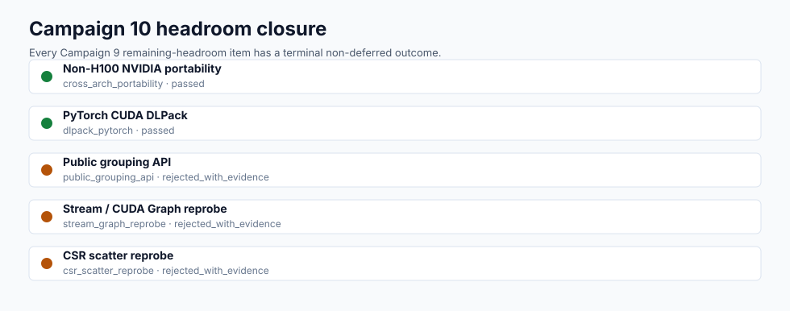

# CUDA Cross-Architecture Campaign 10 Report

Date: 2026-04-29

Campaign 10 closes every remaining-headroom item from Campaign 9 with checked
A100 and RTX PRO 6000 Blackwell source-build evidence. The campaign replaces
the Campaign 9 non-H100 blocker with real non-H100 NVIDIA validation, adds
PyTorch CUDA DLPack coverage, and rejects richer public grouping, stream/CUDA
Graph, and CSR scatter work where fresh evidence does not justify new public
surface or retained-kernel work.

## Evidence Map

```text
summary: docs/benchmarks/data/cuda_cross_architecture_campaign10_2026-04-29/summary.json
raw data: docs/benchmarks/data/cuda_cross_architecture_campaign10_2026-04-29/raw/
logs: docs/benchmarks/data/cuda_cross_architecture_campaign10_2026-04-29/logs/
profiler exports: docs/benchmarks/data/cuda_cross_architecture_campaign10_2026-04-29/profiler/
plots: docs/benchmarks/plots/cuda_campaign10_*.svg
```





## Final Outcomes

| Campaign 9 headroom item | Campaign 10 outcome | Evidence |
| --- | --- | --- |
| Non-H100 NVIDIA portability | passed | A100 `sm_80` and RTX PRO 6000 Blackwell `sm_120` source builds compiled and ran. |
| PyTorch CUDA DLPack coverage | passed | PyTorch CUDA consumed `DeviceCommutationMatrix.__dlpack__` on both hosts. |
| Public grouping API | rejected with evidence | `conflict_degrees(axis=None|0|1)` remains the accepted compact public summary surface. |
| Stream/CUDA Graph reprobe | rejected with evidence | Nsight Systems shows launch overhead is not dominant. |
| CSR scatter reprobe | rejected with evidence | Retained compact consumers do not need full CSR edge-list materialization. |

The checked Campaign 10 summary rejects `final_status: "deferred"` and covers
all five items.

## Hardware

| Host lane | GPU | Compute capability | Requested architecture | CUDA toolkit | Driver/runtime | Result |
| --- | --- | --- | --- | --- | --- | --- |
| A100 | NVIDIA A100-SXM4-80GB | 8.0 | `80` | 12.8.93 | NVIDIA driver 580.126.09, CUDA driver API 13.0 / runtime 12.8 | compiled and ran |
| RTX-class | NVIDIA RTX PRO 6000 Blackwell Server Edition | 12.0 | `120` | 12.8.93 | NVIDIA driver 580.126.09, CUDA driver API 13.0 / runtime 12.8 | compiled and ran |

Both hosts ran `scripts/validate.py` with `FASTPAULI_VALIDATE_CUDA=1` and the
host-specific `FASTPAULI_CUDA_ARCHITECTURES` value. The validation logs are
checked in as `validate_a100.log` and `validate_rtxpro6000blackwell.log`.
Host inventory logs record the `nvidia-smi` and `nvcc` outputs.

## Correctness And Sanitizers

PyTorch CUDA and CuPy DLPack consumer tests passed on both hosts. Compute
Sanitizer memcheck ran the full Phase 11 CUDA test file on both hosts:

```text
A100 memcheck: 34 passed, 3 skipped, ERROR SUMMARY: 0 errors
RTX PRO 6000 Blackwell memcheck: 34 passed, 3 skipped, ERROR SUMMARY: 0 errors
```

Targeted `initcheck`, `synccheck`, and `racecheck` passes ran on the retained
kernel tests on both hosts:

```text
initcheck: 5 passed, ERROR SUMMARY: 0 errors
synccheck: 5 passed, ERROR SUMMARY: 0 errors
racecheck: 5 passed, 0 hazards displayed
```

The memcheck logs also emit nanobind reference-leak diagnostics at interpreter
shutdown. Compute Sanitizer reports zero CUDA memory errors. Treat the nanobind
diagnostics as a Python binding lifecycle follow-up, not as Campaign 10 CUDA
kernel correctness failure evidence.

## Portability Performance

Pairwise commutation at 8192x8192 terms:

| Host | CPU scalar | CPU optimized | CUDA transfer-inclusive | CUDA device-resident | Device output reuse | Compact graph consumer |
| --- | ---: | ---: | ---: | ---: | ---: | ---: |
| A100 | 0.311759 s | 0.068015 s | 0.015406 s | 0.014460 s | 0.005124 s | 0.001043 s |
| RTX PRO 6000 Blackwell | 0.293578 s | 0.035080 s | 0.006399 s | 0.006304 s | 0.002976 s | 0.000558 s |

At 2048x2048 terms, the RTX PRO 6000 Blackwell path measured
0.000249 s transfer-inclusive and 0.000200 s device-resident, while A100
measured 0.000513 s transfer-inclusive and 0.000495 s device-resident.

These are source-build hardware results, not CUDA wheel release claims.

## DLPack Consumers

At 2048x2048 terms:

| Host | PyTorch `from_dlpack` | CuPy `from_dlpack` | CuPy CUDA Array Interface | PyTorch sum total | CuPy DLPack sum total |
| --- | ---: | ---: | ---: | ---: | ---: |
| A100 | 0.000001202 s | 0.000002983 s | 0.000004139 s | 0.000077111 s | 0.001768252 s |
| RTX PRO 6000 Blackwell | 0.000001070 s | 0.000002240 s | 0.000003030 s | 0.000033250 s | 0.001349906 s |

PyTorch CUDA can consume the read-only dense commutation matrix DLPack export
on both non-H100 lanes. The export remains read-only and lifetime-managed by
the `DeviceCommutationMatrix` object.

## Public Grouping Decision

Campaign 10 rejects a true public CUDA grouping API. The accepted public compact
summary remains `DeviceCommutationMatrix.conflict_degrees(axis=None|0|1)`.

```text
A100 conflict_degrees(axis=None): 0.000090925 s
A100 dense_to_host_plus_numpy_conflicts: 0.006950354 s
RTX PRO 6000 Blackwell conflict_degrees(axis=None): 0.000049529 s
RTX PRO 6000 Blackwell dense_to_host_plus_numpy_conflicts: 0.002591294 s
```

The compact public summary path is already much cheaper than dense host export
plus host-side conflict processing for the measured workload. No exact public
grouping return, ordering, ownership, or documentation contract has been
accepted, so adding a richer grouping API would increase public surface without
a retained consumer requirement.

Decision doc:
`docs/plans/cuda_grouping_public_api_campaign10_contract.md`.

## Stream And CUDA Graph Decision

Nsight Systems was available on both hosts. Nsight Compute was not installed on
either non-H100 host, so the latest counter-level evidence remains Campaign 9
H100 privileged Nsight Compute output. The `ncu` availability checks are
recorded in `ncu_unavailable_a100.log` and
`ncu_unavailable_rtxpro6000blackwell.log`.

| Host | `cudaLaunchKernel` CUDA API share | Dominant CUDA API costs | GPU memory time |
| --- | ---: | --- | --- |
| A100 | 0.5% | `cudaMemcpy` 36.2%, `cudaMalloc` 30.5%, `cudaHostRegister` 24.1% | 99.7% Device-to-Host |
| RTX PRO 6000 Blackwell | 0.8% | `cudaMalloc` 35.4%, `cudaMemcpy` 31.1%, `cudaHostRegister` 21.7% | 99.8% Device-to-Host |

Launch overhead is not dominant for the retained compact consumer workloads.
Public stream-aware execution and CUDA Graph replay remain rejected until a
stream/lifetime contract exists and profiler evidence shows launch/replay costs
dominate after allocation and materialization boundaries have already been
removed.

Decision doc:
`docs/plans/cuda_stream_graph_campaign10_decision.md`.

## CSR Scatter Decision

Full CSR export remains an unretained baseline, while compact graph and
grouping consumers remain the retained path.

| Host | Compact graph consumer | Compact grouping consumer | Full CSR export baseline |
| --- | ---: | ---: | ---: |
| A100 8192x8192 | 0.001043 s | 0.001057 s | 0.101427 s |
| RTX PRO 6000 Blackwell 8192x8192 | 0.000558 s | 0.000574 s | 0.056712 s |

No retained Campaign 10 consumer requires full CSR edge lists, so CSR scatter
tuning remains rejected.

Decision doc:
`docs/plans/cuda_csr_scatter_campaign10_decision.md`.

## Residual Risk And Next Work

Campaign 10 leaves no Campaign 9 headroom item in a deferred state. Remaining
future work is not a blocker for CUDA implementation continuity:

```text
CUDA wheels and release packaging remain deliberately separate from source-build evidence.
RTX 6000 Ada, L4, A10, or other sm_86/sm_89 hosts can add more portability lanes.
Non-H100 Nsight Compute counter evidence should be collected when ncu is installed and permissions allow it.
The nanobind reference-leak diagnostics should be investigated as a binding lifecycle hardening task.
```

Do not broaden FastPauli claims beyond the checked source-build evidence above.
