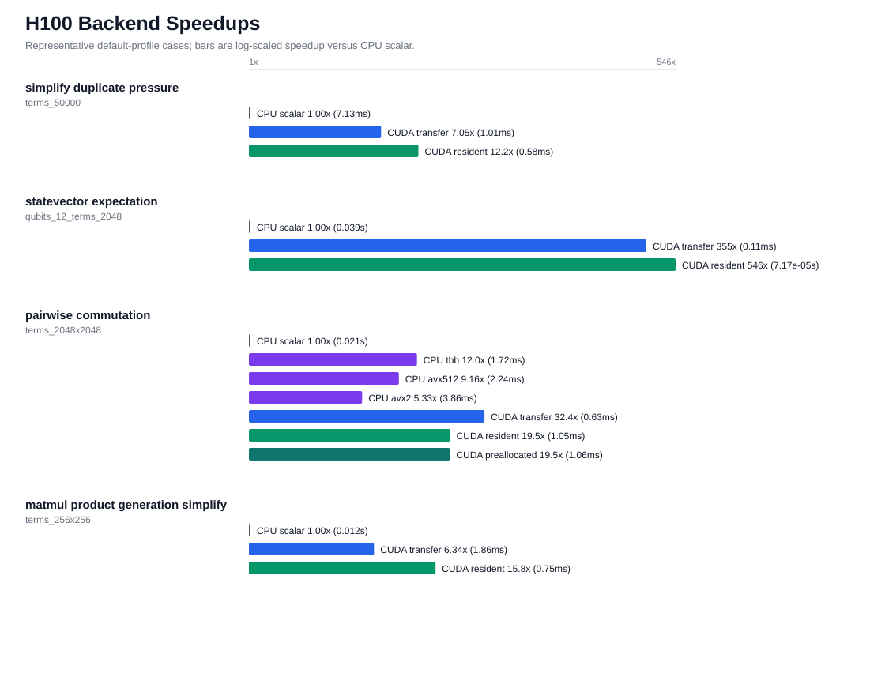
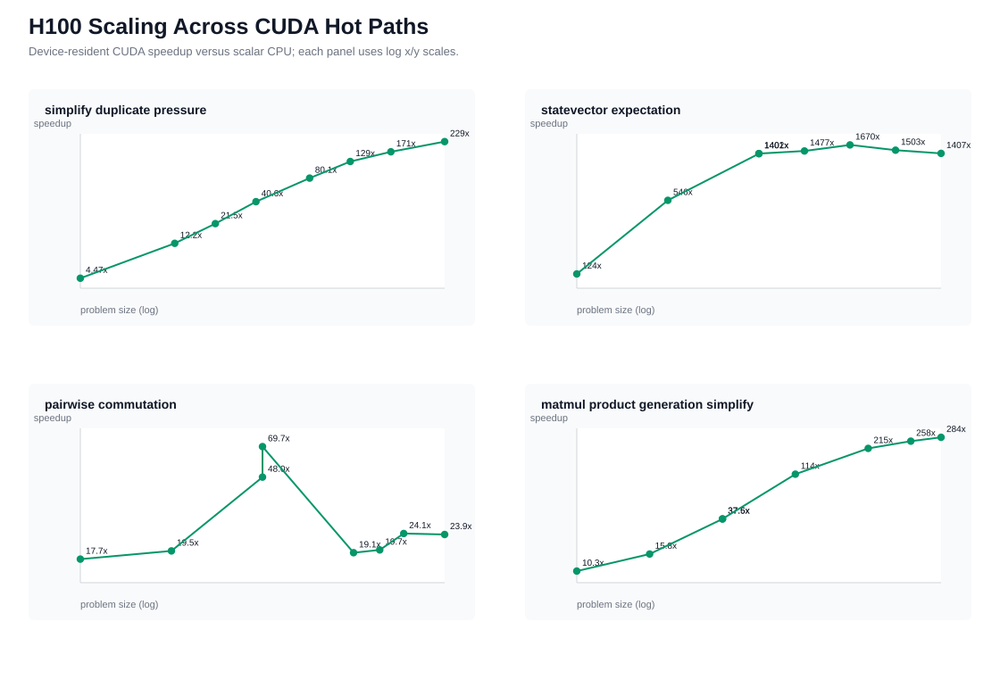
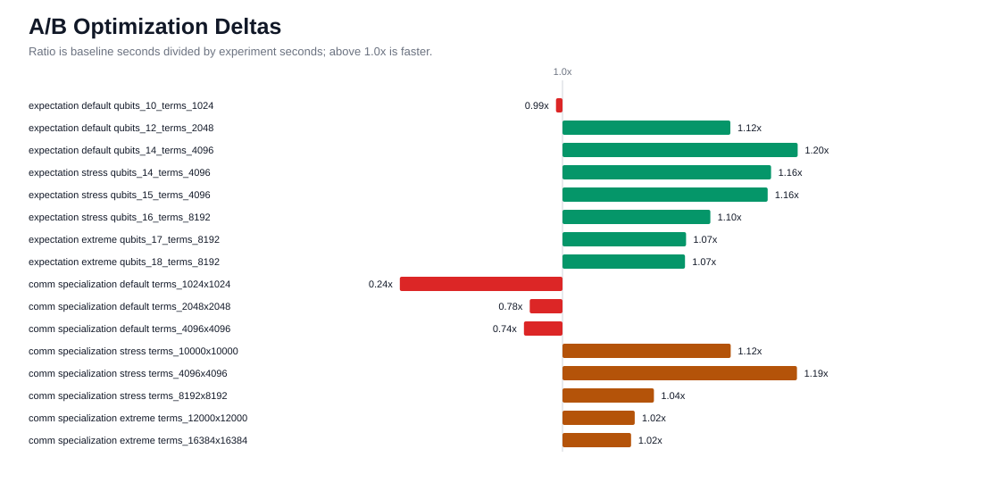
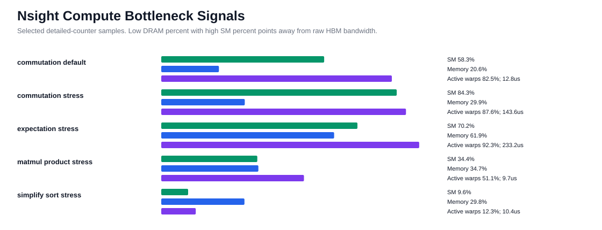
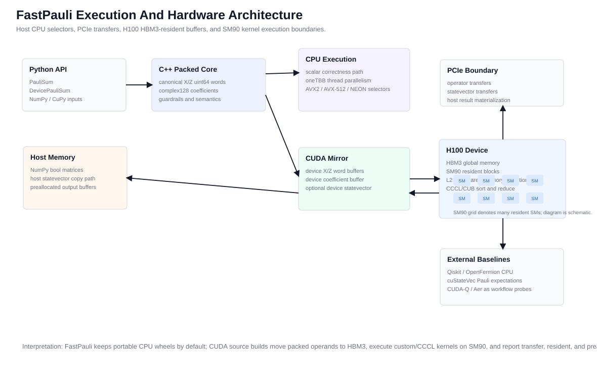
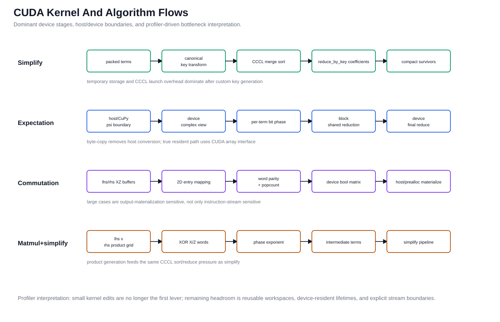

# FastPauli CUDA Deep Optimization Report - NVIDIA H100 PCIe - 2026-04-28

## Executive Summary

This report closes the post-Phase 11 CUDA deep-optimization pass governed by
`docs/plans/cuda_deep_optimization_plan.md`. The retained code change removes
an avoidable host-side statevector conversion before CUDA expectation
statevector copies. It preserves public semantics, keeps the same kernel math,
and improved CUDA statevector expectation timings by 7.1-19.6% on the
meaningful default/stress/extreme device-resident cases and by 4.8-22.3% on
transfer-inclusive cases. The smallest default case was flat/noisy
(-0.9% resident, +0.8% transfer-inclusive), so the retained claim is scale
qualified.

The main rejected kernel experiment was a one- and two-word 2D commutation grid
specialization. It passed CUDA tests and memcheck, but it regressed default
preallocated commutation by 22-76% and made default resident timings much worse.
Large stress/extreme preallocated cases improved by only 1-12%, so the added
kernel complexity is not justified.

The final evidence set includes smoke/default/stress/extreme CUDA scaling,
privileged Nsight Compute passes for custom kernels and CCCL/Thrust paths,
Nsight Systems traces, Compute Sanitizer memcheck/racecheck/initcheck/synccheck,
cuobjdump PTX/SASS inventory, open-source competitor installs, a cuStateVec
statevector expectation comparison where semantics match, and checked-in plots
generated from raw JSON artifacts.

## Visual Summary













Visuals are deterministic SVGs rendered by
`scripts/render_cuda_deep_report_assets.py` from checked-in JSON under
`docs/benchmarks/data/cuda_deep_optimization_h100_2026-04-28/`. No
`gpt-image-2` image was used for this report because exact labels, numeric
traceability, and source-control reproducibility were more important than
illustrative styling. The architecture diagram includes host CPU selectors,
thread/SIMD paths, PCIe movement, H100 HBM3/global-memory residency, SM90
kernel execution, and materialization boundaries. The kernel-flow diagram
spells out the dominant algorithm stages and the profiler interpretation used
to accept or reject optimization directions.

## Environment

- Final benchmark host: Ubuntu 22.04 H100 instance,
  hostname `0151-dsm-prxmx30065`.
- GPU: NVIDIA H100 PCIe, compute capability 9.0, 81079 MiB.
- Driver: 580.126.09.
- CUDA toolkit: 12.9.86.
- FastPauli CUDA runtime metadata: CUDA runtime 12.9, driver API 13.0,
  compiled architecture `90`.
- Nsight Systems: 2025.1.3.140.
- Nsight Compute: 2025.2.1.0.
- Compute Sanitizer: 2025.2.1.0.
- Host compiler: `/usr/bin/g++` 11.4.0.
- CPU: Intel(R) Xeon(R) Platinum 8352Y CPU @ 2.20GHz.
- Available CPU backends: scalar, oneTBB, AVX2, AVX-512.
- oneTBB version: 2021.5.0.
- Python: 3.10.12.
- NumPy: 2.2.6.
- Raw benchmark JSON was captured from H100 experiment clones rooted at
  baseline commit `aeeebbaa2d3d33b7d414974075911af56e16451a`.
- Experiment patch identity is recorded below because the A/B clones were
  intentionally uncommitted during hillclimbing.

## Revision Provenance

| Slice | Baseline Commit | Experiment Identity | Dirty Status | Raw Artifacts |
| --- | --- | --- | --- | --- |
| Baseline profiles | `aeeebbaa2d3d33b7d414974075911af56e16451a` | clean tree | clean | `h100_*_aeeebba`, `sudo_ncu_aeeebba` |
| Retained statevector byte-copy | `aeeebbaa2d3d33b7d414974075911af56e16451a` | stable patch-id `d8da88a96579f20118cdb2bbc955a9c6099e942c` | uncommitted experiment patch | `expectation_bytecopy_*.json`, final scaling, competitor refresh |
| Rejected commutation specialization | `aeeebbaa2d3d33b7d414974075911af56e16451a` | stable patch-id `ebaa400b2fd184cae3ffbeb4cae7111e28061071` | uncommitted experiment patch | `comm_specialized_*.json` |

The checked-in summary JSON repeats this provenance under
`experiment_provenance`. The raw benchmark files still carry the baseline
`git_commit` because they were emitted before the experiment diffs were
committed; the stable patch IDs above are the reproducibility identifiers for
the A/B changes.

## Commands

CUDA source build on the retained experiment clone:

```bash
PATH=/usr/local/cuda-12.9/bin:$PATH \
CUDACXX=/usr/local/cuda-12.9/bin/nvcc \
CUDAHOSTCXX=/usr/bin/g++ \
.venv/bin/python -m pip install -e ".[test]" \
  --config-settings=cmake.define.FASTPAULI_ENABLE_CUDA=ON \
  --config-settings=cmake.define.FASTPAULI_CUDA_ARCHITECTURES=90 \
  --config-settings=cmake.define.CMAKE_CUDA_HOST_COMPILER=/usr/bin/g++
```

Baseline CUDA deep ladder:

```bash
.venv/bin/python scripts/cuda_deep_profile.py \
  --execute --json --profile smoke --competitor-set all --repeat 1 --warmup 0 \
  --continue-on-error --output-root artifacts/cuda_deep_profile/h100_smoke_aeeebba
.venv/bin/python scripts/cuda_deep_profile.py \
  --execute --json --profile default --competitor-set all --repeat 3 --warmup 1 \
  --continue-on-error --output-root artifacts/cuda_deep_profile/h100_default_aeeebba
.venv/bin/python scripts/cuda_deep_profile.py \
  --execute --json --profile stress --competitor-set all --repeat 3 --warmup 1 \
  --continue-on-error --output-root artifacts/cuda_deep_profile/h100_stress_aeeebba
.venv/bin/python scripts/cuda_deep_profile.py \
  --execute --json --profile extreme --competitor-set all --repeat 3 --warmup 1 \
  --continue-on-error --output-root artifacts/cuda_deep_profile/h100_extreme_aeeebba
```

These initial ladder commands intentionally used `--continue-on-error` because
Nsight Compute permissions were not yet configured. Reproduction runs that are
intended to prove completion should add `--require-profiler-artifacts` after
profiler permissions are in place; the missing detailed-counter coverage from
the initial run was replaced by the privileged Nsight Compute pass below.

Privileged Nsight Compute replacement passes used the same benchmark subprocess
isolation as the checked-in harness. For CCCL/Thrust-heavy operations the
kernel-name filter was deliberately omitted and several launches were captured:

```bash
sudo env HOME=<private-path> \
  TMPDIR=<private-path> \
  PATH=/usr/local/cuda-12.9/bin:$PATH \
  ncu --target-processes all --set detailed \
  --section SpeedOfLight --section MemoryWorkloadAnalysis --section LaunchStats \
  --section Occupancy --section SchedulerStats --section WarpStateStats \
  --kernel-name-base function --launch-count 16 --force-overwrite \
  --export <private-path> \
  .venv/bin/python benchmarks/bench_cuda_scaling.py \
  --profile stress --operation simplify_duplicate_pressure --repeat 1 --warmup 0 --json
```

The replacement Nsight Compute artifact root was
`<private-path>`.
It contains detailed reports for `simplify_default`, `statevector_default`,
`pairwise_default`, `pairwise_stress`, `matmul_default`, `simplify_stress`,
`statevector_stress`, and `matmul_stress`.

Final retained scaling evidence:

```bash
.venv/bin/python benchmarks/bench_cuda_scaling.py --profile smoke --repeat 1 --warmup 0 --json
.venv/bin/python benchmarks/bench_cuda_scaling.py --profile default --repeat 5 --warmup 2 --json
.venv/bin/python benchmarks/bench_cuda_scaling.py --profile stress --repeat 5 --warmup 2 --json
.venv/bin/python benchmarks/bench_cuda_scaling.py --profile extreme --repeat 3 --warmup 1 --json
```

Competitor setup and final competitor benchmark:

```bash
.venv/bin/python -m pip install "qiskit>=1.0" "openfermion>=1.7.1" \
  cupy-cuda12x cuquantum-python-cu12 cudaq qiskit-aer-gpu
MPLCONFIGDIR=/tmp/fastpauli-mpl PATH=/usr/local/cuda-12.9/bin:$PATH \
  .venv/bin/python benchmarks/bench_competitive_baselines.py \
  --repeat 3 --warmup 1 --json
```

Historical report asset rendering (requires the separately retained private raw
benchmark archive; the command is not runnable from a public clone alone):

```bash
python scripts/render_cuda_deep_report_assets.py \
  --raw-dir docs/benchmarks/data/cuda_deep_optimization_h100_2026-04-28/raw \
  --summary-output docs/benchmarks/data/cuda_deep_optimization_h100_2026-04-28/summary.json \
  --plot-dir docs/benchmarks/plots
```

## Validation

Focused retained-change validation used:

```bash
cd <private-path>
PATH=/usr/local/cuda-12.9/bin:$PATH \
CUDACXX=/usr/local/cuda-12.9/bin/nvcc \
CUDAHOSTCXX=/usr/bin/g++ \
FASTPAULI_VALIDATE_CUDA=1 FASTPAULI_CUDA_ARCHITECTURES=90 \
  .venv/bin/python scripts/validate.py
compute-sanitizer --tool memcheck --error-exitcode 99 \
  .venv/bin/python -m pytest tests/test_phase11_cuda_kernels.py -q
```

- Synced retained-change full H100 validation after review fixes:
  CPU-only suite `171 passed, 12 skipped`; CUDA-enabled suite
  `182 passed, 1 skipped`; CUDA transfer pytest `5 passed`; CUDA kernel pytest
  `14 passed`; CUDA scaling smoke emitted correctness-checked JSON; source
  distribution smoke built `fastpauli-0.1.0.tar.gz`.
- Statevector byte-copy experiment focused CUDA pytest before the final full
  validation: 15 passed, 1 skipped.
- Statevector byte-copy experiment Compute Sanitizer memcheck:
  13 passed, 1 skipped, `ERROR SUMMARY: 0 errors`.

Focused rejected-experiment validation used the same CUDA source-build
environment in `<private-path>`:

```bash
compute-sanitizer --tool memcheck --error-exitcode 99 \
  .venv/bin/python -m pytest tests/test_phase11_cuda_kernels.py -q
```

- Rejected commutation specialization focused CUDA pytest:
  15 passed, 1 skipped.
- Rejected commutation specialization Compute Sanitizer memcheck:
  13 passed, 1 skipped, `ERROR SUMMARY: 0 errors`.
- Baseline ladder sanitizer logs:
  memcheck/initcheck/synccheck reported `ERROR SUMMARY: 0 errors`; racecheck
  reported `RACECHECK SUMMARY: 0 hazards displayed`.
- Local harness tests after code/doc asset changes:
  `tests/test_cuda_deep_report_assets.py`,
  `tests/test_competitive_baselines_benchmark.py`, and
  `tests/test_cuda_deep_profile_script.py` passed.

## Retained Optimization

The retained CUDA source change is deliberately host-side. The previous
`DevicePauliSum::expectation_statevector(std::complex<T>)` path allocated and
filled a temporary `std::vector<thrust::complex<T>>` before copying to device.
The retained path copies the `std::complex<T>` span bytes directly into the
device `thrust::complex<T>` buffer after compile-time size checks. This removes
one O(statevector length) host allocation and conversion loop while preserving
the same CUDA kernel launch, reduction, synchronization, and public API timing
boundary.

| Profile | Scale | Transfer Ratio | Resident Ratio | Decision |
| --- | --- | ---: | ---: | --- |
| default | qubits_10_terms_1024 | 1.008x | 0.991x | flat/noisy small case |
| default | qubits_12_terms_2048 | 1.048x | 1.120x | keep |
| default | qubits_14_terms_4096 | 1.223x | 1.196x | keep |
| stress | qubits_14_terms_4096 | 1.126x | 1.165x | keep |
| stress | qubits_15_terms_4096 | 1.128x | 1.161x | keep |
| stress | qubits_16_terms_8192 | 1.067x | 1.098x | keep |
| extreme | qubits_17_terms_8192 | 1.064x | 1.072x | keep |
| extreme | qubits_18_terms_8192 | 1.084x | 1.071x | keep |

Ratios are baseline seconds divided by byte-copy seconds. Values above 1.0x
are faster.

## Rejected Optimization

The 2D commutation-grid specialization removes the generic per-entry division
and loop for one- and two-word packed Pauli terms. It was tested only after
the preallocated-output path had separated host materialization from kernel
execution. The experiment was correct, but not stable enough to retain:

| Profile | Scale | Preallocated Ratio | Decision |
| --- | --- | ---: | --- |
| default | terms_1024x1024 | 0.239x | reject: large regression |
| default | terms_2048x2048 | 0.777x | reject: regression |
| default | terms_4096x4096 | 0.737x | reject: regression |
| stress | terms_4096x4096 | 1.195x | insufficient alone |
| stress | terms_8192x8192 | 1.039x | marginal |
| stress | terms_10000x10000 | 1.120x | insufficient alone |
| extreme | terms_12000x12000 | 1.020x | marginal |
| extreme | terms_16384x16384 | 1.016x | marginal |

The regression pattern matches the earlier Phase 11 hillclimb conclusion:
large dense commutation is more constrained by output materialization,
registration/copy behavior, and host result shape than by a simple instruction
stream tweak. The retained path remains the generic kernel plus the already
exposed preallocated output API.

## Nsight Findings

The initial non-sudo Nsight Compute commands hit `ERR_NVGPUCTRPERM`; the
replacement pass ran with `sudo` and produced detailed `.ncu-rep` artifacts.
The harness was fixed so simplify and matmul+simplify profile all operation-
local launches instead of depending on brittle CCCL/Thrust kernel-name regexes.

Selected detailed-counter samples:

| Sample | Kernel Class | Duration | SM Throughput | Memory Throughput | Active Warps | Interpretation |
| --- | --- | ---: | ---: | ---: | ---: | --- |
| pairwise default | custom commutation | 12.8 us | 58.3% | 20.6% | 82.5% | custom kernel is well occupied; output path matters |
| pairwise stress | custom commutation | 143.6 us | 84.3% | 29.9% | 87.6% | kernel scales; host copy dominates end-to-end large matrix |
| statevector stress | custom expectation | 233.2 us | 70.2% | 61.9% | 92.3% | high occupancy; host statevector preparation still mattered |
| matmul stress | custom product | 9.7 us | 34.4% | 34.7% | 51.1% | product kernel is not the end-to-end limiter |
| simplify stress | CCCL merge-sort | captured | multiple | multiple | multiple | sort/reduce pipeline dominates simplify-style workloads |

Nsight Systems traces from the baseline ladder separate CUDA API, allocation,
synchronization, transfer, kernel, and host phases. They reinforce the same
model: custom kernels are not the only limiter. Dense commutation has a large
result materialization cost; simplify and matmul+simplify are governed by
CCCL/Thrust sort/reduce/compaction stages; statevector expectation benefits
from reducing host-side preparation.

cuobjdump SASS/PTX inventories were captured for the CUDA extension. `nvdisasm`
reported that the Python extension shared object was not a supported direct ELF
input for its mode. No raw PTX or inline PTX was retained because profiling did
not show a compiler code-generation defect that justified architecture-gated
assembly.

## Final FastPauli Scaling

The following tables show final retained timings. CUDA transfer-inclusive
includes host/device transfers and host result conversion where applicable.
CUDA resident keeps operators resident; statevector expectation still copies
the host statevector unless a device-pointer interop path is used.

### Default

| Case | Scale | CPU Scalar | CPU Optimized | CUDA Transfer | CUDA Resident | CUDA Preallocated |
| --- | --- | ---: | --- | ---: | ---: | ---: |
| simplify_duplicate_pressure | terms_50000 | 0.007131 | n/a | 0.001012 | 0.000583 | n/a |
| statevector_expectation | qubits_12_terms_2048 | 0.039143 | n/a | 0.000110 | 0.0000717 | n/a |
| pairwise_commutation | terms_2048x2048 | 0.020555 | tbb 0.001717; avx512 0.002243; avx2 0.003860 | 0.000634 | 0.001053 | 0.001056 |
| matmul_product_generation_simplify | terms_256x256 | 0.011775 | n/a | 0.001856 | 0.000747 | n/a |

### Stress

| Case | Scale | CPU Scalar | CPU Optimized | CUDA Transfer | CUDA Resident | CUDA Preallocated |
| --- | --- | ---: | --- | ---: | ---: | ---: |
| simplify_duplicate_pressure | terms_1000000 | 0.185055 | n/a | 0.007410 | 0.001433 | n/a |
| statevector_expectation | qubits_16_terms_8192 | 2.419817 | n/a | 0.001622 | 0.001449 | n/a |
| pairwise_commutation | terms_10000x10000 | 0.565021 | tbb 0.108312; avx512 0.140766; avx2 0.171826 | 0.029794 | 0.028617 | 0.007240 |
| matmul_product_generation_simplify | terms_2048x2048 | 1.080903 | n/a | 0.018106 | 0.005017 | n/a |

### Extreme

| Case | Scale | CPU Scalar | CPU Optimized | CUDA Transfer | CUDA Resident | CUDA Preallocated |
| --- | --- | ---: | --- | ---: | ---: | ---: |
| simplify_duplicate_pressure | terms_5000000 | 1.144631 | n/a | 0.075939 | 0.004992 | n/a |
| statevector_expectation | qubits_18_terms_8192 | 9.782889 | n/a | 0.007039 | 0.006955 | n/a |
| pairwise_commutation | terms_16384x16384 | 1.515832 | tbb 0.285435; avx512 0.356249; avx2 0.465803 | 0.070800 | 0.063548 | 0.018508 |
| matmul_product_generation_simplify | terms_4096x4096 | 4.560530 | n/a | 0.029805 | 0.016073 | n/a |

## Competitor Baselines

Installed competitor package versions:

| Package | Version | Status |
| --- | --- | --- |
| Qiskit | 2.4.1 | available |
| OpenFermion | 1.7.1 | available |
| CuPy CUDA 12 | 13.4.1 | available |
| cuQuantum Python CUDA 12 | 24.8.0 | available |
| CUDA-Q | 0.12.0.post1 | importable; no primitive-equivalent sparse-Pauli benchmark retained |
| Qiskit Aer GPU | 0.15.1 | import failed: `convert_to_target` missing from installed Qiskit provider stack |

Correctness-checked competitor timings:

| Case | FastPauli Timing | Competitor | Competitor Timing | Boundary |
| --- | ---: | --- | ---: | --- |
| simplify | 0.000591 | Qiskit SparsePauliOp.simplify | 0.000721 | CPU primitive |
| multiply | 0.011309 | OpenFermion QubitOperator multiply+compress | 0.208555 | CPU primitive with OpenFermion canonicalization |
| qiskit_grouping | 0.000321 | Qiskit group_commuting | 0.076422 | CPU framework primitive |
| cuquantum_statevector_expectation | 0.000204 FastPauli CUDA device-statevector resident; 0.000225 FastPauli operator-resident host-statevector | cuStateVec Pauli-basis expectations | 0.008101 resident, 0.008202 transfer-inclusive | device-statevector cuStateVec primitive, host coefficient combine |

The cuStateVec comparison is semantically matched for statevector Pauli
expectation: cuStateVec computes one real expectation per Pauli string on the
same normalized statevector, and the benchmark combines those values with
FastPauli's complex coefficients on the host. It is not a substitute for
simplify, commutation, or sparse-Pauli multiplication.

The FastPauli CUDA resident value in this table uses the existing
CUDA-array-interface path with a reused CuPy statevector, so it is comparable to
the cuStateVec reused-device-statevector boundary. The host-statevector number
keeps only the Pauli operator resident and copies `psi` inside each FastPauli
call; it is reported separately to avoid mixing timing boundaries.

## Remaining Headroom

- **Simplify and matmul+simplify:** the next meaningful lever is an explicit
  reusable CCCL/CUB workspace and reduction pipeline, not raw PTX. The public
  lifetime/ownership API for workspaces should be designed before shipping this.
- **Statevector expectation:** the retained byte-copy path removes a host loop.
  Further gains likely require a public device-statevector/high-throughput API
  that avoids host statevector copies and possibly a fused deterministic
  reduction mode.
- **Commutation:** the preallocated output path remains the high-throughput API.
  Further kernel specialization is only worth revisiting if output packing,
  async transfer, or stream-aware APIs change the materialization boundary.
- **External GPU baselines:** CUDA-Q and Aer GPU are framework-level baselines,
  not primitive-equivalent sparse-Pauli paths. They should be benchmarked only
  for documented end-to-end workflows.
- **Future hardware:** HIP, Metal, Apple Silicon GPU/MPS, A100, RTX Pro 6000,
  and AMD GPUs remain future backend or portability targets; this report makes
  only H100 source-build claims.

## Source Artifacts

- Summary JSON:
  `docs/benchmarks/data/cuda_deep_optimization_h100_2026-04-28/summary.json`.
- Raw JSON:
  `docs/benchmarks/data/cuda_deep_optimization_h100_2026-04-28/raw/`.
- Plot renderer:
  `scripts/render_cuda_deep_report_assets.py`.
- Plots:
  `docs/benchmarks/plots/cuda_deep_optimization_h100_path_speedups.svg`,
  `docs/benchmarks/plots/cuda_deep_optimization_h100_scaling.svg`,
  `docs/benchmarks/plots/cuda_deep_optimization_h100_optimization_deltas.svg`,
  `docs/benchmarks/plots/cuda_deep_optimization_h100_profiler_bottlenecks.svg`,
  `docs/benchmarks/plots/cuda_deep_optimization_architecture.svg`, and
  `docs/benchmarks/plots/cuda_deep_optimization_kernel_flows.svg`.
