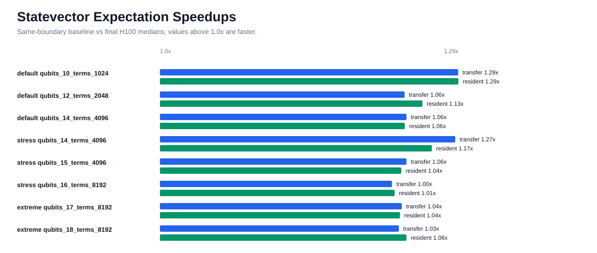
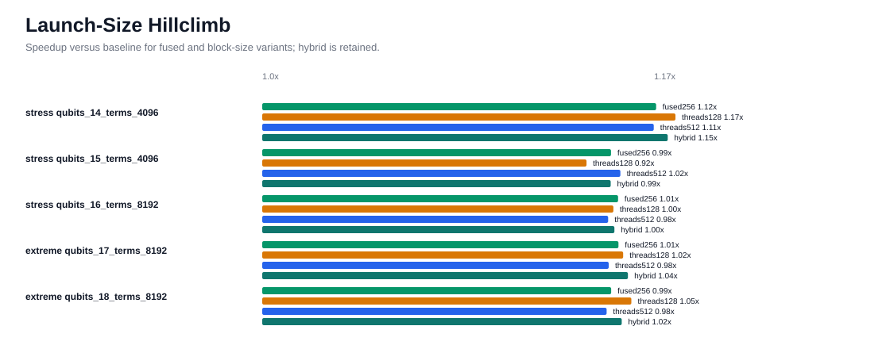
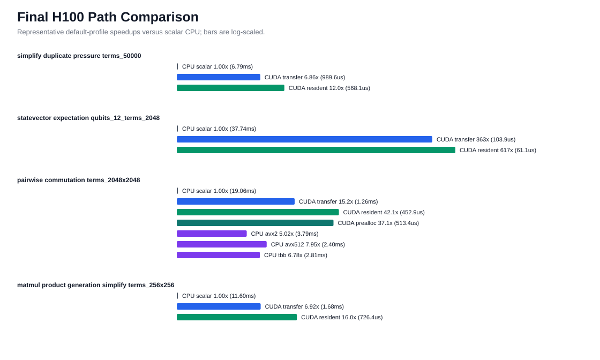
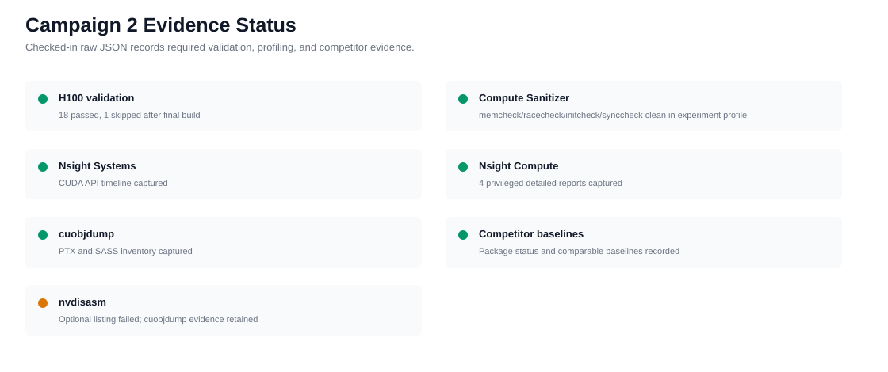

# FastPauli H100 CUDA Deep Optimization Campaign 2

Date: 2026-04-28

Remote artifact root:
`<private-path>`

Checked-in data:
`docs/benchmarks/data/cuda_deep_optimization_h100_campaign2_2026-04-28/`

## Executive Summary

Campaign 2 retained a CUDA statevector expectation optimization and benchmark
harness hardening. The retained kernel change fuses final coefficient
accumulation into the expectation kernel, avoiding the previous per-call
`num_terms` temporary array and follow-up Thrust reduction. The public API,
default-stream synchronization boundary, CUDA-array-interface path, and
documented floating-point tolerance boundary remain unchanged.

The strongest refreshed statevector gains were 1.29x resident /
1.29x transfer-inclusive for `qubits_10_terms_1024` and 1.17x resident /
1.27x transfer-inclusive for the stress `qubits_14_terms_4096` case.
The largest refreshed extreme case reported 1.06x resident speedup. The report
treats the retained change as a narrow statevector-path improvement rather than
a broad CUDA speedup claim.

No public CUDA workspace, stream, async, device-output commutation, or bit-packed
output API was introduced. Those remain deferred because this campaign did not
produce enough evidence to justify changing public lifetime or materialization
semantics.

## Environment

| Item | Value |
| --- | --- |
| GPU | NVIDIA H100 PCIe |
| Compute capability | 9.0 |
| Driver | 580.126.09 |
| CUDA toolkit | 12.9.86 |
| Baseline revision | `f42afafdb884353bd977eeeaeaefa04a60366fb7` |
| Final experiment revision | `084bed2b071cd433ae383f62eb47f79f971908ff` |
| Host | recorded in remote `host.txt`, `gpu.csv`, `lscpu.txt`, `nvidia-smi-q.txt` |

## Retained Changes

| Change | Why retained |
| --- | --- |
| Fused statevector accumulator | Removes temporary term-value storage and the final Thrust reduction from CUDA expectation. |
| Size-gated expectation launch sizing | Keeps 256 threads per term by default and uses 128 threads only for statevectors with at least `2^17` amplitudes. |
| CUDA benchmark `--output` support | Lets H100 benchmark runs write raw JSON artifacts directly. |
| Campaign-2 benchmark fields | Adds p10/p90, repeat/warmup counts, and workspace/materialization metadata. |

## Rejected Or Deferred

| Path | Decision |
| --- | --- |
| Global 512-thread expectation launch | Rejected. Slower than the fused 256-thread kernel on stress and extreme cases. |
| Global 128-thread expectation launch | Rejected globally. It helped the largest cases but regressed mid-sized stress cases. |
| Public CUDA workspace API | Deferred. Workspace remains internal/benchmark-only until ownership and lifetime evidence justify exposure. |
| Device-output or bit-packed commutation API | Deferred. Output materialization remains the public boundary. |
| Raw PTX rewrite | Not pursued. NCU did not identify a specific code-generation defect that justified dropping below CUDA C++. |

## Statevector A/B

Same-boundary statevector expectation comparison against the baseline checkout:

| Profile | Scale | Resident Speedup | Transfer-Inclusive Speedup |
| --- | ---: | ---: | ---: |
| default | `qubits_10_terms_1024` | 1.29x | 1.29x |
| default | `qubits_12_terms_2048` | 1.13x | 1.06x |
| default | `qubits_14_terms_4096` | 1.06x | 1.06x |
| stress | `qubits_14_terms_4096` | 1.17x | 1.27x |
| stress | `qubits_15_terms_4096` | 1.04x | 1.06x |
| stress | `qubits_16_terms_8192` | 1.01x | 1.00x |
| extreme | `qubits_17_terms_8192` | 1.04x | 1.04x |
| extreme | `qubits_18_terms_8192` | 1.06x | 1.03x |



## Launch-Size Hillclimb

The launch-size experiment compared baseline, fused 256-thread, global
128-thread, global 512-thread, and the retained hybrid policy.



Interpretation:

```text
512 threads: rejected because it was not consistently faster.
128 threads: useful for the largest statevectors, but not acceptable globally.
hybrid: retained because it limits 128-thread launch to statevectors >= 2^17 amplitudes.
```

## Final Path Comparison

Representative final default-profile FastPauli paths:



The final matrix includes `smoke`, `default`, `stress`, and `extreme` profiles
with correctness checks enabled. Raw JSON lives under
`docs/benchmarks/data/cuda_deep_optimization_h100_campaign2_2026-04-28/raw/`.

## Profiling And Correctness Evidence



Evidence captured:

```text
H100 validation: passed on baseline and final experiment source builds
CUDA semantic tests: final targeted H100 tests reported 18 passed, 1 skipped
Compute Sanitizer: memcheck, racecheck, initcheck, and synccheck clean
Nsight Systems: CUDA API timeline captured
Nsight Compute: detailed reports captured with sudo after ERR_NVGPUCTRPERM
Binary inspection: cuobjdump SASS/PTX captured; nvdisasm remained unavailable/failed
```

The checked-in `profile_status` in `summary.json` records the nonprivileged
profile run. The NCU nonprivileged path reported `ERR_NVGPUCTRPERM`, so
detailed NCU evidence was collected through the privileged retry directories:

```text
baseline_profile_privileged_ncu_retry/
experiment_profile_privileged_ncu/
```

Privileged NCU report inventory:

| Hot path | Baseline report bytes | Experiment report bytes |
| --- | ---: | ---: |
| simplify duplicate pressure | 4,964,723 | 4,958,403 |
| statevector expectation | 987,377 | 878,327 |
| pairwise commutation | 301,942 | 301,939 |
| matmul product generation simplify | 6,942,766 | 6,929,787 |

## Competitor Baselines

Installed and benchmarked packages:

| Package | Status |
| --- | --- |
| Qiskit | available, version 2.4.1 |
| OpenFermion | available, version 1.7.1 |
| CuPy | available, version 13.4.1 |
| cuQuantum/cuStateVec | available, version 24.8.0 |
| CUDA-Q | importable, version 0.12.0.post1; framework-level only |
| Qiskit Aer GPU | installed but not importable due `qiskit.providers.convert_to_target` mismatch |

The report does not present CUDA-Q or Aer as primitive-equivalent sparse-Pauli
baselines. cuStateVec remains comparable only for the Pauli-basis statevector
expectation mapping recorded in the raw JSON.

## Commands

Representative commands:

```bash
python scripts/validate.py
python benchmarks/bench_cuda_scaling.py --profile stress --json --repeat 7 --warmup 3 --output ...
python benchmarks/bench_cuda_scaling.py --profile extreme --json --repeat 5 --warmup 2 --output ...
python benchmarks/bench_competitive_baselines.py --repeat 5 --warmup 2 --json
python scripts/cuda_deep_profile.py --execute --json --profile stress --competitor-set all --require-profiler-artifacts --continue-on-error
sudo env PATH=/usr/local/cuda/bin:$PATH FASTPAULI_VALIDATE_CUDA=1 ncu --target-processes all --set detailed ...
```

Exact commands and per-step statuses are preserved in the checked-in raw
`*_profile_report.json` files and the remote profiler stdout files.

## Remaining Headroom

The next CUDA performance frontier is still allocation and materialization, not
instruction-level PTX work:

```text
simplify/matmul+simplify still use Thrust temporary allocations and sort/reduce kernels
public workspace semantics are still required before reusable temporary storage can ship
commutation still materializes dense host output for the public API
device-output and async APIs need synchronization and lifetime contracts first
statevector expectation may benefit from a future deterministic or CUB-backed reduction mode only if tolerances and repeatability justify it
```

## Limitations

These results are H100 PCIe source-build evidence only. They are not CUDA wheel,
A100, RTX, AMD GPU, Apple GPU, HIP, Metal, or portable binary claims. CPU and
GPU comparisons use source builds on this host and should not be mixed with
Apple Silicon or other x86_64 reports without relabeling.
