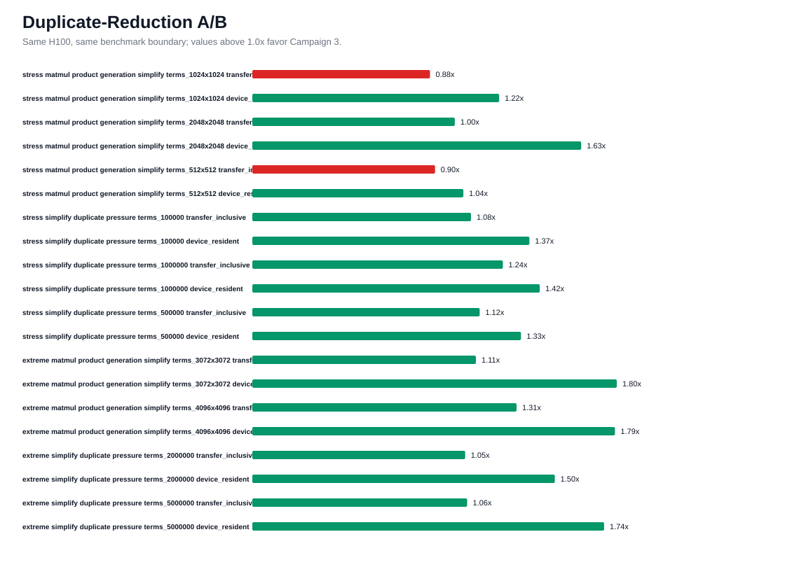
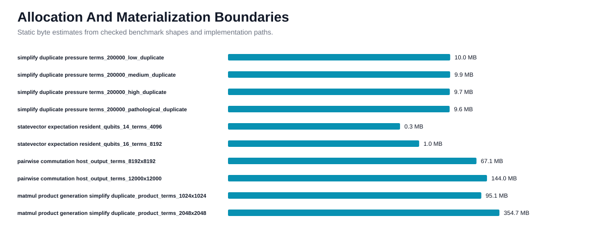
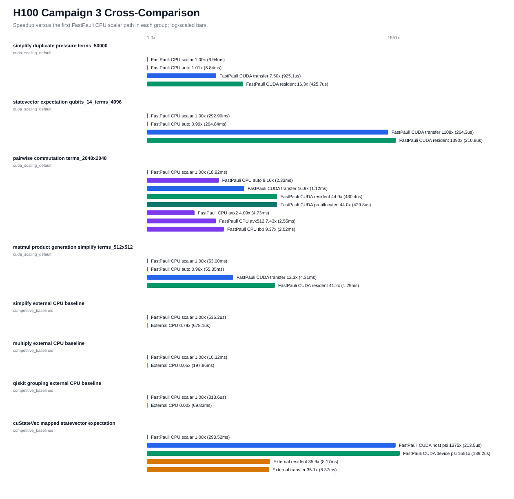
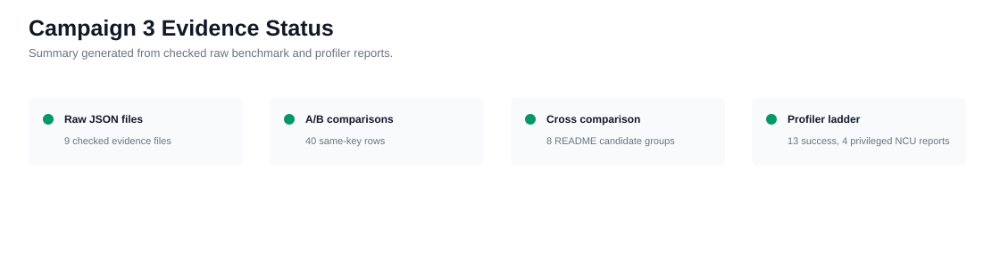

# FastPauli H100 CUDA Deep Optimization Campaign 3

Date: 2026-04-28

Remote artifact root:
`<private-path>`

Checked-in data:
`docs/benchmarks/data/cuda_deep_optimization_h100_campaign3_2026-04-28/`

## Executive Summary

Campaign 3 tested the allocation, temporary-storage, output-materialization,
and reduction-topology headroom left by Campaign 2. The retained production
optimization is a narrower-key CUDA simplify path for one-word operators with
at most 32 qubits. It packs the low 32 bits of `x` and `z` into one 64-bit sort
key, preserving canonical x-then-z order while cutting simplify key traffic
from 16 bytes to 8 bytes per term for the dominant campaign workloads.

Same-boundary H100 evidence supports retaining that path:

```text
simplify device-resident speedups: 1.33x to 1.74x across stress/extreme cases
simplify transfer-inclusive speedups: 1.05x to 1.24x across stress/extreme cases
matmul+simplify device-resident speedups: 1.04x to 1.80x across stress/extreme cases
matmul+simplify transfer-inclusive: mixed on smaller stress cases, 1.11x to 1.31x on extreme cases
```

Campaign 3 also retained a private benchmark-only commutation materialization
prototype behind `FASTPAULI_CUDA_BENCH_REUSE_COMMUTATION_DEVICE_OUTPUT=1`. This
does not change the public API. It quantifies how much dense host-output
allocation and device-output allocation still cost before any public
device-output or bit-packed API is proposed.

No public CUDA workspace, stream, async, device-output commutation,
bit-packed-output, explicit CUB duplicate-reduction, or statevector reduction
topology change was introduced. Those remain deferred because the campaign did
not produce enough evidence to justify changing public ownership, lifetime,
or synchronization semantics.

## Environment

| Item | Value |
| --- | --- |
| GPU | NVIDIA H100 PCIe |
| Compute capability | 9.0 |
| Driver | 580.126.09 |
| CUDA toolkit | 12.9.86 |
| Compiled CUDA architecture | `90` |
| CPU | Intel(R) Xeon(R) Platinum 8352Y CPU @ 2.20GHz |
| OS | Ubuntu 22.04, Linux 6.8.0-90-generic |
| C++ compiler | GNU 11.4.0 |
| oneTBB | enabled, 2021.5.0 |
| CPU backends in source build | scalar, oneTBB, AVX2, AVX-512 |
| Baseline revision | `40dbf1347bcaaca88faad1c731f854141bae4582` |
| Experiment benchmark revision | `0a16c0afc4f1a3c79b8839fe5298ed959eb3654c` |

Metadata files are checked in under
`docs/benchmarks/data/cuda_deep_optimization_h100_campaign3_2026-04-28/metadata/`.

## Retained Changes

| Change | Status | Why retained |
| --- | --- | --- |
| Packed 32-bit x/z simplify key for `words == 1 && num_qubits <= 32` | Production | Same-boundary simplify and matmul+simplify speedups on H100, no public API change, canonical ordering preserved. |
| Allocation/materialization benchmark fields | Benchmark contract | Reports temporary-storage estimates, workspace mode, allocation estimates, result materialization, duplicate survivor counts, CPU auto timing, and unavailable optimized CPU selectors. |
| Materialization stress profile | Benchmark contract | Separates low/medium/high/pathological simplify duplicates, host-output commutation, resident expectation, and matmul+simplify duplicate pressure. |
| Private reusable commutation device-output buffer | Benchmark-only | Quantifies device-output allocation and host materialization cost without exposing device pointers or changing public dense host output semantics. |
| Campaign 3 plot renderer | Reporting | Produces checked-in README cross-comparison, A/B, materialization, and evidence-status SVGs from checked raw JSON. |

## Rejected Or Deferred

| Path | Decision |
| --- | --- |
| Public CUDA workspace API | Deferred. Workspace ownership, device ordinal binding, capacity growth, reset/release, moved-from behavior, stream compatibility, and docs still need a public API design. |
| Simplify/matmul reusable workspace | Deferred as a public or default path. The retained packed-key path reduced the measured duplicate-reduction bottleneck without adding new lifetime semantics. |
| Explicit CUB duplicate-reduction rewrite | Deferred. Thrust/CCCL remains the default implementation; a CUB DeviceRadixSort plus run-length/segmented-reduce rewrite needs a real scratch allocator and did not have enough evidence to justify replacing the lower-risk packed-key path in this campaign. |
| Public device-output or bit-packed commutation API | Deferred. The benchmark-only path shows the value, but public ownership, dtype, shape, lifetime, and synchronization contracts are not ready. |
| Statevector CUB/staged reduction | Deferred. Campaign measurements showed the existing Campaign 2 fused accumulator remained stable; no same-boundary improvement justified changing numerical reduction topology. |
| Raw PTX rewrite | Rejected for this campaign. Privileged NCU did not expose a specific code-generation defect that justified dropping below CUDA C++. |
| Public stream or async API | Deferred. Public methods remain default-stream, synchronize-before-return. |

## Decision Gates

| Gate | Campaign 3 decision |
| --- | --- |
| Workspace ownership | No public workspace. Only the commutation device-output allocation prototype is benchmark-only and env-gated. |
| Workspace lifetime | Public lifetime unchanged. The private commutation buffer is thread-local, tied to the current device ordinal, grows monotonically inside the process, and is not exposed. |
| Temporary storage | Retain Thrust/CCCL with the packed-key32 lower-traffic path for <=32-qubit one-word simplify. No explicit CUB scratch path shipped. |
| Commutation materialization | Public vector return and caller-owned host fill remain supported. Private reused-device-output path is report-only. |
| Statevector reduction | Keep the Campaign 2 fused accumulator. No deterministic or CUB-backed statevector mode was added. |
| Stream semantics | Keep public default-stream synchronize-before-return. |
| Timing boundary | Every plotted row is labeled as CPU scalar, CPU auto/selector, CUDA transfer-inclusive, CUDA device-resident, preallocated host output, or private reused-device-output prototype. |

## Duplicate-Reduction A/B



Same-boundary simplify speedups against the baseline checkout:

| Profile | Scale | Resident Speedup | Transfer-Inclusive Speedup |
| --- | ---: | ---: | ---: |
| stress | `terms_100000` | 1.37x | 1.08x |
| stress | `terms_500000` | 1.33x | 1.12x |
| stress | `terms_1000000` | 1.42x | 1.24x |
| extreme | `terms_2000000` | 1.50x | 1.05x |
| extreme | `terms_5000000` | 1.74x | 1.06x |

Same-boundary matmul+simplify speedups:

| Profile | Scale | Resident Speedup | Transfer-Inclusive Speedup |
| --- | ---: | ---: | ---: |
| stress | `terms_512x512` | 1.04x | 0.90x |
| stress | `terms_1024x1024` | 1.22x | 0.88x |
| stress | `terms_2048x2048` | 1.63x | 1.00x |
| extreme | `terms_3072x3072` | 1.80x | 1.11x |
| extreme | `terms_4096x4096` | 1.79x | 1.31x |

Interpretation:

```text
The packed-key path primarily improves device-resident duplicate reduction.
Transfer-inclusive matmul+simplify remains bounded by product generation and
host conversion at smaller scales, but the retained path wins on the larger
extreme cases where duplicate-reduction traffic is more visible.
```

## Materialization Boundary



Representative materialization-profile timings:

| Case | Public resident | Preallocated host output | Private reused device output |
| --- | ---: | ---: | ---: |
| `terms_8192x8192` commutation | 15.97 ms | 5.27 ms | 4.93 ms |
| `terms_12000x12000` commutation | 33.34 ms | 10.40 ms | 10.17 ms |

These timings are not public API speedup claims. They show that dense
commutation remains materially bounded by output ownership and host
materialization once operands are resident. A public device-output path should
be planned only after API review covers ownership, dtype, shape, device ordinal,
stream synchronization, and error behavior.

## README Cross-Comparison



The README-facing plot intentionally includes CPU scalar, CPU auto or named
optimized selectors where available, CUDA transfer-inclusive, CUDA
device-resident, preallocated or private prototype paths only when clearly
labeled, and semantically comparable external baselines. It is not a CUDA-only
before/after chart.

Representative default-profile ratios:

| Case | CPU scalar | CPU auto / selector | CUDA transfer | CUDA resident |
| --- | ---: | ---: | ---: | ---: |
| simplify `terms_50000` | 6.94 ms | 6.84 ms auto | 0.93 ms | 0.43 ms |
| statevector `qubits_14_terms_4096` | 292.90 ms | 294.84 ms auto | 0.26 ms | 0.21 ms |
| commutation `terms_2048x2048` | 18.92 ms | 2.02 ms oneTBB best captured | 1.12 ms | 0.43 ms |
| matmul+simplify `terms_512x512` | 53.00 ms | 55.35 ms auto | 4.31 ms | 1.29 ms |

## Competitor Baselines

Installed or checked packages:

| Package | Status |
| --- | --- |
| Qiskit | available, version 2.4.1 |
| OpenFermion | available, version 1.7.1 |
| CuPy | available, version 13.4.1 |
| cuQuantum/cuStateVec | available, version 24.8.0 |
| CUDA-Q | importable, version 0.12.0.post1; framework-level only, no primitive-equivalent sparse-Pauli baseline retained |
| Qiskit Aer GPU | installed, version 0.15.1; not importable with this Qiskit environment because `qiskit.providers.convert_to_target` is unavailable |

Comparable competitor rows:

| Workload | FastPauli path | External path | Correctness |
| --- | ---: | ---: | --- |
| simplify CPU baseline | 0.536 ms | Qiskit 0.678 ms | checked |
| multiply CPU baseline | 10.32 ms | OpenFermion 197.86 ms | checked |
| grouping CPU baseline | 0.319 ms | Qiskit 69.83 ms | checked |
| cuStateVec mapped expectation | FastPauli CUDA resident 0.189 ms | cuStateVec resident 8.17 ms | checked |

The cuStateVec row is a semantically mapped statevector Pauli expectation
baseline. CUDA-Q and Aer are not presented as sparse-Pauli primitive baselines.

## Profiling And Correctness Evidence



Evidence captured:

```text
baseline H100 CUDA validation: passed
experiment H100 CUDA validation: passed
experiment final full CUDA-enabled pytest: 189 passed, 1 skipped
experiment CUDA transfer tests: 5 passed
experiment CUDA kernel tests: 16 passed, 1 skipped
Compute Sanitizer: memcheck, racecheck, initcheck, synccheck passed
Nsight Systems: CUDA API timeline captured
Nsight Compute: nonprivileged pass hit ERR_NVGPUCTRPERM, privileged retry succeeded for four hot-path groups
cuobjdump: PTX and SASS inventory captured
nvdisasm: failed on the Python extension shared object and is treated as nonblocking
```

Privileged NCU inventory checked in under
`metadata/privileged_ncu_inventory.txt` records these remote artifacts:

| Hot path | `.ncu-rep` bytes |
| --- | ---: |
| simplify duplicate pressure | 5,588,852 |
| statevector expectation | 876,392 |
| pairwise commutation | 301,941 |
| matmul product generation simplify | 7,901,831 |

## Commands

Representative H100 commands:

```bash
FASTPAULI_VALIDATE_CUDA=1 python scripts/validate.py
python benchmarks/bench_cuda_scaling.py --profile default --repeat 7 --warmup 3 --json --output ...
python benchmarks/bench_cuda_scaling.py --profile stress --repeat 5 --warmup 2 --json --output ...
python benchmarks/bench_cuda_scaling.py --profile extreme --repeat 3 --warmup 1 --json --output ...
python benchmarks/bench_cuda_scaling.py --profile materialization --repeat 5 --warmup 2 --json --output ...
python -m pip install cupy-cuda12x cuquantum-python-cu12 cudaq qiskit-aer-gpu
python benchmarks/bench_competitive_baselines.py --repeat 5 --warmup 2 --json
python scripts/cuda_deep_profile.py --execute --json --profile stress --repeat 3 --warmup 1 --competitor-set none --require-profiler-artifacts --continue-on-error
sudo env PATH=/usr/local/cuda/bin:$PATH FASTPAULI_CUDA_ARCHITECTURES=90 ncu --target-processes all --set detailed ...
```

Historical plot regeneration (requires the separately retained private raw
benchmark archive; the command is not runnable from a public clone alone):

```bash
python scripts/render_cuda_campaign3_assets.py \
  --raw-dir docs/benchmarks/data/cuda_deep_optimization_h100_campaign3_2026-04-28/raw \
  --summary-output docs/benchmarks/data/cuda_deep_optimization_h100_campaign3_2026-04-28/summary.json \
  --plot-dir docs/benchmarks/plots
```

## Remaining Headroom

The useful next CUDA work is now more clearly separated:

```text
1. Design a real private CUDA workspace abstraction before any explicit CUB scratch-buffer rewrite.
2. Prototype CUB DeviceRadixSort plus run-length or segmented reduction only behind that workspace.
3. Plan a public dense commutation device-output API separately if the project wants the measured materialization gains.
4. Keep statevector reduction topology unchanged unless future NCU evidence shows reduction or atomic pressure.
5. Extend evidence to A100 or RTX-class devices before making broader NVIDIA GPU claims.
6. Keep AMD/HIP and Apple Metal/MPS as post-CUDA backend planning work, not H100 performance claims.
```

Campaign 3 exhausts the current H100-side low-risk production changes that do
not require new public ownership or stream semantics. The remaining
materialization and scratch-buffer gains are real but need API and workspace
design before they should ship.

## Limitations

These results are H100 PCIe source-build evidence only. They are not portable
wheel, A100, RTX, AMD GPU, Apple GPU, HIP, Metal, or general CPU performance
claims. External package baselines are included only where the workload mapping
is semantically comparable and correctness-checked.
