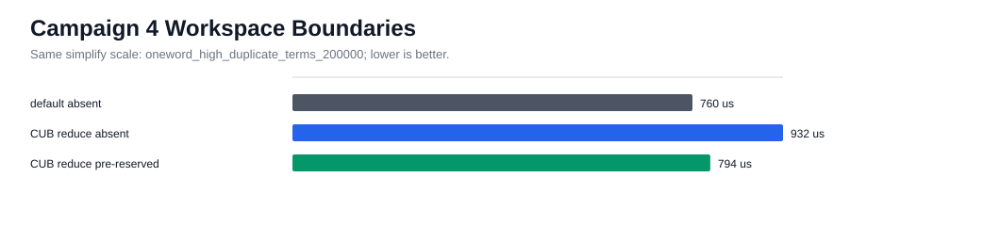
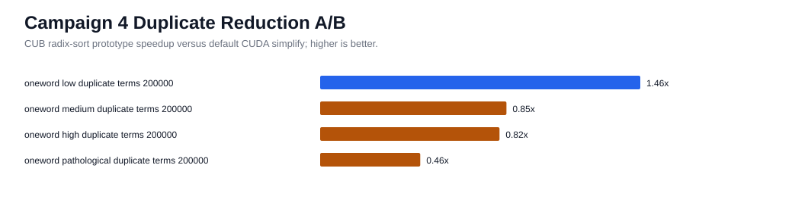
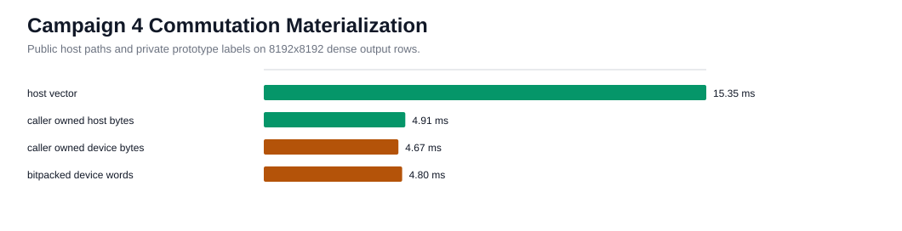
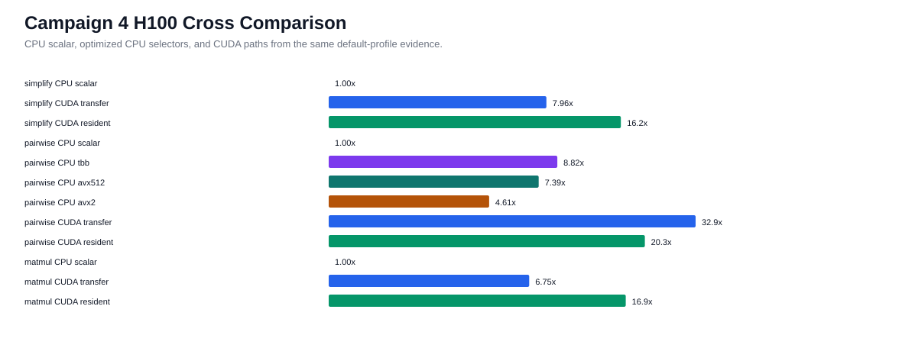
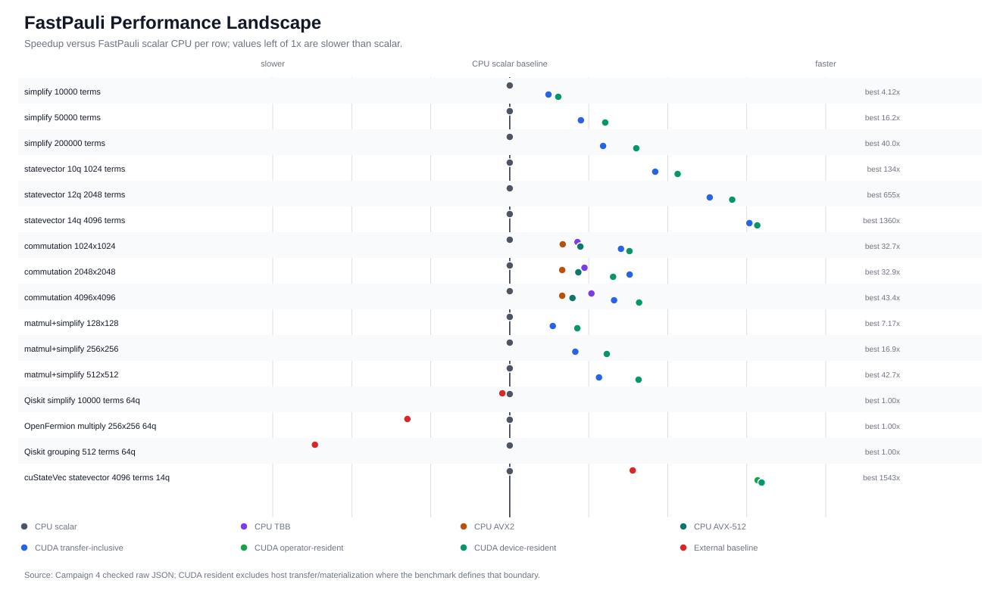
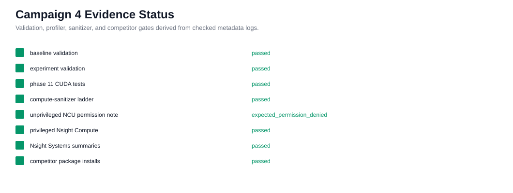

# FastPauli H100 CUDA Deep Optimization Campaign 4

Date: 2026-04-29

Campaign 4 tested the remaining H100 headroom from Campaign 3: private CUDA
workspace ownership, explicit CUB/CCCL duplicate-reduction scratch boundaries,
commutation output materialization, and statevector reduction topology. No
public CUDA API was added.

## Revisions And Platform

| Item | Value |
| --- | --- |
| Baseline revision | `bc68079f1db97822dd4c8ec35712f77c494ca2ed` |
| Experiment revision | `3be083e0b9c3b0bc7756e46c26045e064ce62344` |
| GPU | NVIDIA H100 PCIe, compute capability 9.0 |
| CUDA toolkit/runtime | 12.9.86 / 12.9 |
| Driver | 13.0 |
| Compiled CUDA architecture | `90` |
| Host compiler | GCC 11.4.0 |
| CPU selectors available on H100 | scalar, oneTBB, AVX2, AVX-512 |

## Decisions

| Experiment | Status | Evidence |
| --- | --- | --- |
| Private CUDA workspace | Benchmark-only | Implemented under `src/cuda/`; private `_cuda_workspace_probe_for_testing()` verifies growth/reset/release without exposing device pointers. |
| CUB radix-sort duplicate reduction | Rejected for production | Same-boundary high-duplicate simplify was slower than the retained Thrust path: pre-reserved CUB 0.000794 s vs production default 0.000760 s. |
| CUB run-length duplicate reduction | Not implemented, production fallback | The selector records fallback evidence only; no `DeviceRunLengthEncode` implementation is retained or labeled as CUB-backed. |
| Commutation device output | Deferred to API review | Host vector and caller-owned host byte paths remain public. Device-byte and bit-packed rows stay prototype labels. |
| Statevector reduction topology | Retained current fused accumulator | Privileged NCU showed compute-heavy fused kernel behavior; no replacement topology was justified. |

## Key Results

Representative default-profile H100 rows:

| Case | CPU scalar | CUDA resident | Notes |
| --- | ---: | ---: | --- |
| simplify 50k terms | 7.64 ms | 0.465 ms | CUDA 16.4x faster |
| statevector 14q/4096 terms | 318 ms | 0.216 ms | CUDA 1473x faster |
| pairwise commutation 2048x2048 | 23.3 ms | 0.645 ms | reused device-output prototype measured separately at 0.506 ms |
| matmul+simplify 256x256 | see raw JSON | see raw JSON | retained production path |

Commutation materialization at 8192x8192:

| Boundary | Median |
| --- | ---: |
| public host vector | 15.8 ms |
| public caller-owned host bytes | 5.08 ms |
| private reused device-output prototype label | 4.80-4.93 ms |

External baseline installs succeeded for `qiskit`, `openfermion`,
`cupy-cuda12x`, `cuquantum-python-cu12`, `cudaq`, and `qiskit-aer-gpu`, but
`qiskit_aer` was still not importable in this environment because of a Qiskit
provider API mismatch. No Aer GPU row is used as comparable evidence. The
semantically comparable cuStateVec mapped statevector expectation row measured
8.13 ms versus FastPauli CUDA resident sub-millisecond timings for the same
primitive-style workload.

## Profiler And Validation

Validation:

```text
baseline H100 CUDA validation: passed
experiment H100 CUDA validation: passed
experiment Phase 11 CUDA tests: 19 passed
compute-sanitizer memcheck/racecheck/initcheck/synccheck: 0 errors
local Apple Silicon CPU-only validation: passed
```

Profiler evidence:

```text
Nsight Systems: captured CUDA API, kernel, and memory summaries
Nsight Compute unprivileged: expected ERR_NVGPUCTRPERM
Nsight Compute privileged: captured statevector kernel metrics
```

The Nsight Systems CUDA API summary shows `cudaHostRegister`, `cudaMalloc`,
`cudaMemcpy`, and launch/synchronization costs as separate materialization
components. Privileged NCU reported the statevector kernel as compute-skewed
rather than memory-bandwidth dominated.

## Plots













## Raw Evidence

Raw JSON and profiler exports are checked in under
`docs/benchmarks/data/cuda_deep_optimization_h100_campaign4_2026-04-29/`.
The reproducible renderer is `scripts/render_cuda_campaign4_assets.py`.

## Remaining Headroom

H100-local production optimization is now gated more by public API design than
kernel mechanics. The next meaningful work is to design a supported device
output object or async/stream API, then benchmark it as a real user-visible
boundary. Cross-GPU portability remains future work for additional NVIDIA SKUs,
HIP/AMD, and Metal/MPS.
