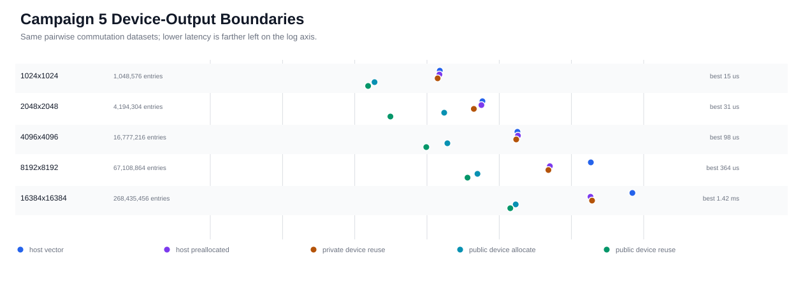
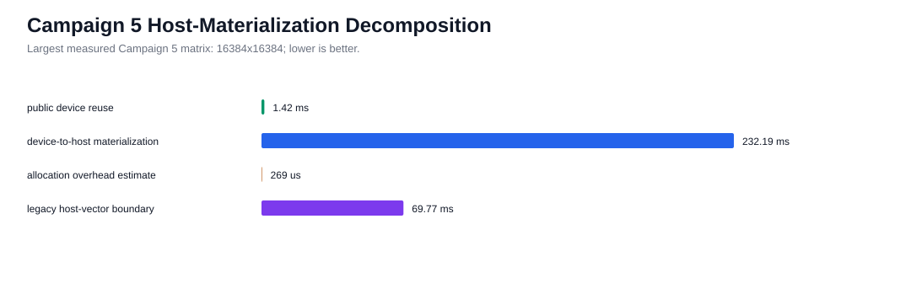
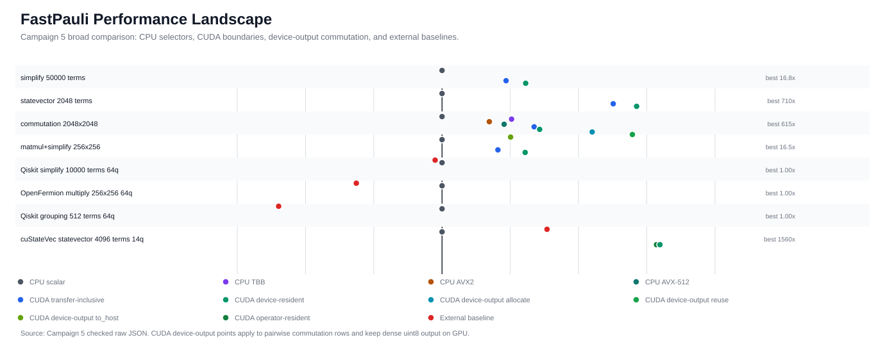

# H100 CUDA Deep Optimization Campaign 5

Date: 2026-04-29

Campaign 5 converted the Campaign 4 commutation-output headroom into a retained
experimental public API: `DeviceCommutationMatrix` plus
`DevicePauliSum.commutes_with_device(...)`. The retained boundary owns dense
row-major `uint8` CUDA output, exposes explicit `to_host()` materialization and
CUDA Array Interface metadata, and preserves the existing synchronous public
CUDA semantics. Public streams, async lifetime management, bit-packed output,
and raw pointer APIs remain deferred.

## Evidence

```text
report: docs/benchmarks/reports/cuda_deep_optimization_h100_campaign5_2026-04-29.md
summary: docs/benchmarks/data/cuda_deep_optimization_h100_campaign5_2026-04-29/summary.json
raw data: docs/benchmarks/data/cuda_deep_optimization_h100_campaign5_2026-04-29/raw/
metadata: docs/benchmarks/data/cuda_deep_optimization_h100_campaign5_2026-04-29/metadata/
profiler: docs/benchmarks/data/cuda_deep_optimization_h100_campaign5_2026-04-29/profiler/
plots: docs/benchmarks/plots/cuda_h100_campaign5_*.svg
```

Hardware and build:

```text
GPU: NVIDIA H100 PCIe, SM 9.0, driver 580.126.09
CUDA toolkit: 12.9.86
compiled CUDA architectures: 90
CPU selectors in build: scalar, oneTBB, AVX2, AVX-512
experiment source revision: cc7413f98b73bfeca22dcec1424276956181a5d3
baseline reference revision: 72b46e86ad4d2564805b93eb4727ab0d9a8dde9b
```

Validation status:

| Gate | Status | Artifact |
| --- | --- | --- |
| Full H100 validation | passed | `metadata/experiment-validate-final.log` |
| Phase 11 CUDA tests | 19 passed, 2 skipped | `metadata/experiment-phase11-cuda.log` |
| Compute Sanitizer memcheck | 0 errors | `metadata/compute-sanitizer-memcheck.log` |
| Compute Sanitizer racecheck | 0 hazards | `metadata/compute-sanitizer-racecheck.log` |
| Compute Sanitizer initcheck | 0 errors | `metadata/compute-sanitizer-initcheck.log` |
| Compute Sanitizer synccheck | 0 errors | `metadata/compute-sanitizer-synccheck.log` |
| Nsight Systems | passed | `profiler/nsys_campaign5_device_output_stats_*.csv` |
| Nsight Compute | unprivileged permission denied, privileged run passed | `profiler/ncu_campaign5_commutation_details.csv` |

The sanitizer logs include nanobind process-exit leak diagnostics under
Compute Sanitizer. These diagnostics are not CUDA memory errors; the sanitizer
summaries report zero device memory errors or hazards. They remain worth
tracking separately if nanobind leak checking becomes a release gate.

## Retained API Decision

Campaign 5 accepted the dense device-output API documented in
`docs/plans/cuda_commutation_device_output_api_review.md`:

```python
matrix = lhs_device.commutes_with_device(rhs_device)
flags = matrix.to_host()
cuda_view = matrix.__cuda_array_interface__

out = fastpauli.DeviceCommutationMatrix.empty(
    (lhs_device.num_terms, rhs_device.num_terms),
    device=lhs_device.device,
)
same = lhs_device.commutes_with_device(rhs_device, output=out)
assert same is out
```

Retained semantics:

```text
storage: dense row-major uint8 flags, 1 for commute and 0 for anti-commute
ownership: move-only C++ owner with Python object lifetime ownership
device policy: same CUDA ordinal for lhs, rhs, and output
shape policy: exact (lhs_terms, rhs_terms)
host materialization: explicit DeviceCommutationMatrix.to_host()
interop: CUDA Array Interface v3, typestr "|u1"
synchronization: public call synchronizes before return
guardrails: commutes_with_device enforces max_commutation_matrix_entries before allocating its own output or filling caller output
CPU-only behavior: import succeeds, use raises existing CUDA rebuild guidance
```

Rejected or deferred surfaces:

| Surface | Status | Reason |
| --- | --- | --- |
| Raw device pointer API | rejected | unsafe lifetime and stream ownership without a full consumer contract |
| Public async/stream API | deferred | no accepted event/stream lifetime model yet |
| Bit-packed commutation output | deferred | dense `uint8` is now proven fast enough for the first public device-output boundary |
| Public CUDA workspace object | deferred | still useful internally, but not required for the retained API |
| Raw PTX rewrite | rejected for this campaign | profiler evidence points at materialization and API boundary, not compiler codegen |

## Device-Output Boundary Results

All rows use pairwise commutation on deterministic 16-qubit, fixed-weight
operators. Times are medians over `repeat=7`, `warmup=2`; lower is better.



| Dense output | Host vector | Host preallocated | Private device reuse | Public device allocate | Public device reuse | `to_host()` |
| --- | ---: | ---: | ---: | ---: | ---: | ---: |
| 1024 x 1024 | 0.150 ms | 0.149 ms | 0.140 ms | 0.0188 ms | 0.0153 ms | 0.511 ms |
| 2048 x 2048 | 0.585 ms | 0.567 ms | 0.445 ms | 0.173 ms | 0.0312 ms | 1.75 ms |
| 4096 x 4096 | 1.79 ms | 1.81 ms | 1.72 ms | 0.192 ms | 0.0978 ms | 6.72 ms |
| 8192 x 8192 | 18.6 ms | 5.02 ms | 4.80 ms | 0.499 ms | 0.364 ms | 58.4 ms |
| 16384 x 16384 | 69.8 ms | 18.4 ms | 19.3 ms | 1.69 ms | 1.42 ms | 232 ms |

The public device-reuse path is the retained win. On the largest measured dense
matrix, it is about 49.0x faster than the host-vector public boundary and about
12.9x faster than caller-owned host fill. It also separates the true
device-resident output boundary from the Campaign 4 private reused-device
benchmark label, which still fed a host-materializing public path.

`to_host()` is intentionally slower than device reuse because it materializes
the full dense matrix on the CPU. It should not be presented as a replacement
for host-output workflows. The retained value is for downstream GPU consumers
that can continue from the CUDA Array Interface without crossing PCIe.



## Broad Performance Landscape

Campaign 5 refreshes the README plot with broad checked evidence rather than a
single specialized device-output view. The plot includes FastPauli CPU scalar,
captured oneTBB/AVX2/AVX-512 selectors, CUDA transfer-inclusive and
device-resident paths, new device-output commutation points, and external
baselines where the workload semantics are comparable.



External package availability in this H100 venv:

| Package | Status |
| --- | --- |
| Qiskit | available, 2.4.1 |
| OpenFermion | available, 1.7.1 |
| CuPy | available, 14.0.1 |
| cuQuantum/cuStateVec | available, 25.3.0.post0 |
| Qiskit Aer | available, 0.17.2; recorded for future framework-level GPU baselines |
| CUDA-Q | package version recorded as 0.14.0, but `import cudaq` failed in this environment |

## Profiler Findings

Nsight Systems confirms that the Campaign 5 profile is still dominated by
host materialization when host output is requested:

| Nsight Systems row | Value |
| --- | ---: |
| `commutation_kernel` instances | 135 |
| total `commutation_kernel` GPU time | 55.7 ms |
| median `commutation_kernel` GPU time | 100 us |
| device-to-host memcpy count | 115 |
| total device-to-host memcpy time | 484 ms |
| total device-to-host bytes | 8.22 GB |
| `cudaMalloc` calls | 255 |
| total `cudaMalloc` API time | 143 ms |
| `cudaDeviceSynchronize` calls | 50 |
| total synchronization API time | 20.8 ms |

Nsight Compute privileged profiling collected 75 `commutation_kernel` launches.
Representative metrics:

| Launch regime | Grid | Duration | SM throughput | Compute+memory throughput | L1/TEX throughput | L2 throughput | DRAM throughput | Uniform branch targets |
| --- | ---: | ---: | ---: | ---: | ---: | ---: | ---: | ---: |
| small | 4096 blocks | 12.8 us | 58% | 20% | 28% | 8% | 0.15% | 100% |
| largest | 1,048,576 blocks | 2.24 ms | 86.7% | 30.8% | 30.8% | 10.4% | 5.46% | 100% |

The profiler model matches the benchmark result: the kernel is not the limiting
cost for device-resident consumers. Host materialization, host registration,
device-to-host copies, and allocation/synchronization boundaries dominate
host-output workflows. The retained API removes that boundary for callers that
consume dense commutation flags on GPU.

## Exhausted Paths

Campaign 5 did not reopen CUB duplicate-reduction, packed simplify keys, raw
PTX, or small instruction-level commutation edits. Campaign 4 already rejected
the narrow CUB duplicate-reduction prototype on same-boundary H100 evidence,
and Campaign 5 profiler data did not identify a new kernel-level bottleneck
that would justify raw PTX work. The meaningful retained change is the public
materialization boundary.

The unprivileged Nsight Compute run failed with `ERR_NVGPUCTRPERM`; this was
superseded by a privileged NCU run on the same H100 host. Both logs are checked
in so the permission path is reproducible.

## Remaining Headroom

The next meaningful CUDA work is no longer dense device-output ownership. It is
one of these explicitly scoped follow-ups:

```text
1. Design an async/stream API plan with explicit event ownership, stream capture
   behavior, host synchronization semantics, and Python lifetime rules.
2. Add downstream GPU consumers for DeviceCommutationMatrix so benchmarks can
   measure end-to-end GPU-resident workflows instead of isolated output fill.
3. Revisit bit-packed output only if a real downstream consumer needs reduced
   memory bandwidth or capacity and can accept a documented packed layout.
4. Add CuPy consumer benchmarks through the CUDA Array Interface once the
   interop test dependency is available in CI or an H100 validation tier.
5. Continue keeping README plots broad; specialized device-output plots belong
   in reports unless they are integrated into the full CPU/CUDA/external view.
```

Campaign 5 satisfies its exhaustion criteria: public device-output API retained
with tests and docs, CPU-only behavior preserved, H100 validation and sanitizer
coverage passed, host and device materialization boundaries timed separately,
Nsight Systems and Nsight Compute evidence captured, competitor baselines
recorded, and the README landscape remains broad.
