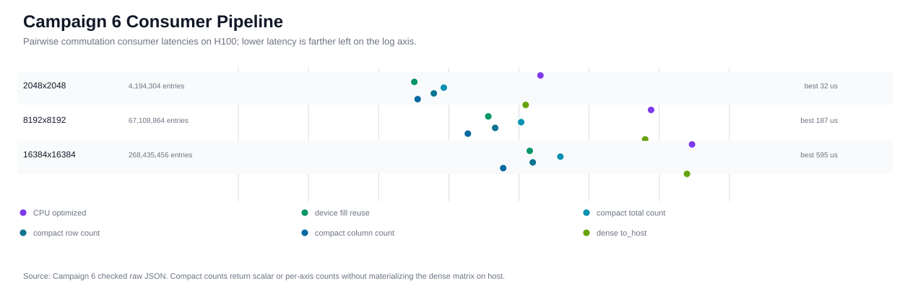
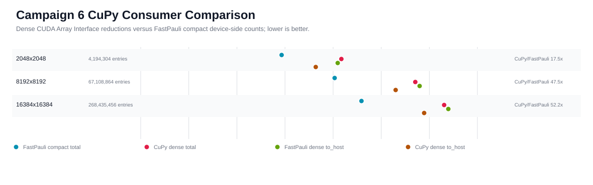
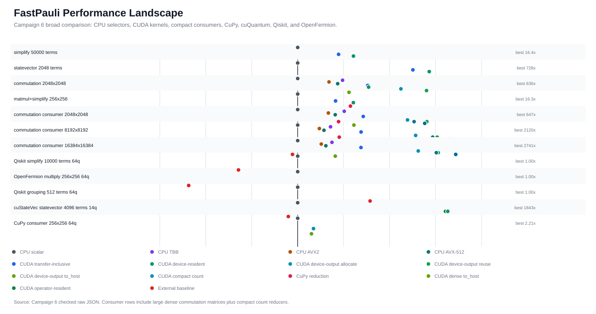

# H100 CUDA Deep Optimization Campaign 6

Date: 2026-04-29

Campaign 6 converted the Campaign 5 remaining-headroom list into an H100
consumer-boundary campaign. It adds retained compact downstream reductions for
`DeviceCommutationMatrix`, benchmarks CuPy consumption through the CUDA Array
Interface, refreshes the broad CPU/CUDA/external README performance landscape,
and documents the stream/async and bit-packed decisions without adding unsafe
public CUDA surfaces.

## Evidence

```text
plan: docs/plans/h100_deep_optimization_campaign6_plan.md
report: docs/benchmarks/reports/cuda_deep_optimization_h100_campaign6_2026-04-29.md
summary: docs/benchmarks/data/cuda_deep_optimization_h100_campaign6_2026-04-29/summary.json
raw data: docs/benchmarks/data/cuda_deep_optimization_h100_campaign6_2026-04-29/raw/
metadata: docs/benchmarks/data/cuda_deep_optimization_h100_campaign6_2026-04-29/metadata/
profiler: docs/benchmarks/data/cuda_deep_optimization_h100_campaign6_2026-04-29/profiler/
plots: docs/benchmarks/plots/cuda_h100_campaign6_*.svg
```

Hardware and build:

```text
GPU: NVIDIA H100 PCIe, SM 9.0, driver 580.126.09
CUDA toolkit: 12.9.86
compiled CUDA architectures: 90
CPU selectors in build: scalar, oneTBB, AVX2, AVX-512
experiment source revision: ca271846f194c089df4e9b07c0a63c8277922cbf
```

Validation status:

| Gate | Status | Artifact |
| --- | --- | --- |
| Full H100 validation | passed | `metadata/experiment-validate-final.log` |
| Phase 11 CUDA tests | 23 passed, 1 skipped | `metadata/experiment-phase11-cuda.log` |
| Compute Sanitizer memcheck | 0 errors | `metadata/compute-sanitizer-memcheck.log` |
| Compute Sanitizer racecheck | 0 hazards | `metadata/compute-sanitizer-racecheck.log` |
| Compute Sanitizer initcheck | 0 errors | `metadata/compute-sanitizer-initcheck.log` |
| Compute Sanitizer synccheck | 0 errors | `metadata/compute-sanitizer-synccheck.log` |
| Nsight Systems | passed | `profiler/nsys_campaign6_consumers_stats_*.csv` |
| Nsight Compute commutation fill | privileged run passed | `profiler/ncu_campaign6_consumers_details.csv` |
| Nsight Compute count reductions | privileged run passed | `profiler/ncu_campaign6_count_kernels_details.csv` |

The sanitizer logs include nanobind process-exit leak diagnostics under
Compute Sanitizer. These diagnostics are not CUDA memory errors; the sanitizer
summaries report zero device memory errors or hazards.

## API Decisions

Campaign 6 retained one narrow public consumer API:

```python
matrix = lhs_device.commutes_with_device(rhs_device)
total = matrix.count_commuting()
row_counts = matrix.count_commuting(axis=1)
col_counts = matrix.count_commuting(axis=0)
```

Retained semantics:

```text
axis=None returns a Python int count of entries with value 1
axis=0 returns a NumPy uint64 vector of length matrix.cols
axis=1 returns a NumPy uint64 vector of length matrix.rows
all reductions execute on the matrix CUDA device
only compact uint64 count results are copied to host
the method synchronizes before returning, matching existing public CUDA semantics
moved-from matrices raise RuntimeError
unsupported axis values raise ValueError
CPU-only builds raise the existing CUDA rebuild-guidance RuntimeError
```

Rejected or deferred surfaces:

| Surface | Status | Reason |
| --- | --- | --- |
| Public stream handles | deferred | no accepted Python lifetime, capture, and event ownership contract yet |
| Public async return objects | deferred | error propagation and object lifetime need a full API design before exposure |
| Private stream/event probes | rejected for this campaign | no public contract was retained, and the consumer work did not need stream probes to answer the current bottleneck |
| Public bit-packed commutation output | deferred | compact consumers reduce the measured host-materialization problem without exposing a packed layout |
| Raw device pointer API | rejected | unsafe without explicit stream ownership and consumer lifetime rules |

## Consumer Pipeline Results

All rows use deterministic 16-qubit fixed-weight pairwise commutation matrices.
Times are medians over `repeat=7`, `warmup=2`; lower is better. `compact total`
copies one `uint64` to host, while `to_host()` copies the full dense bool matrix.



| Matrix | Entries | CPU scalar | CPU best | Fill reuse | Compact total | Axis 0 counts | Axis 1 counts | Dense `to_host()` |
| --- | ---: | ---: | ---: | ---: | ---: | ---: | ---: | ---: |
| 2048 x 2048 | 4,194,304 | 20.85 ms | 2.02 ms | 0.032 ms | 0.085 ms | 0.061 ms | 0.036 ms | 1.25 ms |
| 8192 x 8192 | 67,108,864 | 395.95 ms | 76.45 ms | 0.365 ms | 1.07 ms | 0.457 ms | 0.187 ms | 62.87 ms |
| 16384 x 16384 | 268,435,456 | 1.63 s | 293.14 ms | 1.43 ms | 3.89 ms | 1.57 ms | 0.595 ms | 248.14 ms |

The retained compact consumer path addresses the main Campaign 5 gap: callers
can now continue with count summaries without materializing the full dense
matrix on the host. On the largest row, compact total count is about 63.8x
faster than full `to_host()` and about 419x faster than scalar CPU for the same
deterministic dataset. Dense device-output fill remains much faster than the
compact total reduction, so larger downstream GPU algorithms should fuse
additional work with the fill or operate directly on the dense matrix when they
need more than counts.

## CuPy Consumer Baseline

CuPy was installed and importable in the H100 validation environment. The
benchmark starts from an already populated `DeviceCommutationMatrix` and
reduces the dense CUDA Array Interface view with CuPy. That makes it a consumer
comparison, not an end-to-end replacement for FastPauli commutation fill.



| Matrix | FastPauli compact total | CuPy dense total | FastPauli dense `to_host()` | CuPy dense `to_host()` |
| --- | ---: | ---: | ---: | ---: |
| 2048 x 2048 | 0.085 ms | 1.48 ms | 1.25 ms | 0.436 ms |
| 8192 x 8192 | 1.07 ms | 51.08 ms | 62.87 ms | 19.94 ms |
| 16384 x 16384 | 3.89 ms | 203.26 ms | 248.14 ms | 78.07 ms |

These timings include explicit synchronization around the CuPy reductions.
CuPy's dense `to_host()` path is faster than FastPauli's dense host
materialization, but CuPy dense total reduction is much slower than
FastPauli's compact total because it consumes every dense byte through a
generic reduction. The useful result is that the CUDA Array Interface boundary
works for external consumers while FastPauli's retained count API is the right
compact path for total-count workflows.

External package availability in this H100 venv:

| Package | Status |
| --- | --- |
| Qiskit | available, 2.4.1 |
| OpenFermion | available, 1.7.1 |
| CuPy | available, 14.0.1 |
| cuQuantum/cuStateVec | available, 25.3.0.post0 |
| Qiskit Aer | available, 0.17.2; recorded for future framework-level GPU baselines |
| CUDA-Q | not importable in this environment |

## Broad Performance Landscape

Campaign 6 supersedes Campaign 5 for the README plot because it preserves the
broad CPU/CUDA/external view and adds compact consumer and CuPy rows.



Selected broad rows:

| Workload | Best FastPauli CUDA row | Speedup vs CPU scalar | Comparable external row |
| --- | ---: | ---: | --- |
| simplify, 50k terms | device-resident | 16.4x | Qiskit simplify: 1.30x slower than FastPauli scalar |
| statevector, 2k terms | device-resident | 728x | cuStateVec statevector: 49.0x slower than FastPauli device-resident |
| commutation, 2048 x 2048 | device-output reuse | 636x | CuPy consumer tracked separately |
| matmul+simplify, 256 x 256 | device-resident | 16.3x | OpenFermion multiply: 19.4x slower than FastPauli scalar |
| consumer counts, 16384 x 16384 | column count | 2741x | CuPy dense total is 52.2x slower than FastPauli compact total |

## Profiler Findings

Nsight Systems confirms that consumer-only work is now visible as separate GPU
kernels. The profile was intentionally run with CuPy enabled so interop
consumption appears in the same trace.

| Nsight Systems row | Instances | Median GPU time | Total GPU time |
| --- | ---: | ---: | ---: |
| `cupy_sum` | 36 | 0.567 ms | 1.03 s |
| `commutation_kernel` | 87 | 0.389 ms | 56.7 ms |
| `count_total_kernel` | 15 | 0.438 ms | 11.1 ms |
| `count_cols_kernel` | 15 | 0.393 ms | 9.60 ms |
| `count_rows_kernel` | 15 | 0.138 ms | 3.32 ms |

CUDA API hot spots in the same trace:

| CUDA API row | Calls | Total API time |
| --- | ---: | ---: |
| `cudaMemcpyAsync` | 48 | 1.51 s |
| `cudaHostRegister` | 34 | 796 ms |
| `cudaMemcpy` | 204 | 524 ms |
| `cudaMalloc` | 208 | 154 ms |
| `cudaDeviceSynchronize` | 36 | 23.6 ms |

Nsight Compute privileged profiling collected the commutation fill kernel and
the three count reduction kernels. The following rows are representative
profiled launches; profiler instrumentation changes absolute timing, so the
benchmark tables above remain the timing source of truth.

| Kernel | Duration | SM throughput | Memory throughput | L1/TEX hit | L2 hit | Registers/thread |
| --- | ---: | ---: | ---: | ---: | ---: | ---: |
| `commutation_kernel` | 2.24 ms | 86.7% | 111 GB/s | 74.2% | 100.0% | 32 |
| `count_total_kernel` | 2.56 ms | 77.2% | 109 GB/s | 0.14% | 34.2% | 16 |
| `count_cols_kernel` | 2.32 ms | 13.5% | 117 GB/s | 28.4% | 94.6% | 18 |
| `count_rows_kernel` | 686 us | 43.5% | 395 GB/s | 0.01% | 20.2% | 16 |

The count kernels are adequate for the retained API but not exhausted as raw
GPU reductions. `count_total_kernel` and `count_rows_kernel` show low L1 hit
rates, while `count_cols_kernel` has lower SM utilization because it maps a
column-oriented reduction over row-major dense bytes. That points to future
specialized consumer algorithms or layout-aware reductions rather than a public
bit-packed output surface.

## Bit-Packed Output Decision

No bit-packed prototype was retained or benchmarked in this campaign. The
consumer API review requires a real downstream need before exposing or even
promoting a packed layout. Campaign 6 shows the current dense matrix is already
usable by both FastPauli compact reducers and CuPy through the CUDA Array
Interface; the measured pressure is now specific consumer reduction efficiency,
not dense matrix capacity. Public bit-packed output remains deferred until a
future report proves a capacity or bandwidth constraint and specifies layout,
alignment, axis-count semantics, interop metadata, and host conversion behavior.

## Exhaustion Criteria

Campaign 6 satisfies the complete Campaign 5 remaining-headroom list:

```text
1. async/stream API design: completed, public surface deferred with lifetime and event reasoning
2. downstream GPU consumers: completed, retained count_commuting(axis=None|0|1)
3. bit-packed output revisit: completed by documented deferral; no consumer need proven
4. CuPy interop benchmark: completed on H100 with CuPy 14.0.1
5. README broad plot upkeep: completed with Campaign 6 broad landscape
```

It also preserves CPU-only import behavior, CUDA rebuild guidance, synchronous
public CUDA semantics, and source-build-only H100 performance-claim boundaries.

## Remaining Headroom

The next CUDA work should not be another isolated dense-output campaign. The
remaining high-value paths are:

```text
1. Fuse real downstream commutation algorithms, such as graph construction or grouping, directly onto DeviceCommutationMatrix data.
2. Specialize count reductions only if those fused consumers still need standalone count summaries and profiler evidence shows reduction kernels dominate.
3. Revisit public async/stream APIs only after an accepted lifetime, event, stream capture, error propagation, and Python ownership contract.
4. Revisit bit-packed output only with a consumer whose measured memory capacity or bandwidth limit cannot be addressed by dense-layout fused kernels.
5. Add non-H100 portability runs for the retained consumer API on another NVIDIA architecture before making broader GPU claims.
```
