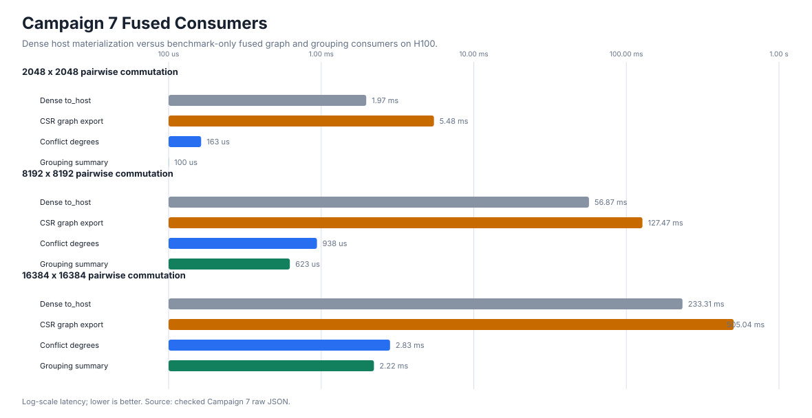
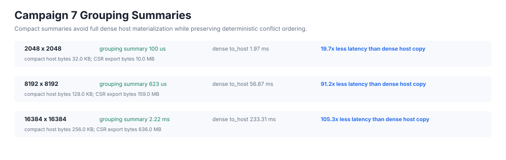
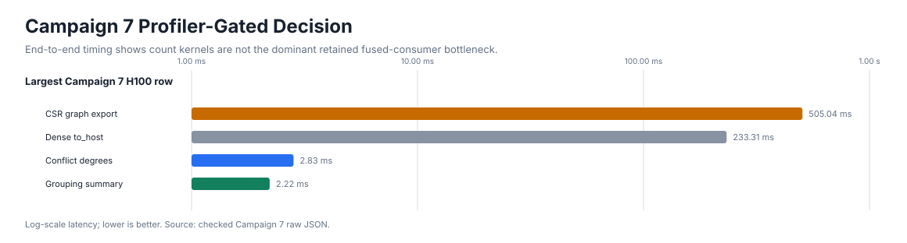
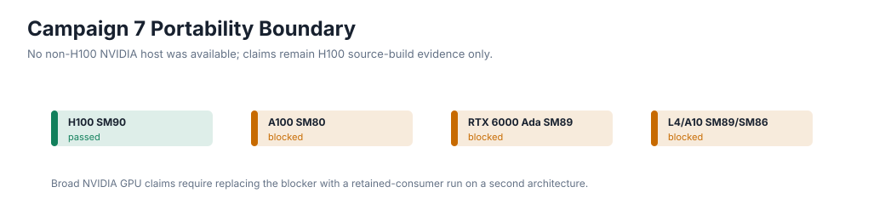
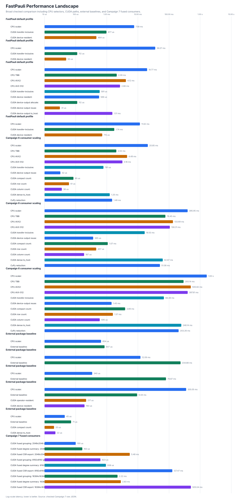

# CUDA Deep Optimization H100 Campaign 7

Status: completed on one H100 source-build host.

Campaign 7 converted the Campaign 6 remaining-headroom list into fused
`DeviceCommutationMatrix` consumer evidence. Public CUDA APIs remain
synchronous and unchanged; the new CSR, conflict-degree, and grouping-summary
consumers are private benchmark-only helpers.

## Evidence

```text
plan: docs/plans/h100_deep_optimization_campaign7_plan.md
fused-consumer API review: docs/plans/cuda_fused_commutation_consumer_api_review.md
async/stream decision: docs/plans/cuda_async_stream_campaign7_decision.md
bit-packed decision: docs/plans/cuda_bitpacked_commutation_campaign7_decision.md
summary: docs/benchmarks/data/cuda_deep_optimization_h100_campaign7_2026-04-29/summary.json
raw data: docs/benchmarks/data/cuda_deep_optimization_h100_campaign7_2026-04-29/raw/
metadata: docs/benchmarks/data/cuda_deep_optimization_h100_campaign7_2026-04-29/metadata/
profiler: docs/benchmarks/data/cuda_deep_optimization_h100_campaign7_2026-04-29/profiler/
plots: docs/benchmarks/plots/cuda_h100_campaign7_*.svg
non-H100 portability: docs/benchmarks/reports/cuda_portability_campaign7_non_h100_nvidia_2026-04-29.md
```

## Hardware

```text
GPU: NVIDIA H100 PCIe, SM 9.0, 81559 MiB
driver: 580.126.09
CUDA toolkit: 12.9.86
compiled CUDA architectures: 90
CPU: Intel Xeon Platinum 8352Y, x86_64
CPU backends: scalar, oneTBB, AVX2, AVX-512
```

## Validation

```text
H100 tests/test_phase11_cuda_kernels.py: 26 passed, 2 skipped
H100 scripts/validate.py: passed
compute-sanitizer memcheck/racecheck/initcheck/synccheck: 0 CUDA errors or hazards
Nsight Systems: captured committed nsys_campaign7_fused_consumers.sqlite trace export
Nsight Compute: captured ncu_campaign7_fused_consumers.ncu-rep and details CSV
```

The sanitizer logs still include the known nanobind process-exit reference-leak
diagnostics. They are reported separately from CUDA sanitizer summaries; the
CUDA error summaries are clean.

## Results

Median H100 repeat-7 timings from
`raw/fused_graph_stress.json`:

| Scale | Dense `to_host()` | CSR Graph Export | Conflict Degrees | Grouping Summary | CSR Host Bytes |
|---:|---:|---:|---:|---:|---:|
| 2048 x 2048 | 1.97 ms | 5.48 ms | 163 us | 100 us | 10.4 MB |
| 8192 x 8192 | 56.87 ms | 127.47 ms | 938 us | 623 us | 166.7 MB |
| 16384 x 16384 | 233.31 ms | 505.04 ms | 2.83 ms | 2.22 ms | 666.9 MB |

The retained grouping-oriented summary is the clear Campaign 7 win: it avoids
full dense host materialization and returns compact deterministic conflict
metadata. CSR graph construction is correct, but exporting explicit
anti-commutation edges is larger than dense `uint8` host materialization on the
measured random workloads, so it remains benchmark-only evidence rather than a
public API.





## Profiler Findings

Nsight Systems reports GPU kernel time across the fused run as dominated by the
dense commutation fill, then CSR scatter and conflict count kernels. End-to-end
CSR latency is dominated by device-to-host transfer of the explicit edge list,
not by scan setup or standalone count reductions.

Nsight Compute was run under sudo because unprivileged performance counters
were unavailable. The focused profile covered row-conflict counts,
column-conflict counts, and CSR scatter. Representative findings:

```text
row count kernels: small absolute duration relative to retained grouping summary
column count kernels: visible but not dominant in end-to-end retained workflow
CSR scatter: meaningful kernel cost, but exported edge-list transfer dominates CSR API shape
```



## Decisions

```text
fused consumers: benchmark-only private helpers retained
count specialization: rejected_not_dominant
async/stream public API: deferred
bit-packed output: deferred_no_dense_capacity_or_bandwidth_trigger
non-H100 portability: blocked_recorded
```

Count specialization is rejected for Campaign 7 because standalone count
reduction kernels are not the dominant bottleneck in the retained fused
workflow. Async/stream APIs remain deferred because no complete public lifetime,
event, stream-capture, error-propagation, and Python ownership contract is
accepted. Bit-packed output remains deferred because dense fused consumers did
not prove a capacity or bandwidth trigger that a packed layout would solve
without immediate unpacking.

No non-H100 NVIDIA host was available for this slice, so README and docs remain
H100 source-build evidence only.



## Broad Landscape

The README broad comparison is refreshed with Campaign 7 fused-consumer rows
while preserving the broader CPU/CUDA/external landscape from Campaign 6.



## Remaining Headroom

Remaining CUDA work should focus on:

```text
device-resident graph consumers that avoid exporting full CSR edge lists
public fused grouping API only after exact return semantics and ownership are accepted
DLPack or framework interop for retained device outputs
non-H100 NVIDIA retained-consumer portability evidence
CUDA Graphs or stream-aware execution only after a complete public contract
additional NCU-guided CSR scatter tuning only if a fully device-resident graph consumer needs it
```
