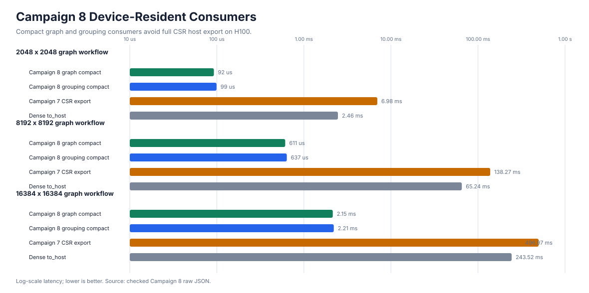
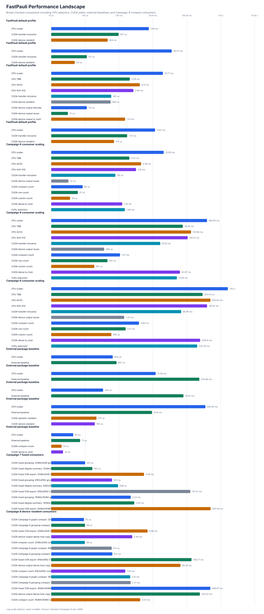
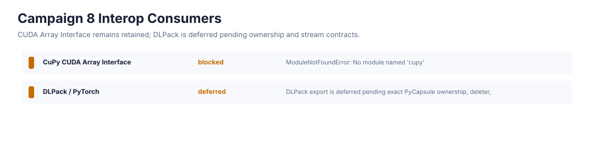
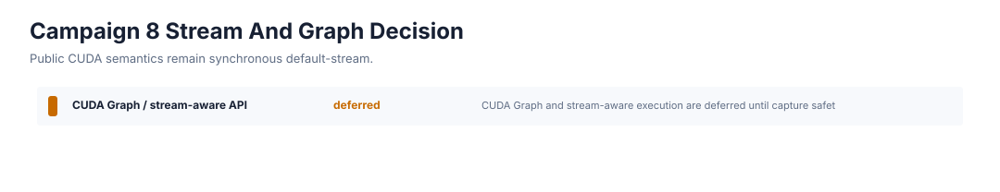
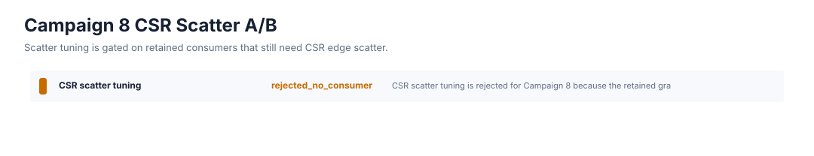
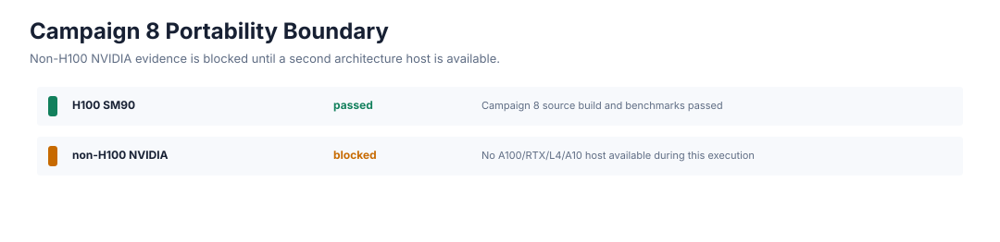

# CUDA Deep Optimization H100 Campaign 8

Date: 2026-04-29

Status: complete on H100, with non-H100 NVIDIA portability blocked on hardware availability.

Campaign 8 covered every remaining-headroom item from Campaign 7. The retained result is a private benchmark-only device-resident graph and grouping consumer path that avoids full CSR edge-list host export for high-scale anti-commutation workflows. Public fused grouping, DLPack, stream-aware execution, and CUDA Graph surfaces remain deferred until their ownership, synchronization, lifetime, and failure contracts are accepted.

## Evidence

Source artifacts:

```text
plan: docs/plans/h100_deep_optimization_campaign8_plan.md
summary: docs/benchmarks/data/cuda_deep_optimization_h100_campaign8_2026-04-29/summary.json
raw data: docs/benchmarks/data/cuda_deep_optimization_h100_campaign8_2026-04-29/raw/
profiler data: docs/benchmarks/data/cuda_deep_optimization_h100_campaign8_2026-04-29/profiler/
portability blocker: docs/benchmarks/reports/cuda_portability_campaign8_non_h100_nvidia_2026-04-29.md
renderer: scripts/render_cuda_campaign8_assets.py
```

Checked plots:













## Hardware

Primary host:

```text
GPU: NVIDIA H100 PCIe
compute capability: 9.0
driver: 580.126.09, CUDA driver 13.0
runtime: CUDA 12.9
toolkit: CUDA 12.9.86
compiled architecture: 90
Python: 3.10.12
```

Campaign 8 evidence remains H100 source-build evidence. It is not a portable wheel claim and does not widen to A100, RTX 6000 Ada, L4, or A10 until the portability report is replaced by a passing named-host run.

## Validation

H100 validation was run before the implementation slice and again after the
final summary refresh. The closeout validation passed with CUDA enabled and its
log plus stable status receipt are stored in the Campaign 8 metadata bundle:

```text
FASTPAULI_VALIDATE_CUDA=1 FASTPAULI_CUDA_ARCHITECTURES=90 python scripts/validate.py
```

```text
metadata/experiment-validate-final.log
metadata/experiment-validate-final-status.txt
```

CUDA-gated Campaign 8 tests passed for the private graph consumer, private grouping consumer, and deferred-mode status rows:

```text
tests/test_phase11_cuda_kernels.py::test_private_campaign8_device_resident_graph_returns_compact_digest
tests/test_phase11_cuda_kernels.py::test_private_campaign8_device_grouping_consumer_is_deterministic
tests/test_phase11_cuda_kernels.py::test_private_campaign8_deferred_modes_report_explicit_reasons
```

Compute Sanitizer logs are clean for retained CUDA paths:

```text
memcheck: ERROR SUMMARY: 0 errors
racecheck: RACECHECK SUMMARY: 0 hazards displayed
initcheck: ERROR SUMMARY: 0 errors
synccheck: ERROR SUMMARY: 0 errors
```

The sanitizer logs may be accompanied by Python-extension exit diagnostics from nanobind object lifetime reporting. Those diagnostics are separate from CUDA memory, race, init, and synchronization errors and are not counted as sanitizer failures.

## Results

The retained Campaign 8 consumer path keeps the dense commutation matrix resident and copies compact graph or grouping metadata rather than full CSR edge lists. For high-scale default rows, `campaign8_device_resident_graph_full_csr_host_bytes` is `0`. The private graph hook still exposes an explicit small-case validation CSR output when `include_outputs=True`, so tests can prove the compact digest against exact row offsets and column indices without making full CSR export the retained benchmark boundary.

| terms | graph compact | grouping compact | Campaign 7 CSR export | dense to_host | graph speedup vs CSR | grouping speedup vs CSR | graph host bytes | grouping host bytes |
| ---: | ---: | ---: | ---: | ---: | ---: | ---: | ---: | ---: |
| 2048 x 2048 | 92.5 us | 99.2 us | 6.98 ms | 2.46 ms | 75.4x | 70.4x | 32.0 KB | 256 B |
| 8192 x 8192 | 610.6 us | 636.5 us | 138.27 ms | 65.24 ms | 226.5x | 217.2x | 128.0 KB | 256 B |
| 16384 x 16384 | 2.15 ms | 2.21 ms | 496.97 ms | 243.52 ms | 231.3x | 225.2x | 256.0 KB | 256 B |

The key result is boundary selection, not a new public user API. Full CSR export remains useful as a correctness and baseline instrument, but it is not the retained high-scale graph consumer boundary.

## Profiler Findings

Nsight Systems captured a Campaign 8 device-graph profile. Top kernel-time rows from the checked SQLite export:

| kernel | launches | time |
| --- | ---: | ---: |
| `commutation_kernel` | 30 | 19.57 ms |
| `count_col_conflicts_kernel` | 6 | 3.85 ms |
| `scatter_csr_conflicts_sorted_by_row_kernel` | 3 | 2.62 ms |
| `count_total_kernel` | 3 | 2.22 ms |
| `count_row_conflicts_kernel` | 9 | 2.00 ms |
| `count_cols_kernel` | 3 | 1.92 ms |

The trace also records 90 CUDA memcpy events totaling 3.92 GB and 300.30 ms in the profiled run. That high transfer volume is from benchmarked dense and CSR baseline paths in the profiling run, not from the retained compact graph boundary. The retained Campaign 8 rows avoid full CSR column-index host export by default.

Nsight Compute was attempted and blocked by host permissions:

```text
ERR_NVGPUCTRPERM
```

Because Nsight Compute counters were unavailable and the retained Campaign 8 graph/grouping consumers do not require full CSR scatter, CSR scatter tuning was rejected for this campaign rather than optimized speculatively.

## Decision Outcomes

```text
device_resident_graph_status: retained
public_grouping_api_status: deferred
dlpack_interop_status: deferred
non_h100_portability_status: blocked
stream_graph_status: deferred
scatter_tuning_status: rejected_no_consumer
```

Device-resident graph consumers are retained as private benchmark-only probes because they produce compact metadata and avoid full CSR edge-list host export.

Public fused grouping remains deferred. The private grouping probe is deterministic and compact, but a public API still needs exact method names, return shapes, ownership, ordering, synchronization, CPU-only behavior, allocation limits, docstrings, and user documentation.

DLPack remains deferred. Campaign 8 keeps CUDA Array Interface framework interop as the retained path and records an explicit DLPack unavailable reason until PyCapsule ownership, deleter behavior, stream semantics, mutability, dtype, shape, and same-device rules are accepted.

Stream-aware execution and CUDA Graph replay remain deferred. Public FastPauli CUDA APIs remain synchronous and default-stream compatible.

CSR scatter tuning is rejected for Campaign 8 because the retained graph and grouping consumers do not export full CSR edge lists by default.

## Non-H100 Portability

The non-H100 NVIDIA portability item is blocked with a hardware-specific blocker report:

```text
docs/benchmarks/reports/cuda_portability_campaign8_non_h100_nvidia_2026-04-29.md
```

No A100, RTX 6000 Ada, L4, or A10 host was available during this run. Campaign 8 claims therefore remain H100-only until a selected non-H100 host runs the matching source build, CUDA validation, and `campaign8-portability` benchmark profile.

## Broad Landscape

The README plot remains a broad checked comparison rather than a narrow single-campaign view. The Campaign 8 renderer preserves CPU scalar, CPU oneTBB, CPU AVX2, CPU AVX-512, CUDA transfer-inclusive, CUDA device-resident, compact count, fused grouping, external package baselines, and the new Campaign 8 compact graph/grouping rows in one source-of-truth landscape.

## Remaining Headroom

The next CUDA optimization path should focus on items that Campaign 8 deliberately left gated:

```text
1. Run Campaign 8 portability on one named non-H100 NVIDIA host.
2. Capture privileged Nsight Compute counters for retained compact graph/grouping consumers.
3. Promote a public fused grouping API only after exact semantics and documentation are accepted.
4. Revisit DLPack only with a complete ownership, stream, and lifetime test plan.
5. Consider stream or CUDA Graph replay only after enqueue, synchronization, workspace, and error semantics are fully specified.
6. Reopen CSR scatter tuning only if a retained consumer again needs full CSR scatter and NCU proves it is material.
```
