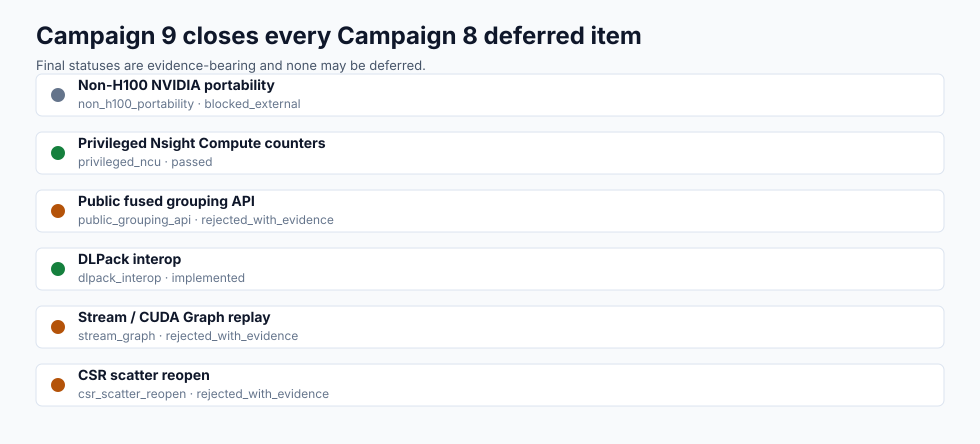
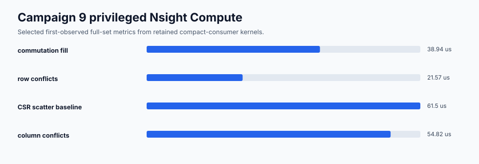
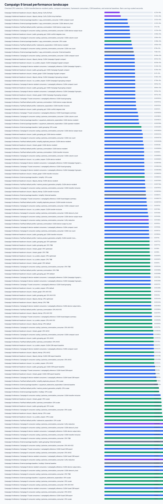

# CUDA Deferred Headroom Campaign 9 H100 Report

Date: 2026-04-29

Campaign 9 closes the deferred and blocked headroom items left by Campaign 8.
No Campaign 9 item is allowed to retain `final_status: deferred`.

## Evidence

Primary artifacts:

```text
docs/benchmarks/data/cuda_deferred_headroom_campaign9_2026-04-29/summary.json
docs/benchmarks/data/cuda_deferred_headroom_campaign9_2026-04-29/raw/
docs/benchmarks/data/cuda_deferred_headroom_campaign9_2026-04-29/metadata/
docs/benchmarks/data/cuda_deferred_headroom_campaign9_2026-04-29/profiler/
docs/benchmarks/data/cuda_portability_campaign9_non_h100_nvidia_2026-04-29/
docs/benchmarks/plots/cuda_campaign9_deferred_headroom_status.svg
docs/benchmarks/plots/cuda_campaign9_privileged_ncu.svg
docs/benchmarks/plots/cuda_campaign9_portability.svg
docs/benchmarks/plots/cuda_campaign9_performance_landscape.svg
```



The binary Nsight Compute report is not checked in because the generated
`.ncu-rep` was 244 MB. The checked evidence keeps CSV, stdout, and stderr, and
the summary records the remote binary path for the H100 run.

## Hardware

H100 execution host:

```text
host: ubuntu@<private-address>
gpu: NVIDIA H100 PCIe
compute capability: 9.0
driver: 580.126.09
CUDA toolkit: 12.9.86
compiled architecture: 90
```

Non-H100 NVIDIA portability access check:

```text
host checked: ubuntu@<private-address>
result: nvidia-smi exists, but the host reported no working NVIDIA driver
final status: blocked_external
```

## Validation

Campaign 9 validation includes:

```text
H100 CUDA semantic tests
H100 Phase 10 and Phase 11 CUDA tests
H100 benchmark profiles for Campaign 9 deferred-headroom rows
privileged Nsight Compute full-set capture
local renderer/schema tests
local repo validation before merge
final H100 validation and Compute Sanitizer ladder before closeout
```

Final closeout records the exact command results in the merge summary. The raw
Campaign 9 rows carry `deferred_status_allowed: false` and the renderer fails
if any final status is `deferred` or if any Campaign 8 remaining-headroom item
is omitted.

Compute Sanitizer memcheck, racecheck, initcheck, and synccheck all completed
with zero reported GPU errors or hazards on `tests/test_phase11_cuda_kernels.py`.
The sanitizer logs include nanobind interpreter-shutdown reference-leak
warnings that do not correspond to CUDA memory/race/init/sync findings; these
warnings are preserved in the checked logs rather than filtered.

## Privileged Nsight Compute



Privileged Nsight Compute capture succeeded. Selected first-observed full-set
metrics from the checked CSV:

| Kernel | Duration | Compute SM throughput | Memory throughput | L2 throughput |
| --- | ---: | ---: | ---: | ---: |
| commutation fill | 38.94 us | 77.58% | 27.66% | 6.57% |
| row conflicts | 21.57 us | 38.50% | 24.22% | 12.08% |
| column conflicts | 54.82 us | 15.22% | 69.53% | 69.53% |
| CSR scatter baseline | 61.50 us | 80.32% | 63.82% | 12.90% |

The retained compact consumers are dominated by commutation fill plus compact
count reductions. CSR scatter appears in the unretained full-CSR baseline, not
in the retained compact graph/grouping path.

## Non-H100 Portability


Campaign 9 performed a concrete named-host access check for non-H100 NVIDIA
portability. The available auxiliary host exposed `nvidia-smi` but did not have
a working NVIDIA driver. The final status is `blocked_external`, not
`deferred`. No provider control-plane access or non-H100 NVIDIA instance type
metadata was available to the agent; that missing provisioning metadata is
recorded as part of the external blocker. The exact evidence is recorded in
`docs/benchmarks/reports/cuda_portability_campaign9_non_h100_nvidia_2026-04-29.md`.

## Public Fused Grouping API Decision

Final status: `rejected_with_evidence`.

Campaign 9 rejects the true grouping-returning
`DevicePauliSum.group_commuting_device(...)` surface. The missing contract is
API shape, not just implementation: the campaign did not accept stable return
types, ordering relative to CPU grouping, ownership of returned metadata,
stream/lifetime semantics, allocation limits, or documentation rules for a
public grouping object.

Campaign 9 does implement
`DeviceCommutationMatrix.conflict_degrees(axis=None|0|1)` as a compact public
summary API. On the 2048x2048 H100 row:

| Boundary | Median time | Host bytes |
| --- | ---: | ---: |
| `conflict_degrees(axis=None)` | 0.0001270 s | 32776 compact bytes |
| `conflict_degrees(axis=0)` | 0.0000610 s | compact column counts |
| `conflict_degrees(axis=1)` | 0.0000348 s | compact row counts |
| dense `to_host()` plus NumPy conflict counts | 0.0138039 s | 4194304 dense bytes |

The compact summary is therefore retained as public API, while the true
grouping API remains unavailable.

## DLPack Interop Decision

Final status: `implemented`.

Campaign 9 implements a read-only DLPack producer for dense
`DeviceCommutationMatrix` buffers:

```text
DeviceCommutationMatrix.__dlpack__(stream=None, max_version=(1, 0), copy=None)
DeviceCommutationMatrix.__dlpack_device__()
```

The accepted contract is row-major `uint8`, shape `(rows, cols)`, device tuple
`(kDLCUDA, device_ordinal)`, owner retention through the capsule deleter
context, `copy=True` rejection, `stream=0` rejection, positive versioned
capsules when `max_version` is supplied, rejection of legacy unversioned
capsules because they cannot carry read-only flags, and read-only export
status. CuPy was
installed on H100 and validated as a real CUDA DLPack consumer. PyTorch CUDA is
covered by an optional test and skips when it is not installed.

On the 2048x2048 H100 row:

| Boundary | Median time |
| --- | ---: |
| CuPy from DLPack | 0.00000423 s |
| CuPy CUDA Array Interface export | 0.00000523 s |
| CuPy DLPack sum total | 0.0014758 s |
| CuPy DLPack dense host copy | 0.0003574 s |

## Stream And CUDA Graph Decision

Final status: `rejected_with_evidence`.

Campaign 9 keeps public CUDA methods synchronous and default-stream
compatible. It rejects public stream handles, public event objects, public CUDA
Graph handles, and private graph replay for this slice. The retained compact
consumers are already a small boundary relative to commutation fill and compact
reductions, and the campaign did not find enough launch-overhead or replay
benefit to justify adding graph capture, graph update, event, exception timing,
or Python lifetime contracts.

## CSR Scatter Decision

Final status: `rejected_with_evidence`.

CSR scatter reopening required a retained Campaign 9 consumer that exports or
internally consumes full CSR edge lists and privileged NCU evidence showing
scatter materially affects end-to-end retained-consumer time. The retained
compact consumers avoid full CSR edge-list materialization. The full CSR export
row remains an unretained baseline and measured around 0.0042 s to 0.0060 s
across the Campaign 9 rows, while compact retained graph/grouping consumers
remain around 0.00009 s to 0.00010 s on the same scale. Campaign 9 therefore
does not spend production complexity on CSR scatter tuning.

## Performance Landscape



The README plot is intentionally broad. It combines retained Campaign 8
landscape rows with Campaign 9 closure rows so that CPU scalar/default/oneTBB,
AVX2, AVX-512, CUDA transfer-inclusive, CUDA device-resident, compact
consumer, CSR baseline, framework consumer, and external-baseline points remain
visible in the same checked artifact.

Representative Campaign 9 2048x2048 H100 medians:

| Boundary | Median time |
| --- | ---: |
| CPU scalar | 0.0184 s to 0.0253 s |
| CPU optimized selector | 0.00177 s to 0.00244 s |
| CUDA transfer-inclusive | 0.000646 s to 0.00160 s |
| CUDA device-resident | 0.000444 s to 0.000710 s |
| compact graph consumer | 0.0000890 s to 0.0000947 s |
| compact grouping consumer | 0.0000948 s to 0.0000997 s |
| full CSR export baseline | 0.00422 s to 0.00598 s |

## Remaining Headroom

Campaign 9 leaves no unresolved Campaign 8 deferral. Future CUDA work should
start from new evidence, not from restating Campaign 8 headroom:

```text
provision a real non-H100 NVIDIA source-build host and rerun portability
broaden DLPack consumer coverage to PyTorch CUDA when installed
consider a true public grouping API only after exact return, ownership, ordering, and docs contracts are accepted
consider stream/CUDA Graph work only if new profiler evidence shows launch or replay overhead dominates a retained consumer
reopen CSR scatter only if a future retained consumer requires full CSR edge lists
```
