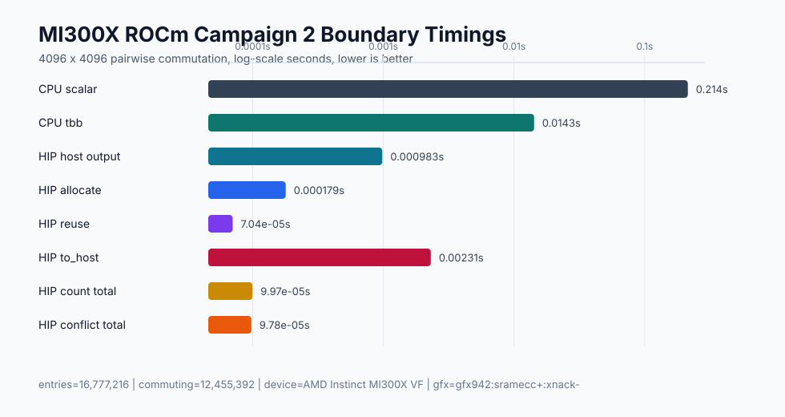

# ROCm MI300X Campaign 2 Report

Date: 2026-04-30 UTC

This report records the second FastPauli ROCm/HIP campaign on a single AMD
Instinct MI300X. The retained result is source-build evidence for HIP
device-resident dense commutation output and compact count/conflict consumers.
It is not a ROCm wheel support claim, not a multi-GPU claim, and not a claim
that CUDA and HIP can be enabled in the same build.

## Evidence Map

```text
plan: docs/plans/mi300x_rocm_optimization_campaign2_plan.md
architecture: docs/architecture/rocm_backend.md
summary: docs/benchmarks/data/rocm_mi300x_campaign2_2026-04-30/summary.json
raw data: docs/benchmarks/data/rocm_mi300x_campaign2_2026-04-30/raw/
logs: docs/benchmarks/data/rocm_mi300x_campaign2_2026-04-30/logs/
profiler artifacts: docs/benchmarks/data/rocm_mi300x_campaign2_2026-04-30/profiler/
plot: docs/benchmarks/plots/rocm_mi300x_campaign2_boundaries.svg
code revision under benchmark: 537a7b6
```

The Campaign 2 evidence root is dated by the UTC closeout date. Execution began
on 2026-04-29 America/Los_Angeles and the retained benchmark/profiler artifacts
were captured on 2026-04-30 UTC.



The plot is report-local. The README keeps the broad CPU/CUDA/external
landscape plot until a later checked landscape refresh incorporates ROCm rows
without narrowing the top-level performance view.

## Scope

In scope:

```text
single-node 1x MI300X source build
HIP DeviceCommutationMatrix allocation and RAII cleanup
HIP DeviceCommutationMatrix.empty(shape, device=0)
HIP DeviceCommutationMatrix.to_host()
HIP DeviceCommutationMatrix.count_commuting(axis=None|0|1)
HIP DeviceCommutationMatrix.conflict_degrees(axis=None|0|1)
HIP DevicePauliSum.commutes_with_device(other)
HIP DevicePauliSum.commutes_with_device(other, output=existing_matrix)
MI300X benchmark rows for host-output, device-output allocating, device-output reused, dense to_host, compact count, and compact conflict boundaries
rocprof trace, HIP API stats, copy stats, and counter evidence for retained HIP kernels
README, roadmap, ROCm architecture, and benchmark evidence updates tied to measured results
```

Out of scope:

```text
HIP DLPack, __dlpack_device__, or ROCm array-interface exposure
CUDA Array Interface exposure from HIP objects
public HIP stream parameters
public HIP workspace handles
HIP simplify, expectation, or matmul kernels
multi-GPU MI300X execution
ROCm binary wheels
simultaneous CUDA+HIP source builds
```

## Host And Build Inventory

| Field | Captured value |
| --- | --- |
| Host OS | Ubuntu 24.04.4 LTS, Linux 6.8.0-106-generic |
| GPU | AMD Instinct MI300X VF |
| GFX target | `gfx942:sramecc+:xnack-` |
| HIP runtime | 7.2.26015 |
| HIP driver | 7.2.26015 |
| HIP toolkit | 7.2.26015-fc0010cf6a |
| FastPauli HIP architecture | `gfx942` |
| CPU selectors available on host | scalar, oneTBB, AVX2, AVX-512 |

The HIP source build used:

```text
FASTPAULI_ENABLE_HIP=ON
FASTPAULI_HIP_ARCHITECTURES=gfx942
PATH=/opt/rocm/bin:$PATH
```

## Implementation Outcome

| Area | Terminal status | Evidence |
| --- | --- | --- |
| Public contract | passed | `docs/architecture/rocm_backend.md` |
| Source layout | passed | `src/hip/device_commutation_matrix.hip.*`, `src/hip/commutation_hip.hip.cpp` |
| Build integration | passed | `CMakeLists.txt`, `scripts/validate.py` HIP source inventory |
| Public header isolation | passed | HIP runtime headers stay under `src/hip/` |
| Device matrix lifetime | passed | HIP matrix PImpl owns `uint8` row-major device allocation through RAII |
| Device-output commutation | passed | `DevicePauliSum.commutes_with_device()` fills HIP matrix output |
| Reused output | passed | `commutes_with_device(..., output=matrix)` preserves object identity and validates shape/device |
| Compact consumers | passed | total, row, and column counts/conflict degrees match NumPy over `to_host()` |
| Unsupported interop | passed | HIP CUDA Array Interface and DLPack surfaces raise explicit HIP/ROCm errors |
| Benchmark protocol | passed | Campaign 2 timing fields separate allocation, reuse, dense host materialization, and compact consumers |

The retained dense output is a HIP-owned row-major `uint8` matrix. The API is
synchronous and mirrors the CUDA `DeviceCommutationMatrix` shape, dtype, device,
`to_host()`, `count_commuting()`, and `conflict_degrees()` semantics where HIP
can support them. It deliberately does not expose CUDA Array Interface or
DLPack semantics.

## Validation

The TDD red step was run on MI300X before implementation. The new Campaign 2
tests failed with the expected `HIP commutes_with_device is not implemented yet`
stub behavior while the pre-existing HIP foundation tests still passed.

Branch validation before final closeout included:

```text
.venv/bin/python -m pytest tests/test_phase12_rocm_foundation.py -q
local CPU-only host: 5 passed, 11 skipped

PATH=/opt/rocm/bin:$PATH .venv/bin/python -m pytest tests/test_phase12_rocm_foundation.py -q
MI300X HIP source build: 15 passed, 1 skipped

.venv/bin/python benchmarks/bench_rocm_kernels.py --smoke --repeat 1 --warmup 0 --json
local CPU-only host: passed with HIP unavailable

PATH=/opt/rocm/bin:$PATH .venv/bin/python benchmarks/bench_rocm_kernels.py --profile commutation-device-output-smoke --repeat 1 --warmup 0 --json
MI300X HIP source build: passed with correctness checks enabled
```

Final closeout validation logs are checked in under:

```text
docs/benchmarks/data/rocm_mi300x_campaign2_2026-04-30/logs/local_validate_macos_m4pro.log
docs/benchmarks/data/rocm_mi300x_campaign2_2026-04-30/logs/remote_device_output_equivalence_mi300x.log
docs/benchmarks/data/rocm_mi300x_campaign2_2026-04-30/logs/remote_pytest_mi300x.log
docs/benchmarks/data/rocm_mi300x_campaign2_2026-04-30/logs/remote_rocm_targeted_mi300x.log
docs/benchmarks/data/rocm_mi300x_campaign2_2026-04-30/logs/remote_rocm_smoke_mi300x.log
```

Final local CPU-only validation passed:

```text
.venv/bin/python scripts/validate.py
199 passed, 71 skipped, benchmark smokes passed, sdist smoke passed
```

Final remote MI300X full pytest passed:

```text
PATH=/opt/rocm/bin:$PATH .venv/bin/python -m pytest
209 passed, 61 skipped
```

The widened HIP device-output equivalence check passed after review fixes:

```text
PATH=/opt/rocm/bin:$PATH .venv/bin/python -m pytest tests/test_phase12_rocm_foundation.py::test_hip_device_commutation_matrix_matches_cpu_when_available -q
1 passed
```

Final remote MI300X targeted validation passed:

```text
PATH=/opt/rocm/bin:$PATH .venv/bin/python -m pytest tests/test_phase12_rocm_foundation.py tests/test_phase6_commutation_grouping.py -q
26 passed, 1 skipped
```

Final remote ROCm benchmark smoke passed:

```text
PATH=/opt/rocm/bin:$PATH FASTPAULI_BENCHMARK_GIT_COMMIT=537a7b6 .venv/bin/python benchmarks/bench_rocm_kernels.py --smoke --repeat 3 --warmup 1 --json
status ok, correctness_passed true
```

The single skipped MI300X test requires at least two visible HIP devices to
validate wrong-device output rejection. One MI300X device was visible, so the
skip is expected.

## Benchmarks

Benchmark commands:

```text
PATH=/opt/rocm/bin:$PATH FASTPAULI_BENCHMARK_GIT_COMMIT=537a7b6 .venv/bin/python benchmarks/bench_rocm_kernels.py --profile commutation-device-output-scaling --repeat 5 --warmup 2 --json --output docs/benchmarks/data/rocm_mi300x_campaign2_2026-04-30/raw/rocm_commutation_device_output_scaling_mi300x.json
PATH=/opt/rocm/bin:$PATH FASTPAULI_BENCHMARK_GIT_COMMIT=537a7b6 .venv/bin/python benchmarks/bench_rocm_kernels.py --profile commutation-compact-consumers --repeat 5 --warmup 2 --json --output docs/benchmarks/data/rocm_mi300x_campaign2_2026-04-30/raw/rocm_commutation_compact_consumers_mi300x.json
PATH=/opt/rocm/bin:$PATH FASTPAULI_BENCHMARK_GIT_COMMIT=537a7b6 rocprof -d docs/benchmarks/data/rocm_mi300x_campaign2_2026-04-30/profiler --hip-trace --stats .venv/bin/python benchmarks/bench_rocm_kernels.py --profile commutation-campaign2-profiler --repeat 1 --warmup 0 --json --output docs/benchmarks/data/rocm_mi300x_campaign2_2026-04-30/raw/rocm_commutation_campaign2_profiler_mi300x.json
PATH=/opt/rocm/bin:$PATH FASTPAULI_BENCHMARK_GIT_COMMIT=537a7b6 rocprof -i docs/benchmarks/data/rocm_mi300x_campaign2_2026-04-30/profiler/rocprof_campaign2_counters.txt -o docs/benchmarks/data/rocm_mi300x_campaign2_2026-04-30/profiler/rocm_commutation_campaign2_counters.csv .venv/bin/python benchmarks/bench_rocm_kernels.py --profile commutation-campaign2-profiler --repeat 1 --warmup 0 --json --output docs/benchmarks/data/rocm_mi300x_campaign2_2026-04-30/raw/rocm_commutation_campaign2_counters_mi300x.json
```

Representative non-profiler 4096 x 4096 rows, 16,777,216 pairwise entries:

| Boundary | Large dense output | Compact consumer row |
| --- | ---: | ---: |
| CPU scalar full matrix | 214.28 ms | 215.41 ms |
| Best optimized CPU selector | oneTBB, 14.26 ms | oneTBB, 13.44 ms |
| HIP device operands, host output | 982.96 us | 1.05 ms |
| HIP device-output allocate | 179.20 us | 178.12 us |
| HIP device-output reused | 70.38 us | 70.76 us |
| HIP dense `to_host()` | 2.31 ms | 2.26 ms |
| HIP `count_commuting(axis=None)` | 99.70 us | 98.94 us |
| HIP `count_commuting(axis=0)` | 130.98 us | 135.65 us |
| HIP `count_commuting(axis=1)` | 32.88 us | 33.23 us |
| HIP `conflict_degrees(axis=None)` | 97.75 us | 98.62 us |
| HIP `conflict_degrees(axis=0)` | 137.70 us | 138.73 us |
| HIP `conflict_degrees(axis=1)` | 36.14 us | 35.67 us |

Correctness digests for the retained large rows:

| Case | Shape | Commuting | Conflicts |
| --- | ---: | ---: | ---: |
| campaign2_large_dense_output | 4096 x 4096 | 12,455,392 | 4,321,824 |
| campaign2_compact_large | 4096 x 4096 | 12,449,186 | 4,328,030 |

Interpretation:

```text
device-output reuse removes the dense host-output boundary and is the fastest retained boundary for callers that can keep results device-resident
dense to_host remains intentionally explicit and is much slower than compact count/conflict consumers because it copies the full 16 MiB uint8 matrix to host
compact axis=1 reductions are fastest on these row-major matrices; axis=0 reductions are column-stride and correspondingly slower
optimized CPU selector rows remain in the same datasets so HIP results are not compared only against scalar CPU
```

No ROCm external sparse-Pauli primitive baseline was retained in this campaign.
Future ROCm baseline work must record version, installation method, device
enablement, semantic mapping, timing boundary, correctness oracle, and
unavailable reasons before making package-to-package claims.

## rocprof Evidence

The retained trace artifacts include top-level `results.*` files and rocprof
spill directories under:

```text
docs/benchmarks/data/rocm_mi300x_campaign2_2026-04-30/profiler/
```

HIP API stats for the traced profiler run show the expected boundary shape:

| HIP API | Calls | Share of HIP API duration |
| --- | ---: | ---: |
| hipMemcpy | 16 | 96.20% |
| hipLaunchKernel | 9 | 2.15% |
| hipFree | 15 | 0.73% |
| hipMalloc | 15 | 0.51% |
| hipDeviceSynchronize | 3 | 0.38% |

Representative counter rows for the retained kernels:

| Kernel | Grid | Workgroup | MeanOccupancyPerCU | VALUUtilization | VALUBusy | FetchSize | WriteSize |
| --- | ---: | ---: | ---: | ---: | ---: | ---: | ---: |
| commutation_kernel | 16,777,216 | 256 | 25.48 to 25.56 | 100.00 | 64.06 to 64.51 | 1181.38 to 1182.63 | 16,384.00 |
| count_total_kernel | 16,777,216 | 256 | 24.04 to 24.39 | 88.40 | 19.00 to 20.31 | 16,413.75 to 16,414.38 | 2,048.00 |
| count_cols_kernel | 1,048,576 | 256 | 24.31 to 24.38 | 98.35 | 4.44 to 4.48 | 161,750.63 to 163,560.00 | 132.19 to 132.66 |
| count_rows_kernel | 1,048,576 | 256 | 17.34 to 17.42 | 98.30 | 21.15 to 21.24 | 16,415.75 to 16,415.88 | 128.00 |

The profiler run is instrumentation-heavy and should not be used as the primary
throughput claim. It is retained to explain cost structure: dense
materialization is copy-dominated, launch overhead is not the limiting factor
for large rows, and the column-oriented compact reductions are memory-access
heavier than row-oriented reductions.

## Acceptance Criteria

| Acceptance item | Status |
| --- | --- |
| CPU-only local validation passes with HIP disabled | passed |
| HIP source build succeeds on MI300X with `gfx942` | passed |
| CUDA+HIP configure-time rejection remains covered by validation | passed |
| Public headers contain no HIP or ROCm runtime headers | passed |
| HIP `DeviceCommutationMatrix.empty()` allocates requested shape/device | passed |
| HIP `DevicePauliSum.commutes_with_device()` matches CPU commutation | passed |
| HIP reused output preserves object identity and rejects invalid shape/size/device where testable | passed |
| HIP `count_commuting(axis=None|0|1)` matches NumPy sums over `to_host()` | passed |
| HIP `conflict_degrees(axis=None|0|1)` matches NumPy conflicts over `to_host()` | passed |
| HIP DLPack and CUDA Array Interface surfaces remain explicitly unavailable | passed |
| Benchmark JSON separates allocation, reuse, compact consumers, and dense `to_host()` timings | passed |
| rocprof trace/stats/counter evidence exists for retained HIP kernels | passed |
| README and roadmap state only evidence-backed ROCm claims | passed |
| Independent review is recorded before merge | passed after review closeout |

## Review Closeout

One independent reviewer agent inspected the Campaign 2 closeout before merge.
The review scope covered HIP device-output correctness, CUDA/HIP API
compatibility, benchmark/report honesty, source-of-truth docs, validation
evidence, and release wording. The review found five issues:

```text
P1: HIP device-output equivalence coverage did not yet cover every planned edge class
P1: review evidence was marked passed before the review closeout was recorded
P2: hardware-target source-of-truth docs still routed Campaign 2 as future work
P2: compact benchmark rows labeled count and conflict consumers as count-only materialization
P3: shared accelerator docstrings still used CUDA-only wording for HIP-supported or HIP-guarded methods
```

All findings were resolved before merge:

```text
device-output tests now cover empty, scalar, vector, matrix, one-word, multi-word, and randomized cases
hardware target docs route Campaign 2 as complete with checked report evidence
ROCm benchmark rows record compact_uint64_counts_and_conflicts plus the explicit compact count/conflict target list
shared accelerator docstrings distinguish active accelerator behavior from CUDA-only and HIP-deferred methods
this section records review scope, findings, resolutions, validation after fixes, and residual risk
```

Validation after review fixes:

```text
local targeted tests for CUDA/HIP matrix allocation and native-layout guardrails passed
MI300X widened HIP device-output equivalence test passed
full local validation and full MI300X validation are retained in the checked logs listed above
```

## Correctness Risks

The retained Campaign 2 surface is still intentionally narrow. Remaining
correctness risks are future expansion risks rather than unresolved defects in
the retained slice:

```text
HIP DLPack needs a separate ownership, stream, read-only, and consumer compatibility contract before exposure
simultaneous CUDA+HIP builds need a backend-neutral device object model
public HIP streams or workspaces need explicit synchronization and lifetime rules
HIP simplify, expectation, and matmul need their own CPU/HIP equivalence ladders
multi-GPU MI300X behavior is untested because only one visible HIP device was used
ROCm wheels and broader AMD GPU support need release packaging evidence
```

## Remaining Headroom

Further ROCm work should be planned as separate slices:

```text
define and validate HIP DLPack only if a named ROCm consumer and stream/ownership contract are accepted
add HIP simplify after deciding whether rocThrust, hipCUB, or custom duplicate reduction is the retained implementation path
add HIP expectation and matmul after CPU/CUDA semantic parity tests are promoted to HIP
profile packed or bitset commutation summaries only if a public consumer can use them without forcing dense host materialization
refresh the broad README performance landscape once ROCm rows can be added without replacing the cross-path CPU/CUDA/external view
evaluate additional AMD GPUs only when portability evidence is needed for a release or support claim
```

## Release Claim

The accepted claim after this campaign is:

```text
FastPauli has source-build ROCm/HIP evidence on one MI300X for backend metadata, host/device transfers, pairwise commutation, HIP device-resident commutation matrices, dense host materialization, and compact count/conflict consumers.
```

The rejected claims remain:

```text
FastPauli ships ROCm wheels
FastPauli supports every AMD GPU
FastPauli supports simultaneous CUDA+HIP builds
FastPauli exposes HIP stream, graph, DLPack, workspace, simplify, expectation, or matmul APIs
```
