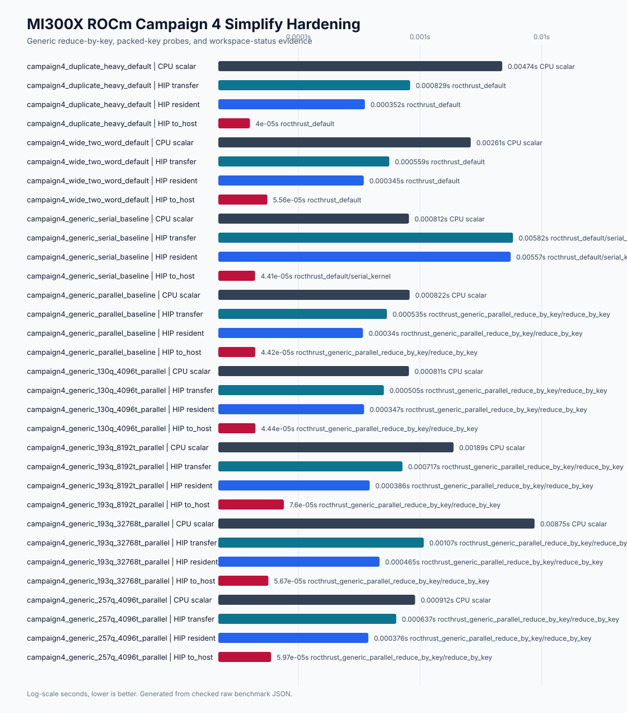

# ROCm MI300X Campaign 4 Report

Date: 2026-04-30

Git revision benchmarked: `8e40e9f`

Evidence root:
`docs/benchmarks/data/rocm_mi300x_campaign4_2026-04-30`

Plots:

```text
docs/benchmarks/plots/rocm_mi300x_campaign4_simplify_hardening.svg
docs/benchmarks/plots/accelerator_landscape_with_rocm.svg
```

## Scope

Campaign 4 closes the private ROCm/HIP simplify hardening items identified by
Campaign 3. It keeps the public surface unchanged:

```text
HIP DevicePauliSum.simplify(atol=1e-12, rtol=0.0)
device-resident HIP DevicePauliSum output
CPU-equivalent canonical ordering and tolerance filtering
no public HIP workspaces, streams, DLPack, expectation, matmul, wheels, or multi-GPU APIs
```

The retained implementation change is the generic multi-word simplify path:
the Campaign 3 single-thread serial reducer remains as a private A/B fallback,
while production generic multi-word simplify now uses sorted representative
indices plus parallel rocThrust `reduce_by_key`.

## Host And Build Inventory

The MI300X lane used `/root/FastPauli` on a ROCm-enabled Ubuntu host. Benchmark
JSON records:

```text
GPU: AMD Instinct MI300X VF
LLVM target: gfx942:sramecc+:xnack-
CPU: Intel Xeon Platinum 8568Y+
FASTPAULI_ENABLE_HIP=ON
FASTPAULI_HIP_ARCHITECTURES=gfx942
FASTPAULI_ENABLE_CUDA=OFF
FASTPAULI_ENABLE_NATIVE=OFF
ROCm runtime: 7.2.26015
ROCm toolkit: 7.2.26015-fc0010cf6a
HIP compiler: /opt/rocm/bin/amdclang++ 22.0.0
C++ compiler: GNU 13.3.0
Compiled CPU selectors: scalar, tbb, avx2, avx512
Active CPU backend during simplify benchmarks: scalar
```

## Implementation Outcome

Retained:

```text
generic multi-word HIP simplify: parallel sorted-index reduce_by_key
one-word and two-word HIP simplify: existing rocThrust key paths
private serial generic fallback: benchmark-only A/B selector
private HIP workspace RAII class: implementation building block, not public API
Campaign 4 benchmark JSON fields for strategy, key shape, workspace mode, and terminal statuses
```

Rejected or unavailable:

```text
custom packed-key probes: unavailable; no distinct lower-level rocPRIM/hipCUB implementation retained or timed
rocPRIM/hipCUB scratch workspace probes: unavailable for current rocThrust boundary
public HIP workspace handles: not exposed
HIP DLPack, streams, expectation, matmul, multi-GPU, ROCm wheels, and CUDA+HIP builds: out of scope
```

## Validation

Local CPU-only validation during implementation:

```bash
<private-path> -m pytest tests/test_phase12_rocm_foundation.py -q
<private-path> -m pytest tests/test_rocm_campaign4_assets.py -q
git diff --check
```

Observed results before closeout:

```text
tests/test_phase12_rocm_foundation.py: 6 passed, 20 skipped
tests/test_rocm_campaign4_assets.py: 2 passed
git diff --check: passed
```

MI300X HIP validation during implementation:

```bash
PATH=/opt/rocm/bin:$PATH .venv/bin/python -m pytest \
  tests/test_phase12_rocm_foundation.py::test_hip_simplify_matches_cpu_for_edge_cases_when_available \
  tests/test_phase12_rocm_foundation.py::test_hip_simplify_randomized_matches_cpu_when_available \
  tests/test_phase12_rocm_foundation.py::test_hip_simplify_campaign4_generic_multiword_pressure_when_available \
  -q

PATH=/opt/rocm/bin:$PATH FASTPAULI_HIP_BENCH_GENERIC_MULTIWORD_REDUCTION=serial_kernel \
  .venv/bin/python -m pytest \
  tests/test_phase12_rocm_foundation.py::test_hip_simplify_campaign4_generic_multiword_pressure_when_available \
  -q

PATH=/opt/rocm/bin:$PATH .venv/bin/python benchmarks/bench_rocm_kernels.py \
  --profile simplify-campaign4-custom-key-ab --repeat 1 --warmup 0 --json
```

Result:

```text
parallel generic selected tests: 3 passed
serial generic fallback guard: 1 passed
custom packed-key profile: 3 strategy_unavailable rows with exact unavailable reason
```

## Benchmark Commands

The retained benchmark rows were generated on MI300X with:

```bash
PATH=/opt/rocm/bin:$PATH FASTPAULI_BENCHMARK_GIT_COMMIT=8e40e9f \
  .venv/bin/python benchmarks/bench_rocm_kernels.py \
  --profile simplify-campaign4-baseline --repeat 5 --warmup 2 --json \
  --output docs/benchmarks/data/rocm_mi300x_campaign4_2026-04-30/raw/rocm_simplify_campaign4_baseline_mi300x.json

PATH=/opt/rocm/bin:$PATH FASTPAULI_BENCHMARK_GIT_COMMIT=8e40e9f \
  .venv/bin/python benchmarks/bench_rocm_kernels.py \
  --profile simplify-campaign4-custom-key-ab --repeat 5 --warmup 2 --json \
  --output docs/benchmarks/data/rocm_mi300x_campaign4_2026-04-30/raw/rocm_simplify_campaign4_custom_key_mi300x.json

PATH=/opt/rocm/bin:$PATH FASTPAULI_BENCHMARK_GIT_COMMIT=8e40e9f \
  .venv/bin/python benchmarks/bench_rocm_kernels.py \
  --profile simplify-campaign4-generic-multiword --repeat 5 --warmup 2 --json \
  --output docs/benchmarks/data/rocm_mi300x_campaign4_2026-04-30/raw/rocm_simplify_campaign4_generic_mi300x.json

PATH=/opt/rocm/bin:$PATH FASTPAULI_BENCHMARK_GIT_COMMIT=8e40e9f \
  .venv/bin/python benchmarks/bench_rocm_kernels.py \
  --profile simplify-campaign4-workspace-ab --repeat 5 --warmup 2 --json \
  --output docs/benchmarks/data/rocm_mi300x_campaign4_2026-04-30/raw/rocm_simplify_campaign4_workspace_mi300x.json
```

Profiler capture:

```bash
PATH=/opt/rocm/bin:$PATH FASTPAULI_BENCHMARK_GIT_COMMIT=8e40e9f \
  rocprof -d docs/benchmarks/data/rocm_mi300x_campaign4_2026-04-30/profiler \
  --hip-trace --stats \
  .venv/bin/python benchmarks/bench_rocm_kernels.py \
  --profile simplify-campaign4-profiler --repeat 1 --warmup 0 --json \
  --output docs/benchmarks/data/rocm_mi300x_campaign4_2026-04-30/raw/rocm_simplify_campaign4_profiler_mi300x.json
```

The profiler emitted HIP/HSA trace files under
`docs/benchmarks/data/rocm_mi300x_campaign4_2026-04-30/profiler/`; stderr was
empty.

## Benchmark Results

Median seconds, lower is better:

| Case | Qubits | Terms | Strategy | CPU scalar | HIP transfer | HIP resident | HIP to_host | Resident speedup vs CPU |
|---|---:|---:|---|---:|---:|---:|---:|---:|
| duplicate heavy default | 24 | 32768 | rocthrust default | 0.004741 | 0.000829 | 0.000352 | 0.000040 | 13.45x |
| wide two-word default | 70 | 8192 | rocthrust default | 0.002613 | 0.000559 | 0.000345 | 0.000056 | 7.58x |
| generic serial A/B | 130 | 4096 | serial fallback | 0.000812 | 0.005818 | 0.005566 | 0.000044 | 0.15x |
| generic parallel A/B | 130 | 4096 | reduce_by_key | 0.000822 | 0.000535 | 0.000340 | 0.000044 | 2.42x |
| generic 130q/4096t | 130 | 4096 | reduce_by_key | 0.000811 | 0.000505 | 0.000347 | 0.000044 | 2.34x |
| generic 193q/8192t | 193 | 8192 | reduce_by_key | 0.001887 | 0.000717 | 0.000386 | 0.000076 | 4.89x |
| generic 193q/32768t | 193 | 32768 | reduce_by_key | 0.008750 | 0.001073 | 0.000465 | 0.000057 | 18.82x |
| generic 257q/4096t | 257 | 4096 | reduce_by_key | 0.000912 | 0.000637 | 0.000376 | 0.000060 | 2.42x |

The direct A/B row improved from 0.005566 s to 0.000340 s resident, a 16.4x
speedup over the Campaign 3 serial generic fallback. The retained generic path
also clears the plan gate by becoming faster than scalar CPU on all measured
generic rows.



## Strategy Decisions

| Candidate | Key shape | Status | Decision |
|---|---|---|---|
| rocThrust default | packed32/key2 | retained | Remains the production one-word and two-word path. |
| rocThrust generic reduce_by_key | generic multiword | retained | Replaces the serial generic reducer in production. |
| serial generic kernel | generic multiword | benchmark_only | Kept only as private A/B fallback. |
| custom packed key | packed32/key1/key2 | unavailable | Not timed because no distinct lower-level rocPRIM/hipCUB implementation replaced rocThrust. |
| rocPRIM scratch probe | packed32 | unavailable | Current rocThrust path does not expose a stable explicit scratch-buffer contract. |
| hipCUB scratch probe | generic multiword | unavailable | Current rocThrust path does not expose a stable explicit scratch-buffer contract. |

Workspace accounting fields are present on every Campaign 4 row. Retained rows
report `hip_workspace_mode: absent` with zero allocation counts; unavailable
workspace probes report exact unavailable reasons rather than timing a fallback
under a false label.

## README Landscape

The README plot was regenerated as a broad CPU/CUDA/ROCm/external landscape,
not a narrow ROCm-only view:


The reproducible renderer is:

```bash
python scripts/render_rocm_campaign4_assets.py \
  --data-dir docs/benchmarks/data/rocm_mi300x_campaign4_2026-04-30 \
  --plot-dir docs/benchmarks/plots
```

## Terminal Statuses

| Item | Status |
|---|---|
| generic multi-word simplify | retained |
| custom packed key | unavailable |
| workspace/scratch probes | rejected_with_evidence |
| DLPack | out_of_scope_with_next_trigger |
| public streams | out_of_scope_with_next_trigger |
| public workspaces | out_of_scope_with_next_trigger |
| expectation | out_of_scope_with_next_trigger |
| matmul | out_of_scope_with_next_trigger |
| portability | MI300X_gfx942_only |
| ROCm wheels | out_of_scope_with_next_trigger |
| multi-GPU | out_of_scope_with_next_trigger |
| simultaneous CUDA+HIP | configure_time_rejected |

## Remaining Headroom

Campaign 4 closes the private simplify performance headroom that blocked
generic multi-word rows. The next ROCm work should be planned as explicit API
or release-support slices:

```text
HIP DLPack/consumer interop with a named PyTorch ROCm or CuPy ROCm consumer
public stream or graph execution only after lifetime and synchronization contracts
public HIP workspace handles only with a measured benefit and accepted ownership model
HIP expectation and matmul after CPU/CUDA parity fixtures are promoted to HIP
ROCm portability, CI, and packaging evidence beyond single-host MI300X gfx942 source builds
backend-neutral multi-accelerator design before simultaneous CUDA+HIP or multi-GPU ROCm claims
```
