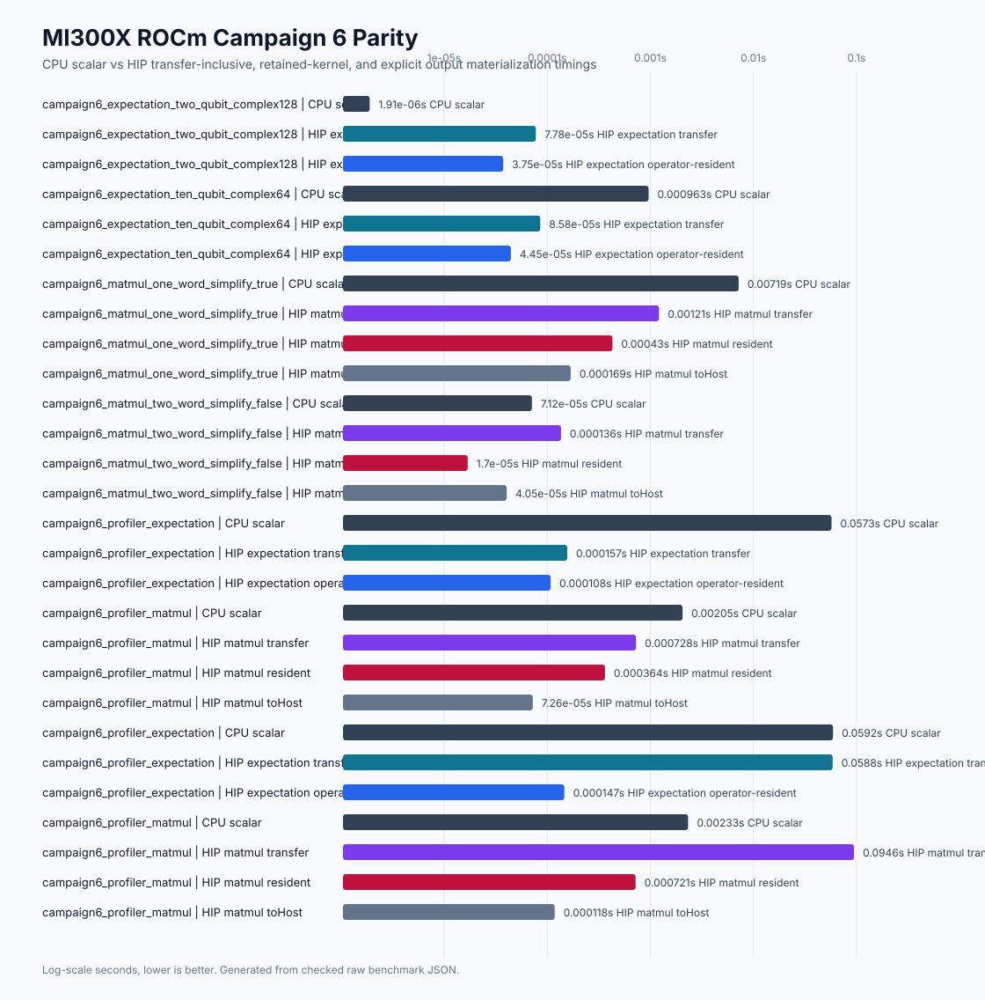

# ROCm MI300X Campaign 6 Expectation And Matmul Parity Report

Date: 2026-04-30

## Scope

Campaign 6 retained HIP implementations for the existing
`DevicePauliSum.expectation_statevector()` and `DevicePauliSum.matmul()` public
methods on MI300X. It did not add new public methods, stream arguments,
workspace arguments, graph replay, HIP DLPack statevector import, external HIP
device-pointer statevectors, ROCm wheels, multi-GPU ROCm support, broader AMD
GPU portability claims, or simultaneous CUDA+HIP source builds.

The retained expectation boundary accepts host NumPy `complex64` and
`complex128` statevectors. External device-pointer statevectors remain
unavailable with an explicit HIP/ROCm interop message. The retained matmul
boundary returns HIP-backed `DevicePauliSum` objects, preserves
`simplify=False` CPU nested-loop ordering, and uses retained HIP simplify for
`simplify=True`.

## Host And Build

| Field | Value |
|---|---:|
| Host | `rocm-7-2-software-gpu-mi300x1-192gb-devcloud-atl1` |
| GPU | AMD Instinct MI300X VF |
| GFX target | `gfx942:sramecc+:xnack-` |
| HIP runtime / driver | `7.2.26015` / `7.2.26015` |
| ROCm toolkit | `7.2.26015-fc0010cf6a` |
| HIP compiler | `/opt/rocm/bin/amdclang++`, Clang `22.0.0` |
| CPU | Intel Xeon Platinum 8568Y+ |
| Build commit | `a728ef488cd4bc29bd5064cd99f1fe3b863de20c` |
| Build flags | `FASTPAULI_ENABLE_HIP=ON`, `FASTPAULI_HIP_ARCHITECTURES=gfx942` |

The MI300X build, correctness, benchmark, and profiler evidence was captured at
`a728ef488cd4bc29bd5064cd99f1fe3b863de20c`. Later Campaign 6 commits added the
checked report, plots, roadmap/doc updates, and renderer-test closeout; they do
not change the HIP implementation that generated the evidence.

Evidence:

```text
docs/benchmarks/data/rocm_mi300x_campaign6_2026-04-30/
docs/benchmarks/data/rocm_mi300x_campaign6_2026-04-30/summary.json
docs/benchmarks/plots/rocm_mi300x_campaign6_parity.svg
docs/benchmarks/plots/accelerator_landscape_with_rocm.svg
```

## Implementation Outcome

Retained:

```text
HIP DevicePauliSum.expectation_statevector(host NumPy complex64/complex128)
HIP DevicePauliSum.matmul(rhs, simplify=True)
HIP DevicePauliSum.matmul(rhs, simplify=False)
HIP matmul simplify=True through retained HIP DevicePauliSum.simplify()
Campaign 6 benchmark rows for expectation and matmul protocol fields
Campaign 6 README broad CPU/CUDA/ROCm/external landscape refresh
```

Preserved as unavailable, rejected, or out of scope:

```text
external HIP statevector device pointers
HIP DLPack and HIP __dlpack_device__
HIP CUDA Array Interface
public streams
public graphs
public workspaces
ROCm wheels
multi-GPU ROCm
broader AMD portability claims beyond MI300X gfx942 evidence
simultaneous CUDA+HIP source builds
```

## Validation

Local CPU-only validation during implementation:

```bash
uv run python -m pytest tests/test_phase12_rocm_foundation.py tests/test_rocm_campaign6_assets.py tests/test_validate_entrypoint.py -q
git diff --check
uv run python scripts/validate.py
```

Observed results:

```text
targeted pytest: 16 passed, 30 skipped
git diff --check: passed
scripts/validate.py: passed
```

MI300X HIP validation:

```bash
PATH=/opt/rocm/bin:/opt/rocm/llvm/bin:$PATH .venv/bin/python -m pytest \
  tests/test_phase12_rocm_foundation.py -q
```

Observed result:

```text
37 passed, 2 skipped in 3.71s
```

The two skips require at least two visible HIP devices for different-device
guardrail coverage. The single-device MI300X host still covered same-device
matmul, expectation, dense output, compact consumers, simplify, and retained
guardrails.

The HIP build metadata reports retained kernels:

```text
simplify
expectation_statevector
commutes_with
commutes_with_device
commutation_count_consumers
matmul
```

## Benchmark Commands

Expectation parity:

```bash
PATH=/opt/rocm/bin:/opt/rocm/llvm/bin:$PATH .venv/bin/python \
  benchmarks/bench_rocm_kernels.py \
  --profile campaign6-expectation-parity --repeat 5 --warmup 2 --json \
  --output docs/benchmarks/data/rocm_mi300x_campaign6_2026-04-30/raw/rocm_campaign6_expectation_mi300x.json
```

Matmul parity:

```bash
PATH=/opt/rocm/bin:/opt/rocm/llvm/bin:$PATH .venv/bin/python \
  benchmarks/bench_rocm_kernels.py \
  --profile campaign6-matmul-parity --repeat 5 --warmup 2 --json \
  --output docs/benchmarks/data/rocm_mi300x_campaign6_2026-04-30/raw/rocm_campaign6_matmul_mi300x.json
```

Profiler benchmark:

```bash
PATH=/opt/rocm/bin:/opt/rocm/llvm/bin:$PATH .venv/bin/python \
  benchmarks/bench_rocm_kernels.py \
  --profile campaign6-profiler --repeat 3 --warmup 1 --json \
  --output docs/benchmarks/data/rocm_mi300x_campaign6_2026-04-30/raw/rocm_campaign6_profiler_mi300x.json
```

rocprof trace and stats:

```bash
PATH=/opt/rocm/bin:/opt/rocm/llvm/bin:$PATH rocprof --hip-trace --stats \
  -o rocm_campaign6_rocprof.csv \
  .venv/bin/python benchmarks/bench_rocm_kernels.py \
  --profile campaign6-profiler --repeat 1 --warmup 0 --json \
  --output docs/benchmarks/data/rocm_mi300x_campaign6_2026-04-30/raw/rocm_campaign6_profiler_rocprof_mi300x.json
```

The final profiler command completed. Two earlier rocprof flag-adjustment
attempts are preserved in logs so the checked evidence explains the tooling
path rather than hiding the retry history.

## Benchmark Results

Median seconds, lower is better. For expectation rows, the middle HIP column is
operator-resident host-statevector timing: the HIP `DevicePauliSum` is reused,
but the public method still accepts a host NumPy statevector and copies that
statevector internally on each call. For matmul rows, the middle HIP column is
the retained device-resident product path, including retained HIP simplify when
`simplify=True`.

| Case | Operation | Dataset | CPU scalar | HIP transfer-inclusive | HIP retained-kernel path | HIP to_host |
|---|---|---|---:|---:|---:|---:|
| two-qubit complex128 | expectation | 5 terms, state size 4 | 0.000001906 | 0.000077789 | 0.000037547 | n/a |
| ten-qubit complex64 | expectation | 256 terms, state size 1024 | 0.000963113 | 0.000085812 | 0.000044488 | n/a |
| profiler expectation | expectation | 1024 terms, state size 16384 | 0.057278043 | 0.000156804 | 0.000108039 | n/a |
| one-word simplify=True | matmul | 256 x 256 terms, 36864 output terms | 0.007192872 | 0.001213662 | 0.000429602 | 0.000169331 |
| two-word simplify=False | matmul | 64 x 64 terms, 4096 output terms | 0.000071185 | 0.000136338 | 0.000016973 | 0.000040510 |
| profiler matmul | matmul | 128 x 128 terms, 9216 output terms | 0.002054369 | 0.000728104 | 0.000364058 | 0.000072584 |

The small two-qubit expectation row is intentionally retained as correctness
and overhead evidence, not as a throughput claim. Transfer overhead dominates
that case. Larger expectation rows show the retained HIP expectation kernel
advantage after excluding repeated operator transfer, while still copying the
host statevector through the public API. Matmul rows show the intended HIP
device-resident advantage while keeping transfer-inclusive timings checked in.



## Profiler Evidence

`rocprof --hip-trace --stats` completed for the Campaign 6 profiler profile.
The profiler run includes retained HIP expectation and matmul rows, and emits
HIP stats, copy stats, system info, JSON, and database artifacts under:

```text
docs/benchmarks/data/rocm_mi300x_campaign6_2026-04-30/profiler/
```

The rocprof-instrumented benchmark rows are intentionally kept separate from
the repeated benchmark rows because profiling overhead perturbs
transfer-inclusive timings. The profiler resident timings still confirm that
the retained kernels execute under the HIP trace. For expectation, that
profiled retained-kernel timing is still operator-resident host-statevector
timing, not external device-statevector interop.

## Terminal Statuses

| Item | Status |
|---|---|
| HIP expectation | retained |
| HIP matmul | retained |
| External statevector device pointers | unavailable |
| HIP DLPack | rejected_with_evidence |
| HIP CUDA Array Interface guard | rejected_with_evidence |
| Public streams | rejected_with_evidence |
| Public graphs | rejected_with_evidence |
| Public workspaces | rejected_with_evidence |
| Portability beyond MI300X `gfx942` | out_of_scope_with_next_trigger |
| ROCm wheels | out_of_scope_with_next_trigger |
| Multi-GPU ROCm | out_of_scope_with_next_trigger |
| Simultaneous CUDA+HIP source builds | unavailable |

## README Landscape

The README landscape was regenerated as the broad CPU/CUDA/ROCm/external view,
not a narrow ROCm-only plot:


The reproducible renderer is:

```bash
python scripts/render_rocm_campaign6_assets.py \
  --data-dir docs/benchmarks/data/rocm_mi300x_campaign6_2026-04-30 \
  --plot-dir docs/benchmarks/plots
```

## Remaining Headroom And Next Work

Campaign 6 closes the HIP expectation and matmul parity gap on the MI300X
source-build lane. The next ROCm work should move to Wave 5 release-support
evidence or narrowly targeted performance hardening:

```text
repeatability and portability evidence on another AMD GPU only when access exists
ROCm CI or release-runbook support for source-build validation
ROCm packaging policy before any wheel or support-matrix wording changes
HIP expectation external-statevector interop only after a separate ownership, stream, and read-only consumer contract exists
matmul/simplify profiling under larger duplicate-pressure workloads if a concrete retained operation shows new bottlenecks
backend-neutral accelerator design before simultaneous CUDA+HIP or multi-GPU ROCm claims
```
