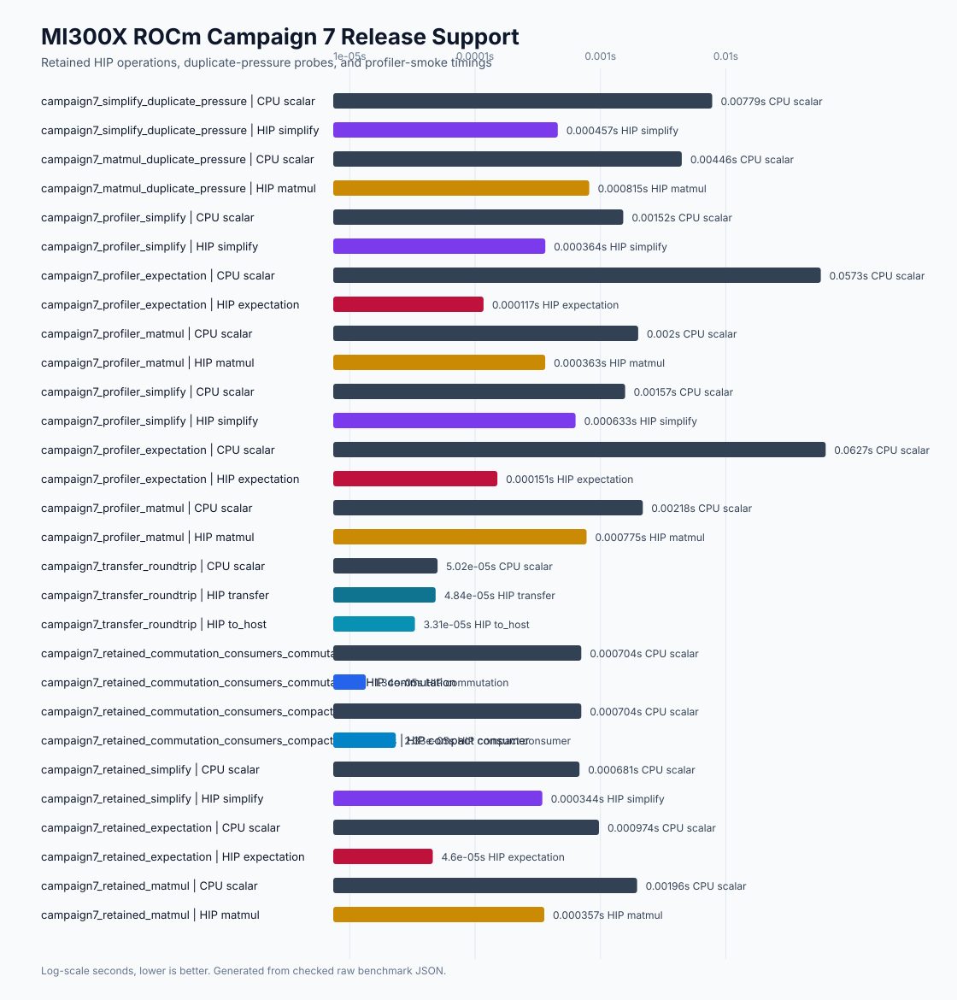

# ROCm MI300X Campaign 7 Release-Support Report

Date: 2026-04-30

## Scope

Campaign 7 converts retained MI300X ROCm/HIP operation evidence into a
repeatable release-support lane. It does not add new public methods, new HIP
kernels, ROCm wheels, additional AMD GPU support claims, multi-GPU ROCm,
external HIP statevector interop, HIP DLPack, HIP CUDA Array Interface, public
streams, public graphs, public workspaces, or simultaneous CUDA+HIP source
builds.

The retained support claim is source-build-only MI300X `gfx942` evidence for
existing HIP transfers, commutation, compact consumers, simplify, expectation,
and matmul. Wheel support and broader AMD portability remain unavailable until
separate packaging and hardware-lane evidence exists.

## Host And Build

| Field | Value |
|---|---:|
| Host | `rocm-7-2-software-gpu-mi300x1-192gb-devcloud-atl1` |
| OS | Ubuntu 24.04.4 LTS, Linux 6.8.0-106-generic |
| GPU | AMD Instinct MI300X VF |
| GFX target | `gfx942:sramecc+:xnack-` |
| VRAM | 205,822,885,888 bytes |
| HIP runtime / driver | `7.2.26015` / `7.2.26015` |
| ROCm toolkit | `7.2.26015-fc0010cf6a` |
| HIP compiler | `/opt/rocm/bin/amdclang++`, Clang `22.0.0` |
| CPU | Intel Xeon Platinum 8568Y+, 20 vCPU, AVX2/AVX-512 visible |
| Python | 3.12.3 |
| Build commit | `f96c653820ef426f868a2c68d7ab9f5ff59103a3` |
| Build flags | `FASTPAULI_ENABLE_HIP=ON`, `FASTPAULI_HIP_ARCHITECTURES=gfx942` |

The MI300X source build, validation, benchmark, and profiler evidence was
captured at commit `f96c653820ef426f868a2c68d7ab9f5ff59103a3`. Later Campaign 7
commits add the checked report, plots, README, roadmap, and documentation
closeout; they do not change HIP implementation code that generated the
evidence.

Evidence:

```text
docs/benchmarks/data/rocm_mi300x_campaign7_2026-04-30/
docs/benchmarks/data/rocm_mi300x_campaign7_2026-04-30/summary.json
docs/benchmarks/plots/rocm_mi300x_campaign7_release_support.svg
docs/benchmarks/plots/accelerator_landscape_with_rocm.svg
```

## Validation

Local CPU-only implementation validation:

```bash
uv run python -m pytest tests/test_rocm_campaign7_plan.py tests/test_rocm_campaign7_assets.py -q
uv run python -m pytest tests/test_phase12_rocm_foundation.py tests/test_rocm_campaign7_plan.py tests/test_rocm_campaign7_assets.py -q
git diff --check
```

Observed results:

```text
Campaign 7 plan/assets tests: 6 passed
Phase 12 plus Campaign 7 tests on Apple Silicon CPU-only build: 15 passed, 30 skipped
git diff --check: passed
```

MI300X release-support validation:

```bash
python scripts/validate.py
PATH=/opt/rocm/bin:/opt/rocm/llvm/bin:$PATH .venv/bin/python -m pip install -e .[test] \
  --config-settings=cmake.define.FASTPAULI_ENABLE_HIP=ON \
  --config-settings=cmake.define.FASTPAULI_HIP_ARCHITECTURES=gfx942
PATH=/opt/rocm/bin:/opt/rocm/llvm/bin:$PATH .venv/bin/python -m pytest \
  tests/test_phase12_rocm_foundation.py -q
.venv/bin/cmake -S . -B /tmp/fastpauli-campaign7-cuda-hip-reject \
  -DFASTPAULI_ENABLE_CUDA=ON -DFASTPAULI_ENABLE_HIP=ON
```

Observed results:

```text
CPU-only source build and scripts/validate.py control lane: passed
HIP source build: passed
HIP tests: 37 passed, 2 skipped in 3.36s
CUDA+HIP configure-time rejection: passed, nonzero configure exit with cannot-both-be-ON diagnostic
```

The two HIP skips require at least two visible HIP devices for different-device
guardrail coverage. The single visible MI300X still covered same-device
transfers, commutation, compact consumers, simplify, expectation, matmul, and
retained guardrails.

## Benchmark Commands

Release smoke:

```bash
PATH=/opt/rocm/bin:/opt/rocm/llvm/bin:$PATH .venv/bin/python \
  benchmarks/bench_rocm_kernels.py \
  --profile campaign7-release-smoke --repeat 5 --warmup 2 --json \
  --output docs/benchmarks/data/rocm_mi300x_campaign7_2026-04-30/raw/rocm_campaign7_release_smoke_mi300x.json
```

Duplicate pressure:

```bash
PATH=/opt/rocm/bin:/opt/rocm/llvm/bin:$PATH .venv/bin/python \
  benchmarks/bench_rocm_kernels.py \
  --profile campaign7-duplicate-pressure --repeat 5 --warmup 2 --json \
  --output docs/benchmarks/data/rocm_mi300x_campaign7_2026-04-30/raw/rocm_campaign7_duplicate_pressure_mi300x.json
```

Profiler smoke:

```bash
PATH=/opt/rocm/bin:/opt/rocm/llvm/bin:$PATH .venv/bin/python \
  benchmarks/bench_rocm_kernels.py \
  --profile campaign7-profiler --repeat 3 --warmup 1 --json \
  --output docs/benchmarks/data/rocm_mi300x_campaign7_2026-04-30/raw/rocm_campaign7_profiler_mi300x.json
```

rocprof trace and stats:

```bash
PATH=/opt/rocm/bin:/opt/rocm/llvm/bin:$PATH rocprof \
  -d docs/benchmarks/data/rocm_mi300x_campaign7_2026-04-30/profiler \
  --hip-trace --stats \
  .venv/bin/python benchmarks/bench_rocm_kernels.py \
  --profile campaign7-profiler --repeat 1 --warmup 0 --json \
  --output docs/benchmarks/data/rocm_mi300x_campaign7_2026-04-30/raw/rocm_campaign7_profiler_rocprof_mi300x.json
```

## Benchmark Results

Median seconds, lower is better. These rows are release-support smoke evidence,
not a new kernel optimization campaign.

| Case | Boundary | CPU scalar | HIP measured path | Status |
|---|---|---:|---:|---|
| transfer roundtrip, 256 terms | transfer-inclusive `to_device` | 0.000050193 | 0.000048420 | retained |
| commutation, 512 x 512 terms | device-output reuse | 0.000703733 | 0.000013438 | retained |
| compact consumer, 512 x 512 terms | count commuting | 0.000703733 | 0.000023330 | retained |
| simplify, 4096 terms | device-resident simplify | 0.000681144 | 0.000343796 | retained |
| expectation, 256 terms, state size 1024 | operator-resident host-statevector | 0.000973938 | 0.000045969 | retained |
| matmul, 128 x 128 terms | device-resident product | 0.001960759 | 0.000356801 | retained |
| simplify duplicate pressure, 32768 terms | device-resident simplify | 0.007793817 | 0.000456935 | rejected_with_evidence |
| matmul duplicate pressure, 256 x 256 terms | device-resident product | 0.004457502 | 0.000814801 | rejected_with_evidence |

The duplicate-pressure rows do not justify a Campaign 7 public API or kernel
change. They retain the current ROCm implementation and close the item as
`rejected_with_evidence` for this release-support slice. Future ROCm
optimization should reopen those paths only with a concrete profiler-backed
bottleneck and an implementation plan scoped to the retained operation.



## Profiler Evidence

`rocprof --hip-trace --stats` completed for the Campaign 7 profiler profile.
The evidence root contains HIP trace, HSA handle, stats CSV, copy stats CSV,
JSON, database, and system-info artifacts under:

```text
docs/benchmarks/data/rocm_mi300x_campaign7_2026-04-30/profiler/
```

ROCm 7.2 emitted a deprecation warning for legacy `rocprof` in favor of
`rocprofv3`, but the requested `rocprof --hip-trace --stats` command completed
and produced checked artifacts. The profiler-smoke rows also ran without
rocprof wrapping so repeated benchmark timings remain separate from profiling
overhead.

## Release And Packaging Outcome

Retained:

```text
repeatable MI300X source-build validation lane
scripts/run_rocm_release_support_lane.py dry-run command inventory
Campaign 7 benchmark profiles and renderer
ROCm source-build-only release policy
README support wording that separates source-build evidence from wheel support
terminal statuses for all Campaign 6 residual and long-horizon items
```

Rejected, unavailable, or out of scope:

```text
ROCm wheels: unavailable
additional AMD GPU portability: blocked_external without another AMD GPU lane
external HIP statevector interop: out_of_scope_with_next_trigger
HIP DLPack: rejected_with_evidence
HIP CUDA Array Interface: rejected_with_evidence
public streams, graphs, workspaces: rejected_with_evidence
multi-GPU ROCm: out_of_scope_with_next_trigger
simultaneous CUDA+HIP source builds: unavailable
backend-neutral accelerator design: out_of_scope_with_next_trigger
```

## Terminal Statuses

| Item | Status |
|---|---|
| MI300X repeatability | passed |
| CPU-only control | passed |
| ROCm source-build runbook | retained |
| ROCm CI or release lane | retained |
| ROCm packaging policy | retained |
| ROCm wheel support | unavailable |
| Alternate AMD GPU portability | blocked_external |
| Profiler availability | passed |
| Duplicate-pressure simplify | rejected_with_evidence |
| Duplicate-pressure matmul | rejected_with_evidence |
| External HIP statevector interop | out_of_scope_with_next_trigger |
| HIP DLPack | rejected_with_evidence |
| HIP CUDA Array Interface | rejected_with_evidence |
| Public streams | rejected_with_evidence |
| Public graphs | rejected_with_evidence |
| Public workspaces | rejected_with_evidence |
| Multi-GPU ROCm | out_of_scope_with_next_trigger |
| Simultaneous CUDA+HIP source builds | unavailable |
| Backend-neutral accelerator design | out_of_scope_with_next_trigger |

## README Landscape

The README landscape remains the broad CPU/CUDA/ROCm/external view:


The reproducible renderer is:

```bash
python scripts/render_rocm_campaign7_assets.py \
  --data-dir docs/benchmarks/data/rocm_mi300x_campaign7_2026-04-30 \
  --plot-dir docs/benchmarks/plots
```

## Residual Risk And Next Work

Campaign 7 closes the immediate Wave 5 release-support gap for MI300X
source-build evidence. Reasonable next ROCm work is no longer another
same-host release-support pass unless new regressions appear. The remaining
work should start only when its missing prerequisite exists:

```text
alternate AMD GPU source-build lane when a non-MI300X AMD GPU is available
ROCm wheel packaging design only after a supported package channel, runtime policy, CI hardware, and clean-machine install tests are specified
rocprofv3 migration when ROCm 7.x legacy rocprof deprecation becomes a release concern
backend-neutral accelerator architecture before simultaneous CUDA+HIP or multi-GPU ROCm claims
external HIP statevector or DLPack interop only after accepted ownership, stream, and read-only consumer contracts
targeted ROCm performance campaign only if profiler evidence identifies a retained-operation bottleneck that this release-support run did not expose
```
