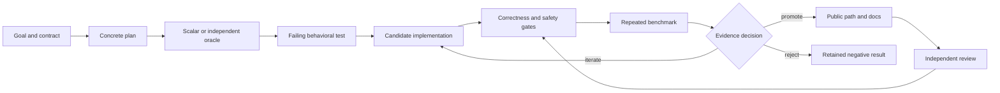

# Agent-driven kernel engineering

Wolfgang treats coding agents as high-bandwidth collaborators, not as sources of truth. Agents can search a broad design space quickly, draft kernels and tests, compare alternatives, orchestrate remote experiments, and perform independent reviews. Only executable evidence can promote a change.

This distinction is central to the project. Low-level optimization is unusually vulnerable to plausible-looking failure: a kernel may compile but race, return the right answer only for one shape, measure asynchronous launch time instead of completion, transfer more data than the baseline, use unsupported instructions, or “win” because semantics differ. Fluent generated explanations do not reduce those risks.

## The operating loop

### 1. Lock the contract

Before optimizing, the project states:

- exact operator semantics and ordering;
- accepted shape, dtype, layout, and index conventions;
- ownership and lifetime;
- allocation and growth limits;
- synchronization behavior;
- public versus benchmark-only status;
- timing boundary and correctness oracle.

A candidate cannot redefine the problem after measurement.

### 2. Build the oracle first

The portable scalar C++ path is the default structural oracle. Where useful, Qiskit, OpenFermion, dense matrices, or a simpler Python implementation provide independent checks. Property tests cover algebraic identities and generated edge cases.

Agents are instructed to create the failing behavior test before production changes. This establishes what should happen rather than merely documenting what generated code happens to do.

### 3. Generate narrow candidates

Candidates target one bottleneck and one evidence question at a time: a packed commutation lane, threshold, reduction, workspace policy, transfer boundary, or device consumer. Narrow slices make failures attributable and keep rollback inexpensive.

Multiple agents may independently inspect architecture, security, numerical behavior, and release claims. They do not edit overlapping files concurrently unless isolated worktrees and explicit integration review are used.

### 4. Verify before timing

A benchmark row is invalid unless correctness passes. Native changes also face checked arithmetic, malformed inputs, moved-from/lifetime cases, CPU-only import, unavailable-backend behavior, and sanitizer or accelerator tooling where available.

Hardware absence is recorded as an external blocker or explicit skip. It is never replaced with invented command output, simulated profiler evidence, or a claim that compile success implies runtime support.

### 5. Measure honest boundaries

Accelerator timing names what it includes:

- host-to-device and device-to-host transfer;
- allocation versus output/workspace reuse;
- kernel or command-buffer execution;
- synchronization point;
- compact reduction versus dense materialization;
- pipeline/cache warmup;
- host conversion and Python binding overhead.

Benchmark metadata is allowlisted and sanitized. The project retains enough environment detail to interpret results without publishing usernames, addresses, hostnames, arbitrary environments, or raw infrastructure databases.

### 6. Promote, iterate, or reject

Promotion requires repeated evidence in a relevant regime and no semantic regression. A candidate that loses stays private or is removed. A candidate blocked by missing hardware or tooling remains unavailable. Negative results are useful: they prevent the same attractive but unproductive idea from being rediscovered without context.

### 7. Review independently

Fresh reviewers assess spec compliance before code quality, then integration, security, and public claims. The implementer does not substitute self-review for independent review. Release-facing changes additionally verify artifacts from clean installation, not just an editable tree.

## Evidence hierarchy

| Level | What it proves | What it does not prove |
|---|---|---|
| Source-inspected | The design is understandable | It compiles or is correct |
| Compile-tested | A named toolchain accepts it | Runtime behavior |
| Runtime-tested | Correctness executes on named hardware | Performance |
| Performance-tested | A scoped timing result is retained | Broad portability |
| Release-supported | Install/runtime evidence is continuously gated | Every future platform |

The vocabulary prevents a common failure mode in accelerated software: collapsing all five levels into “supported.”

## Repository evidence

The public artifact exposes the loop rather than hiding it:

- `docs/plans/` records concrete implementation and experiment plans;
- `tests/` retains semantic, property, protocol, and packaging contracts;
- `benchmarks/` contains deterministic producers;
- `docs/benchmarks/reports/` records accepted and rejected conclusions;
- `docs/architecture/` defines ownership, support, and synchronization;
- `docs/research/provenance.md` routes detailed campaign history;
- `scripts/validate.py` turns project policy into executable gates;
- `AGENTS.md` gives automated contributors the same source-of-truth map.

Raw profiler captures and private infrastructure records are not part of the public proof. The impressive artifact is the reproducible reasoning chain—contract, code, test, environment, measurement, decision—not the volume of unfiltered logs.

## Why this scales

Agent assistance increases implementation throughput and the number of hypotheses that can be considered. The evidence loop prevents that throughput from becoming unreviewed complexity. Small plans, isolated worktrees, test-first behavior, promotion thresholds, independent review, and explicit stopping reasons make the process auditable by another engineer.

The result is not “code written by an agent.” It is a systems-engineering process in which agent speed is subordinated to numerical correctness, hardware reality, privacy, and release discipline.
