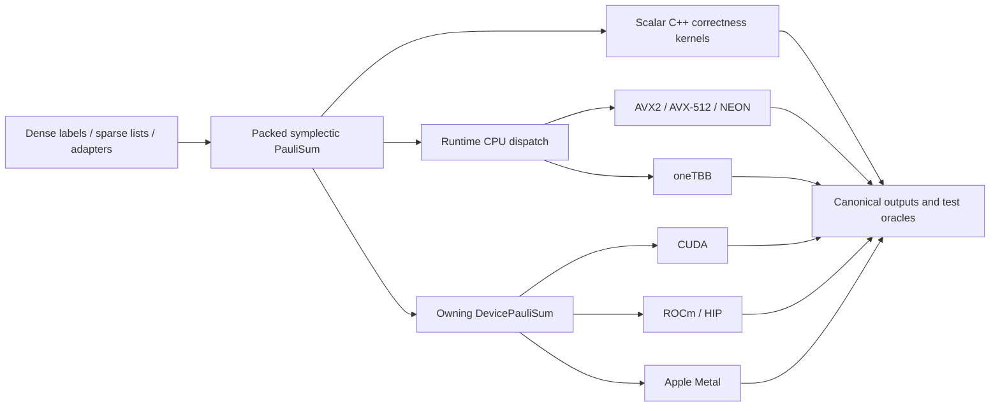

# Architecture

Wolfgang is organized around a compact mathematical invariant rather than around one accelerator API.

## Packed storage

For `n` qubits, each term uses `ceil(n / 64)` words for its `x` mask and the same number for `z`. This makes commutation a parity calculation over bitwise intersections and makes multiplication primarily XOR plus phase accounting.

The representation enables:

- exact structure and compact memory;
- deterministic canonical keys;
- vectorized popcount kernels;
- coalesced device storage;
- one semantic model shared across backends.

## Correctness before dispatch

Every build retains a scalar path. Runtime dispatch selects only kernels whose instruction set is available and whose covered shape is validated. A forced unsupported selector fails rather than silently executing a differently labeled path.

## Device ownership

`DevicePauliSum` owns device buffers and records backend/device identity. Device outputs retain explicit ownership and same-device rules. External-pointer and DLPack paths are separate trust boundaries with protocol, lifetime, read-only, and synchronization contracts.

## Evidence-gated optimization

Optimization work is promoted only after:

1. scalar or independent-library correctness comparison;
2. retained regression tests;
3. named hardware/toolchain evidence;
4. explicit transfer/allocation/synchronization boundary;
5. repeated measurements;
6. a demonstrated win in a relevant regime.

Rejected ideas and unavailable tooling are recorded rather than converted into optimistic claims. This discipline is especially important in agent-driven low-level engineering: agents generate hypotheses and implementations, while executable evidence decides what survives.

## Source map

- `include/wolfgang/`: documented native API declarations.
- `include/fastpauli/`: one-transition forwarding headers for legacy source compatibility.
- `src/`: scalar CPU semantics, dispatch, and backend implementations.
- `bindings/python/`: nanobind ownership and protocol boundary.
- `python/wolfgang_quantum/`: canonical Python package and optional adapters.
- `python/fastpauli/`: one-transition Python compatibility shim.
- `tests/`: behavioral, property, packaging, protocol, and hardware-gated tests.
- `benchmarks/`: deterministic benchmark producers.
- `docs/benchmarks/reports/`: reviewed, sanitized conclusions.
